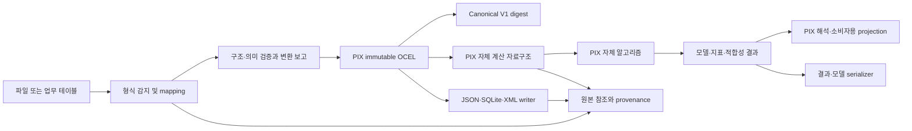

PIX OCEL 입출력 및 자체 계산 엔진 제안
====================================

조사일: 2026-09-09. 상태: 검토용 제안이며 구현 완료나 채택된 아키텍처 결정이 아니다.
기준: 현재 PIX 작업 트리, 고정한 upstream 소스, 공식 OCEL 문서. 제품 코드는 변경하지 않았다.

기존 설계 전제: PIX는 자체 계산과 해석을 담당하는 독립 엔진이며 PM4Py·OCPA는 참조 대상이다. 이는 이번 대화에서 새로 정한 방향이 아니다. 초기 [프로젝트 아키텍처](0_PIX_PROJECT_CONTEXT_AND_ARCHITECTURE.md)는 PIX를 독립적인 계산·해석 엔진으로 정의하고 계산 책임을 PIX에 둔다. 문서 표시일은 2026-07-18이며, 최초 저장소 커밋 `a736445`(2026-07-19)에도 이 역할이 명시돼 있다. [v0.1.0 기준선](../version/v0.1.0_PACKAGE_FOUNDATION_BASELINE.md)은 2026-07-26부터 “PIX source는 Schumpeter, PIG, OCPX, PM4Py 또는 OCPA를 import하지 않는다”, “PM4Py와 OCPA는 참조 대상이며 PIX의 런타임 의존성이 아니다”라고 명시한다.

이 제안서의 첫 작성에서 계산을 외부 라이브러리 adapter에 위임한 것은 작성자가 기존 목적과 의존성 경계를 적용하지 못한 오류였다. 이후 수정에서 이를 새 사용자 지정 범위나 기존 설계의 교체로 기록한 부분도 바로잡는다. 이전 문서의 호환성 view만으로 PIX의 계산 책임을 외부에 넘긴다고 해석하지 않는다. 초기 milestone의 알고리즘 제외 항목은 영구적인 제품 범위 제한으로 해석하지 않는다.

제품 목적은 PM4Py·OCPA를 대체할 독립 Process Intelligence 엔진이며, 두 라이브러리가 가진 계산 알고리즘들도 PIX 자체에 구현하는 것이 사용자가 재확인한 목표이다. 사용자가 설명한 개발 동기는 기존 라이브러리에서 경험한 오류와 업데이트 속도에 대한 불만이다. 특정 버전의 결함 판단은 아래의 개별 근거와 재현 범위에 따른다. 기존 API나 버그와의 동작 일치를 제품의 최우선 기준으로 삼지 않는다. 이 문서는 입출력·계산 계약의 제안이며 전체 알고리즘 구현이나 기능 동등성을 달성했다는 뜻은 아니다. 원래의 아키텍처·기준선 파일은 이번 정정에서 변경하지 않았다.

**확인한 현재 상태**

PIX는 `0.2.0`, HEAD `1db2d54fa7abf943a06780b9733311c4b6b15e90`이다. canonical만 구현된 상태보다 앞서 있다. JSON·XML·SQLite reader, JSON/XML gzip, immutable OCEL, semantic validator, Canonical V1 digest, import 진단 결과가 구현되어 있다. 외부 writer, OCEL interchange serializer, pm4py/OCPA adapter는 없다. 기존 작업 트리에 문서 수정 및 untracked fixture가 있으며 이 제안에서 변경하지 않았다. 근거: [README](../../README.md), [현재 reader](../../src/pix/ocel/ingest/reader.py), [package metadata](../../pyproject.toml).

`pix.ocel.canonical.v1`은 내부 동일성 판정을 위한 형식이다. 정수를 문자열, 실수를 `float.hex()`로 기록하고 E2O/O2O를 별도 최상위 컬렉션에 둔다. 따라서 그 bytes를 `.jsonocel`로 저장하는 것은 표준 OCEL 2.0 export가 아니다. 파일 bytes의 hash와 canonical dataset digest도 다른 용도이다. 근거: [Canonical V1 명세](../specifications/PIX_OCEL_CANONICAL_V1.md).

**OCEL 표준에서 가져올 계약**

OCEL 2.0의 교환 형식은 JSON, XML, relational SQLite이다. 보존 대상은 event/object ID와 type, event timestamp·attributes, 시간별 object attributes, qualifier를 포함한 E2O와 방향 있는 O2O이다. 같은 두 endpoint라도 qualifier가 다르면 별개 관계이다. 관계에 참여하지 않는 event/object도 허용된다. E2E, 계산된 directly-follows graph, 분석 결과는 2.0 핵심 구성요소가 아니다. 근거: [2.0 명세 §4, §6–8](https://www.ocel-standard.org/2.0/ocel20_specification.pdf).

현재 공식 사이트는 compact CSV와 CSV/Parquet bundle을 **2.1 개정에서 추가된 직렬화**로 안내한다. bundle은 OCEL 2.0 log를 저장하며 metadata 예시의 `ocelVersion`도 `2.0`이다. 따라서 의미 모델 판본, 교환 형식 판본, 라이브러리 함수 이름을 독립적으로 기록해야 한다. `read_ocel2_csv`라는 이름만 보고 원래 2.0의 필수 형식으로 분류하지 않는다. 근거: [overview](https://www.ocel-standard.org/specification/overview/), [bundle 명세](https://www.ocel-standard.org/specification/formats/bundled/).

**표준 검증에도 판본과 프로파일이 필요하다.** 다운로드한 2.0 및 2.1 JSON Schema는 attribute `value`를 string으로 제한하지만 공식 JSON 예시는 숫자 `1`을 사용한다. XML 예시는 `relationship` element를 쓰지만 다운로드 XSD는 관계 위치에도 `object`를 참조한다. 공식 자료 사이의 이 차이를 PIX가 조용히 고친 뒤 “공식 schema 통과”로 표시해서는 안 된다. 근거: [JSON 설명](https://www.ocel-standard.org/specification/formats/json/), [2.0 JSON Schema](https://www.ocel-standard.org/2.0/ocel20-schema-json.json), [XML 설명](https://www.ocel-standard.org/specification/formats/xml/), [2.0 XSD](https://www.ocel-standard.org/2.0/ocel20-schema-xml.xsd).

2026-09-09에 직접 다운로드해 계산한 artifact hash는 다음과 같다. 같은 종류의 2.0/2.1 파일은 이번 다운로드에서 동일했다. 공식 사이트 수정 시 다시 확인할 수 있는 기준이다.

| Artifact | bytes | SHA-256 |
|---|---:|---|
| JSON Schema | 4504 | `bd3dfc26a35c5a6d49e3e4adc049aa41c1efe31576dfd564e3e399d7b04f3dc6` |
| XML XSD | 5595 | `7ed3339957504a8fb9c3992d054719d4dbdf96f01443e56dda74bf9fa8c3a8b2` |

제안하는 검증 결과는 `reference_schema`, `pix_semantics`, `target_compatibility`를 분리한다. 각 결과에는 검사한 artifact hash와 profile version을 남기고, 수행하지 않은 검사는 `not_run`, 자료 충돌로 판정할 수 없는 항목은 `unresolved`로 표시한다. PIX가 정의한 보완 profile의 통과를 공식 reference schema 통과와 혼동하지 않는다.

**라이브러리 조사 결과와 채택 범위**

| 대상 | 확인한 지원 | PIX에서의 사용 제안 |
|---|---|---|
| PM4Py | `read_ocel2` / `write_ocel2` 계열: JSON·XML·SQLite, gzip, compact CSV, CSV/Parquet bundle | 알고리즘·자료구조·입출력의 참조 및 차등 검증 대상. PIX에 계산 알고리즘 자체 구현 |
| OCPA | 조사한 최신 wheel에 2.0 XML·SQLite import. 2.0 JSON importer 없음. 제공 JSON exporter는 1.0 출력 | 객체 중심 알고리즘과 실행 의미의 참조 및 차등 검증 대상. PIX에 계산 알고리즘 자체 구현 |
| Rust4PM / r4pm | JSON·XML·SQLite, CSV 및 bundle 구현. 최근 bundle streaming 지원 기록 | 자료구조·streaming·직렬화 및 성능 비교의 참조. PIX 계산의 runtime backend로 채택하는 제안은 하지 않음 |
| pm4js | OCEL2 JSON·XML·SQLite 및 compact CSV 구현 | 브라우저 소비자와 회귀 비교를 위한 참조. PIX 원본을 만들기 위한 필수 경유 계층으로 채택하지 않음 |

PM4Py 로컬은 `2.7.23.3`, SHA `3329bbcbadce8764f7df660fd88636c30793fbd0`이다. 최신 PyPI는 `2.7.23.8`(2026-09-01), tag/release SHA는 `24a3bf610aea6ecc4938b1864b3ad71fcfb82084`로 확인했다. 현재 dispatch는 일반 `.csv`와 `.ocel.csv`를 구별한다. legacy `read_ocel`/`write_ocel`보다 명시적인 2.0 API를 사용해야 한다. 근거: [PyPI](https://pypi.org/project/pm4py/), [고정 read.py](https://github.com/process-intelligence-solutions/pm4py/blob/24a3bf610aea6ecc4938b1864b3ad71fcfb82084/pm4py/read.py).

PM4Py 메모리 모델의 `events`, `objects`, `relations`, `o2o`, `object_changes` 테이블은 PIX 자체 자료구조 설계의 비교 대상이다. 다만 최신 소스에서도 Python 표준 JSON 경로는 같은 event/object의 여러 qualifier를 object-ID dictionary에서 덮어쓸 수 있다. object attribute 첫 배열 항목은 timestamp 없는 base로 옮기고 export 시 epoch 시각을 만든다. 연결되지 않은 event/object를 제거하는 필터도 있다. 이는 모든 backend나 모든 형식이 똑같이 손실된다는 뜻은 아니다. 특히 관계 테이블 자체는 복수 qualifier를 담을 수 있다. 근거: [classic 경유 변환](https://github.com/process-intelligence-solutions/pm4py/blob/24a3bf610aea6ecc4938b1864b3ad71fcfb82084/pm4py/objects/ocel/importer/jsonocel/variants/classic.py), [표준 JSON importer](https://github.com/process-intelligence-solutions/pm4py/blob/24a3bf610aea6ecc4938b1864b3ad71fcfb82084/pm4py/objects/ocel/importer/jsonocel/variants/ocel20_standard.py), [filtering](https://github.com/process-intelligence-solutions/pm4py/blob/24a3bf610aea6ecc4938b1864b3ad71fcfb82084/pm4py/objects/ocel/util/filtering_utils.py).

또한 선언된 type/attribute schema는 그대로 보존되지 않고 관측 DataFrame에서 재추론된다. 문자값 `"null"`도 Python JSON 경로에서 None으로 바뀐다. `r4pm`/`rustxes` 설치 여부에 따라 reader backend가 자동 선택되므로 **개발 시 비교 시험의 라이브러리 버전과 parser backend를 함께 고정**해야 한다. 이 기록은 PIX 계산의 runtime 의존성 설정이 아니다. 이번 조사에서 대체 backend의 실제 round-trip 결과는 알 수 없음이다. 근거: [JSON type 출력](https://github.com/process-intelligence-solutions/pm4py/blob/24a3bf610aea6ecc4938b1864b3ad71fcfb82084/pm4py/objects/ocel/exporter/jsonocel/variants/ocel20.py), 위 importer와 read.py.

OCPA 로컬과 GitHub main은 SHA `de056e0203a3fa4a9bbc19a95e001eada323074a`이며 소스 버전은 `1.3.3`이다. PyPI 최신 `1.3.4`(2025-09-19) wheel을 메모리에서 열어 비교한 OCEL2 importer/exporter 파일은 로컬과 동일했다. wheel에는 OCEL2 JSON importer가 없고 JSON exporter는 `ocel:version=1.0`을 쓴다. 공식 도구 표의 JSON 체크 표시만으로 2.0 JSON read/write를 보장할 수 없다. 근거: [PyPI](https://pypi.org/project/ocpa/), [OCEL2 importer 폴더](https://github.com/ocpm/ocpa/tree/de056e0203a3fa4a9bbc19a95e001eada323074a/ocpa/objects/log/importer/ocel2), [exporter](https://github.com/ocpm/ocpa/blob/de056e0203a3fa4a9bbc19a95e001eada323074a/ocpa/objects/log/exporter/ocel/versions/export_ocel_json.py), [공식 도구 표](https://www.ocel-standard.org/tool-support/overview/).

OCPA는 E2O qualifier를 event/object당 하나로, O2O를 `nx.DiGraph`로 저장하므로 다중 qualifier를 충실히 표현하기 어렵다. XML helper의 float attribute 문자열화와 E2O qualifier 덮어쓰기는 추출한 함수를 사용한 작은 실행에서도 재현됐다. SQLite E2O 결합의 event-ID index/RangeIndex 불일치는 소스상 우려이며 이번에 전체 importer 실행으로 확정하지 않았다. OCPA wheel은 `pm4py==2.2.32`를 요구하므로 개발 시 upstream 비교 시험 환경은 최신 PM4Py 시험 환경과 분리한다. 이는 PIX 제품의 실행 환경 요구가 아니다. 근거: [XML importer](https://github.com/ocpm/ocpa/tree/de056e0203a3fa4a9bbc19a95e001eada323074a/ocpa/objects/log/importer/ocel2/xml), [SQLite importer](https://github.com/ocpm/ocpa/blob/de056e0203a3fa4a9bbc19a95e001eada323074a/ocpa/objects/log/importer/ocel2/sqlite/versions/import_ocel2_sqlite.py), [package 설정](https://github.com/ocpm/ocpa/blob/de056e0203a3fa4a9bbc19a95e001eada323074a/setup.py).

Rust4PM 조사 HEAD는 `cd9d27c1a9d75aeddd6b8a6818b803b86d59c8b7`, r4pm은 `f8d55f3eeaf64abbb6c7a4e43ba97c393dafa5bb`이다. 0.6.1/0.6.2 변경 기록에 bundle 및 streaming 지원이 있다. 이것만으로 PIX 대비 속도 향상이나 무손실을 확정하지 않는다. pm4js HEAD는 `3eb7378dd5db8db72d7474454d69a455855b9e25`; JSON2 importer/exporter에 첫 object attribute 시점의 base/epoch 변환이 관찰되어 의미 보존 검증이 필요하다. 근거: [Rust4PM changelog](https://github.com/aarkue/Rust4PM/blob/cd9d27c1a9d75aeddd6b8a6818b803b86d59c8b7/CHANGELOG.md), [r4pm](https://github.com/aarkue/r4pm/tree/f8d55f3eeaf64abbb6c7a4e43ba97c393dafa5bb), [pm4js](https://github.com/pm4js/pm4js-core/tree/3eb7378dd5db8db72d7474454d69a455855b9e25).

**형식별 입출력 제안**

| 용도 / 형식 | Import | Export | 우선순위와 제한 |
|---|---|---|---|
| OCEL 2.0 JSON (`.json`, `.jsonocel`, 선택적 `.gz`) | 기존 reader 보강 | 새 writer | 기본 교환·디버깅 형식. 타입 선언과 속성 시점 보존 |
| OCEL 2.0 SQLite (`.sqlite`, `.sqlite3`) | 기존 reader 보강 | 새 writer | 파일 배포·SQL 검사를 위한 기본 선택지. 크기별 성능은 측정 전 알 수 없음 |
| OCEL 2.0 XML (`.xml`, `.xmlocel`, 선택적 `.gz`) | 기존 reader 보강 | 새 writer | XML 소비자 호환용. reference-XSD와 producer dialect 결과를 분리 |
| 기존 OCEL 1.0 JSON/XML | 별도 migration profile | 명시적 downgrade만 | qualifier/O2O/history의 부재를 기록. 임의 복원 금지 |
| 일반 CSV/XLSX/DB 테이블 | 명시적 mapping을 통한 변환 | CSV는 분석 projection | 하나의 행을 event로 볼지, 객체·관계를 어떻게 만들지 정해야 함 |
| XES / case-centric DataFrame | case를 객체로 만드는 명시적 adapter | object type/case 관점을 선택한 projection | 다중 객체 의미의 원상복원은 보장 불가. 분할·복제된 event의 원본 ID 매핑 필요 |
| 2.1 `.ocel.csv` | 후속 선택 기능 | 후속 제한 기능 | 일반 CSV와 구별. ID/qualifier delimiter 및 schema 추론 제약을 점검 |
| 2.1 `.ocel.zip` CSV/Parquet bundle | 후속 확장 | 후속 확장 | typed tables/대량 교환 수요가 확인될 때 추가. 독자적 `.ocel.zip` 규격 생성은 피함 |
| Canonical V1 bytes | 내부 identity/cache 계약 | 내부 identity/cache 계약 | 외부 OCEL interchange로 배포하지 않음 |

compact CSV는 `/`, `#`, `{`를 object ID/qualifier에서 escape하지 못하고 명시적인 attribute schema도 없다. 따라서 범용 무손실 기본 형식으로 두기 어렵다. bundle은 `ocel-meta.json`과 형식이 지정된 여러 테이블을 사용하므로 구조적으로 더 적합한 후보이다. 이것은 성능 측정 결과가 아니라 표현력에 따른 설계 판단이다. 근거: [CSV 명세](https://www.ocel-standard.org/specification/formats/csv/), [bundle 명세](https://www.ocel-standard.org/specification/formats/bundled/).

**권장 데이터 흐름**



PIX가 원본 파일을 직접 읽고, canonical OCEL에서 알고리즘에 필요한 trace·graph·index·matrix를 PIX 내부에서 생성한다. 계산과 그 결과의 해석도 PIX가 담당한다. 파생 자료구조와 분석 결과로 canonical 원본을 덮어쓰지 않는다. PM4Py/OCPA 코드는 이 제품 실행 경로 밖에서 알고리즘 정의 조사와 개발 시 비교 시험에 사용한다.

여기서 OCEL은 관측 로그의 공통 계약이며 모든 알고리즘의 유일한 입력 타입은 아니다. 발견 알고리즘의 출력 모델, 적합성 검사에 필요한 모델과 로그의 조합, feature matrix 등도 PIX가 별도 typed contract로 소유해야 한다. 기존 아키텍처의 `projection`은 소비자에게 제공하는 process-state 계층이므로, 계산 전 trace/graph 생성과 구분하여 문서화한다.

파일 감지는 확장자뿐 아니라 magic bytes, JSON top-level 구조, XML root, SQLite table schema를 확인한다. 구조가 legacy/enriched JSON인지 standard JSON인지 판별하고 불명확하면 `unsupported` 또는 진단 가능한 결과를 반환한다. 일반 CSV에는 매핑을 요구한다. 내용이 OCEL인 것처럼 보이도록 임의 추론해 정상 입력으로 승격하지 않는다.

비표준 데이터의 권장 중간 입력 계약은 `event_types`, `object_types`, `events`, `objects`, `event_attributes`, `object_attribute_values`, `e2o`, `o2o`의 typed table 집합이다. object attribute 행은 `(object_id, attribute_name, time, typed_value)`를 갖는다. E2O/O2O는 endpoint와 qualifier를 각각 별도 열로 둔다. pandas 없이도 records/iterables로 받을 수 있게 하고, pandas/Arrow adapter는 optional로 제공한다. 이 표 집합은 **PIX API 계약 제안**이며 새로운 OCEL 표준 파일 형식이라는 주장이 아니다.

CSV/DB mapping에는 event ID·activity·timestamp 열, 객체 ID·type, 관계 열, attribute type, 시간대, null 처리, ID namespace 규칙을 명시한다. ID가 없어서 만들어야 할 때는 재현 가능한 생성 규칙과 source-row mapping을 기록한다. 같은 값이라는 이유만으로 서로 다른 업무 시스템의 객체 ID를 자동 병합하지 않는다.

**API 계약 제안**

현재 구현된 `import_ocel(path, *, format=None)`와 `read_ocel(...)`의 의미는 유지한다. 아래는 추가할 API의 모양이며 현재 실행 가능한 예제가 아니다.

```python
# 제안 API: 아직 구현되지 않음
result = import_ocel(
    path,
    format=None,
    policy=ImportPolicy(
        profile="pix-ocel20-v1",
        naive_time="reject",
        precision_loss="reject",
        repair="none",
    ),
)

export = export_ocel(
    result.require_ocel(),
    "orders.sqlite",
    format="ocel20-sqlite",
    policy=ExportPolicy(on_loss="error", overwrite=False),
)

# 자체 알고리즘을 실행할 공개 경계의 제안
computations = pix.compute(
    dataset=result.require_ocel(),
    operators=["relation_integrity", "trace_reconstruction"],
)
```

`read_ocel`는 성공 시 OCEL, 실패 시 현재처럼 evidence를 가진 exception을 제공한다. 대칭적인 `write_ocel`은 성공 경로의 편의 함수, `export_ocel`은 사전검사·손실·출력 검증을 담은 `ExportResult`를 반환하도록 설계한다. 자체 알고리즘은 PIX의 compute 경계로 제공하며 공개 API에 PM4Py/OCPA 객체를 요구하지 않는다. 위 operator 이름은 기존 아키텍처 초안의 예시이며 현재 구현된 함수라는 뜻은 아니다. bytes/stream 입력은 `loads_ocel` 또는 명시적인 source abstraction으로 후속 제공할 수 있다.

기존 reader는 timezone 없는 timestamp를 UTC로 가정하고 warning을 남긴다. 새 policy 없이 이 기본값을 조용히 바꾸지 않는다. 엄격한 ingestion 경로에서는 `naive_time="reject"`를 명시하고, 알려진 업무 시간대는 mapping으로 입력한다. DST 모호성·잘못된 현지 시각도 임의 결정 대신 진단한다.

**보존과 손실의 구체적 규칙**

1. 원본 ID, qualifier, 문자열, 타입 선언, 관계 없는 엔티티를 보존한다. 미사용 타입·속성 선언도 버리지 않는다. 완전히 동일한 관계 중복과 다른 qualifier의 관계를 구별하며, 정리 정책 적용 시 원래 행과 변환을 기록한다.
2. object 속성의 최초 관찰 시각을 임의로 epoch로 옮기지 않는다. `(object, attribute, time)`에 서로 다른 값이 있으면 충돌로 진단한다. 전체 object history를 최신값 한 개로 줄이는 것은 별도 snapshot projection이다.
3. null, 누락, 빈 문자열, 문자값 `"null"`, 0, False를 구별한다. PIX의 현재 five-primitive 모델에 없는 값은 명시적으로 거절하거나 별도 확장 대상으로 보고한다. SQL NULL을 자동으로 string 또는 0으로 바꾸지 않는다.
4. 현재 V1은 microsecond datetime, finite Python float를 사용한다. 이를 넘는 입력 정밀도는 strict 경로에서 거절한다. 정밀도를 줄이는 선택을 제공한다면 손실 보고와 원본 참조를 남긴다. native nanosecond/decimal 확장은 canonical V2 검토 대상이다.
5. SQLite writer는 `event`, `object`, type mapping table, type별 상세 table, `event_object`, `object_object`를 사용한다. 관계마다 qualifier를 보존하고 type 이름은 충돌 없는 SQL table mapping으로 분리한다. 모든 이름을 영숫자로 stripping하는 방식을 사용하지 않는다. 정수 범위, 실수 표현, boolean/time 선언은 export preflight와 재수입으로 확인한다. 근거: [SQLite 명세](https://www.ocel-standard.org/specification/formats/sqlite/).
6. JSON은 공식 top-level `eventTypes`, `objectTypes`, `events`, `objects`를 출력하고 관계는 events/objects 안에 넣는다. Canonical V1의 typed wrapper나 float hex를 그대로 출력하지 않는다. XML은 채택한 dialect/profile을 기록하고 그 profile에 맞춘 writer를 제공한다.
7. 원본 보존은 hash만으로 해결되지 않는다. 원본을 다시 읽을 수 있는 immutable artifact 참조 또는 보관본을 선택적으로 유지한다. 모델에 담지 못한 확장 필드가 있으면 sidecar만 남았다고 전체 의미의 무손실을 주장하지 않는다.
8. PIX 내부 trace/graph/snapshot을 만들 때 object type·qualifier 선택, timestamp 동률 순서, attribute snapshot 시점과 집계 범위를 명시한다. 원본 정보가 줄어드는 계산 관점은 그 범위와 source ID mapping을 기록한다. 알고리즘이 요구하는 정보가 없으면 `unavailable` 또는 `invalid_input`을 반환하며, 성공한 빈 결과나 0으로 대체하지 않는다.

`ImportResult`/`ExportResult`는 source/output SHA-256, canonical version·digest, source format, profile version, schema artifact hash, 건수, issues, transformations, losses, assumptions, ID mapping을 담는 방향이 적절하다. status의 `valid`와 target 의미 보존 수준은 별도 필드여야 한다. 손실 상태는 `exact`, `lossy_projection`, `unrepresentable`, `unknown`처럼 구별할 수 있다. 자체 계산 결과에는 PIX operator ID·version, 입력 dataset/model digest, 관점·parameter·seed, evidence reference를 기록한다. 비교한 upstream version/backend는 개발 검증 기록에 남긴다. 위 API·필드명은 제안이다.

진단용 sidecar 예시는 `orders.sqlite.pix.json`이다. 표준 OCEL 파일에는 PIX 전용 metadata를 필수로 섞지 않는다. sidecar는 출력 파일 hash와 source dataset digest를 함께 참조한다. 계산 자료구조와 결과에도 원본 참조를 남기지만, reference가 있다는 사실만으로 알고리즘의 계산 정확성이 검증되는 것은 아니다.

**자체 알고리즘 구현에 따른 입출력 확장**

| 계약 | PIX가 소유할 내용 | 외부 형식과의 관계 |
|---|---|---|
| 관측 로그 | 기존 canonical OCEL과 provenance | OCEL 2.0 JSON·XML·SQLite로 교환 |
| 계산 자료구조 | trace, variant, typed graph, 관계 index, 시점별 속성 view, feature matrix | 내부 계약과 cache. 외부 library의 클래스 형태에 종속시키지 않음 |
| 계산 모델 | 발견·적합성 검사 등에 필요한 graph/net/process model과 구성 요소 ID | versioned PIX model schema. PNML·BPMN 등의 교환 지원은 해당 모델의 표현 범위와 mapping을 따로 정의 |
| 계산 결과 | metric, alignment·위반·진단 등 결과별 typed payload와 계산 근거 | versioned PIX result JSON. CSV·Parquet는 정의한 tabular 결과 view에 사용 |
| 해석 및 소비자 출력 | 규칙 기반 findings와 process-state projection | 기존 compute → intelligence → projection 계약에 맞춤 |

발견된 모델이나 적합성 검사 결과를 원본 OCEL에 임의 필드로 넣어 기본 log 의미를 바꾸지 않는다. 계산 실행 자체를 이벤트로 기록하려면 별도 실행 로그로 만들고 입력·결과 artifact를 참조한다. OCEL log, process model, analysis result의 파일 형식과 버전은 독립적으로 관리한다.

알고리즘 포트폴리오는 사용자 목표대로 PM4Py·OCPA 전반을 대상으로 목록화한다. 각 알고리즘과 variant마다 원 논문/정의, 고정 upstream 구현, 지원 입력 모델, 필요한 계산 자료구조, 출력 타입, parameter, 정확성 기준, 복잡도 가정, 구현 상태를 기록한다. 초기 구현 순서는 의존 관계에 따른 단계일 뿐, 포트폴리오를 영구히 몇 개 연산자로 제한하는 결정이 아니다. 전체 알고리즘 수·동등성 달성 범위·구현 공수는 아직 알 수 없음이다.

검증은 손으로 답을 계산할 수 있는 작은 사례, 수학적 불변식, 입력 변화에 따른 관계, upstream과의 차등 비교를 조합한다. upstream 결과가 명세와 다르면 차이를 조사해 기록하고, 알려진 importer 손실이나 버그까지 PIX의 정답으로 복제하지 않는다. 데이터 손실 때문에 결과가 달라진 경우와 알고리즘이 달라진 경우를 분리하려면 비교 입력의 의미적 동등성도 확인해야 한다. 그래프/모델은 계약에 맞는 구조적 동등성, 수치는 명시한 허용오차, 확률적 연산은 seed와 검증 범위를 정의한다.

**현재 PIX에 대한 작은 재현과 선행 작업**

이번에 CPython 3.11.15로 adapter를 직접 호출하고 JSON/XML은 BytesIO mock, SQLite는 `:memory:` DB를 사용해 아래를 재현했다. 파일 입력부터의 전체 통합 시험이나 전체 pytest suite를 실행했다는 주장은 아니다.

| 입력 | 관찰된 결과 | 보완 제안 / 코드 |
|---|---|---|
| JSON에 `events` member를 두 번 넣고 두 번째를 빈 배열로 지정 | 앞의 member가 사라지고 valid empty 결과; 변환 기록 없음 | duplicate JSON member 감지. [json.py](../../src/pix/ocel/ingest/formats/json.py) |
| `<log><extra><unmapped value="discarded"/></extra></log>` | unknown subtree가 빠지고 valid empty 결과 | 허용 extension과 unknown field 검사, 누락 보고. [xml.py](../../src/pix/ocel/ingest/formats/xml.py) |
| SQLite root는 비어 있고 E2O/O2O table에 missing-source 관계만 존재 | 관계가 사라지고 valid empty 결과 | 관계 table 전체를 보존하여 source/target 모두 검증. [sqlite.py](../../src/pix/ocel/ingest/formats/sqlite.py) |
| event timestamp `.123456789Z` | `.123456+00:00`으로 절삭, 변환 기록 없음 | parse 전에 지원 정밀도 검사 또는 명시적 손실 policy. [common.py](../../src/pix/ocel/ingest/formats/common.py) |

SQLite target만 누락된 비교 입력에서는 관계가 남고 `dangling_e2o_object`, `dangling_o2o_target`으로 실패했다. 따라서 발견 범위는 missing source가 adapter의 root 기반 조립에서 빠지는 경우이다. semantic validator가 모든 dangling 관계를 무시한다는 뜻이 아니다.

**구현 순서와 수용 기준**

| 순서 | 범위 | 다음 단계로 넘어갈 근거 |
|---|---|---|
| 0 | 위 reader 보존 결함과 validation profile 정리 | 작은 반례가 명시적 실패 또는 기록된 변환이 됨 |
| 1 | JSON·SQLite writer, ExportResult와 PIX 계산 입력·결과 계약 | 파일 왕복 digest 동일성과 trace/graph의 의미 검증. 계약이 안정되면 I/O와 계산 기반 구현을 병행 가능 |
| 2 | PIX 자체 index·trace·graph·속성 시점 조회·기초 연산자 | 작은 정답 사례, 불변식, 동률·qualifier·history 처리 계약 검증 |
| 3 | PIX 자체 발견·적합성·성능·feature 및 나머지 알고리즘군의 단계적 구현 | 알고리즘별 정의·variant inventory, 독립 정답 사례, 설명 가능한 upstream 차등 비교 |
| 4 | XML writer, 업무 CSV/DB mapping, 필요한 XES 및 모델/결과 입출력 | 로그·모델·결과를 구분한 재현성·표현 범위·ID 추적 검증. 필요한 소비자에 따라 병행 |
| 5 | 2.1 bundle/Parquet 및 자체 계산·저장 성능 개선 | 실제 업무 규모 benchmark와 의미 보존 fixture 통과 |

기본 fixture는 empty log, isolated event/object, O2O만 있는 객체, 다중 qualifier, unsorted history, epoch가 아닌 최초 속성 시점, 미사용 타입·속성, 다섯 primitive, 문자값 `"null"`, UTC/offset/naive time, 정밀도 초과, Unicode 및 충돌할 수 있는 type 이름, dangling source/target을 포함한다. export 대상의 정수·float 경계도 점검한다.

무손실 profile의 기준은 `digest(import(export(D))) == digest(D)`이다. 서로 다른 JSON/XML/SQLite의 파일 hash가 같아야 한다는 뜻은 아니다. 이 왕복 검증은 로그 I/O의 기준이며 계산 알고리즘의 정확성을 대신하지 않는다. 계산 자료구조와 결과는 각 operator의 계약으로 검증한다. 제3자 도구가 파일을 연 사실만으로 무손실 판정을 내리지 않는다.

파일 writer는 사전검사 후 임시 파일에 출력하고, 재수입·검증이 성공하면 목적 파일로 교체하는 방식을 제안한다. 기존 파일 overwrite는 기본값에서 끈다. 표현 불가능한 dataset은 빈 파일이나 일부 파일로 성공 처리하지 않는다.

**대안, 불확실성, 철회 조건**

전체 제품 방향은 기존 독립 계산 엔진 설계와 사용자가 재확인한 대체 목적에 따른다. 그 범위 안에서 무행동 대안은 아직 필요한 입력 계약이나 정확성 기준이 정해지지 않은 개별 알고리즘의 구현을 보류하는 것이다. 판단 근거 없이 함수를 늘리는 것보다 먼저 정의와 반례를 정리한다. 계산을 외부 라이브러리에 위임하는 구조는 기존 계산 책임과 의존성 경계에 부합하지 않는다. 단계별 도입 순서는 미구현 알고리즘을 영구 제외한다는 뜻이 아니다.

대규모 처리량, 최대 파일 크기, 메모리 한계, 개발 공수, 형식별 실제 손실 빈도는 **알 수 없음**이다. PM4Py 대체 backend의 의미 동등성, 모든 라이브러리 버전의 round-trip, XML 충돌에 대한 공식 최종 해석도 이번 조사로 확정하지 않는다. XML iterparse나 SQLite 사용만으로 전체 pipeline의 bounded-memory streaming을 주장하지 않는다.

사실 판단의 유효 범위는 조사일과 위 PIX/upstream SHA 및 schema hash이다. 해당 코드·backend·schema가 바뀌면 영향을 받는 판단을 재검증한다. PIX 보존 반례가 수정 후 재현되지 않으면 해당 결함 판단을 철회한다. 자체 알고리즘이 독립 정답 사례나 수학적 불변식을 위반하면 해당 구현의 정확성 주장을 철회하고 원인을 조사한다. 실제 대용량 수요와 측정이 현재 in-memory 구조를 부적합하게 만들면 계산 자료구조·저장 계층·2.1 bundle 우선순위를 바꾼다. upstream 결함이 개선되더라도 사용자가 정한 자체 대체 엔진이라는 제품 방향을 자동으로 바꾸지는 않는다.

종합 제안은 **PIX canonical을 데이터 기반으로 두고, 표준 파일 입출력·계산 자료구조·알고리즘·결과 계약을 PIX 자체에 구현하는 것**이다. PM4Py·OCPA는 대체 대상이자 조사·비교 참조이며, 로그에는 OCEL 교환 형식, 계산 모델과 결과에는 별도 계약을 적용한다.
