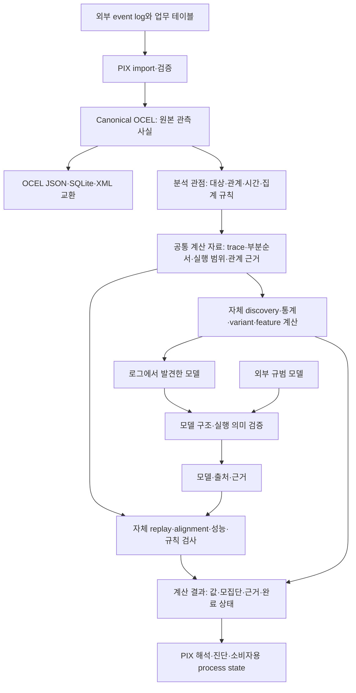
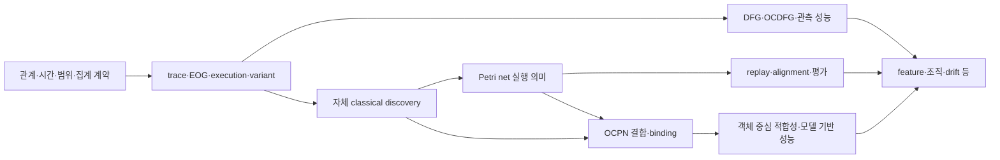

PIX 자체 Process Mining 엔진 — 도메인 구조 검토와 구현 계획
=========================================================

검토일: 2026-09-09. 독자: Process Mining 도메인 전문가. 상태: 구조·의미 계약의 검토안.

PIX가 자체 계산 알고리즘을 갖는 독립 대체 엔진이라는 기존 목적을 전제로 한다. PM4Py·OCPA는 계산 정의와 구현의 참조 및 비교 대상이다. 여기서는 패키지·함수 이름보다 **분석 대상의 구성 → 비교할 행동의 정의 → 모델 실행 의미 → 측정값의 의미**를 설명한다. 제안과 확인된 구현 동작을 구분한다.

**기존 분석에 이번에 더한 내용**

기존 [PM4Py 전체 구조 분석](../reference-analysis/pm4py/0_PM4PY_OVERALL_STRUCTURE_ANALYSIS.md), [OCPA 전체 구조 분석](../reference-analysis/ocpa/0_OCPA_OVERALL_STRUCTURE_ANALYSIS.md), [OCEL 데이터 모델 비교](../reference-analysis/comparison/0_OCPA_PM4PY_OCEL_DATA_MODEL_COMPARISON.md)는 API·variant dispatch·모델군·복합 OCEL·파생 계산 분리를 이미 다루었다. 이번에는 그 아래에서 실제 결과를 바꾸는 다음 정의를 추가 추적했다.

| 기존에 확인한 구조 | 이번에 추가로 확인한 계산 의미 |
|---|---|
| PM4Py의 알고리즘 variant와 표현 변환 | trace 입력과 DFG 입력에 따른 알고리즘 선택, 객체별 순서 근거, OCDFG 집계 단위 |
| OCPA의 process execution·variant | 연결성/leading type의 실행 경계, overlap, 정확한 동형 비교에서도 빠지는 객체 연결 정보 |
| 두 라이브러리의 OCPN discovery | 객체형별 발견 후 activity 전이 결합, 가변 arc 판단의 서로 다른 모집단 |
| replay·alignment·evaluation 제공 | 비용·분모·미지원 event·timeout·제외 표본이 결과에 반영되는 방식 |
| 성능 분석 제공 | 같은 지표명 아래 서로 다른 시각 기준, point event만으로 계산할 수 없는 기간 |

소스 확인은 기존 분석과 같은 PM4Py `2.7.23.3` / SHA `3329bbcbadce8764f7df660fd88636c30793fbd0`, OCPA `1.3.3` 표기 checkout / SHA `de056e0203a3fa4a9bbc19a95e001eada323074a`를 기준으로 한다. 두 checkout의 working tree는 확인 시 clean이었다. OCPA 1.3.4의 I/O 파일 동일성은 앞선 I/O 조사 범위이며, 이 문서의 모든 계산 파일을 wheel과 비교했다는 뜻은 아니다. 이번 upstream 추가 조사는 정적 분석이다. 후속 버전에 같은 동작이 남아 있다고 자동 일반화하지 않는다.

**PIX 전체 구조: 로그의 사실과 분석 관점을 분리한다**

분석 관점은 OCEL에 원래 주어진 사실이 아니다. 어떤 객체를 case로 보는지, 어떤 관계를 실행 구성에 사용하는지, 같은 시각을 어떻게 취급하는지, 무엇을 한 번으로 세는지를 결정한 분석 조건이다. 그 조건이 달라지면 서로 다른 계산이다. 원본 OCEL의 digest가 같다는 이유만으로 trace·variant·alignment 결과를 재사용하지 않는다.

발견 모델과 외부 규범 모델은 모두 구조·실행 의미를 검증하되 출처를 유지한다. 로그에서 발견한 모델이 관측 행동을 얼마나 설명하는지 평가하는 것과, 외부에서 정한 규범을 관측 행동이 준수하는지 평가하는 것은 별개 질문이다. 원본 로그 교환과 분석 결과·모델 교환도 별도 형식으로 관리한다. 그림의 XML writer와 모델 입력·검증 경로는 계획 범위이며 현재 코드 초안의 구현 완료 표시가 아니다.

| PIX가 소유할 부분 | 반드시 드러낼 내용 | 피해야 할 혼동 |
|---|---|---|
| 관측 로그 | ID·type·timestamp·attribute history·qualified E2O/O2O | 사건의 저장 순서가 업무의 선후관계라는 해석 |
| 분석 관점 | 대상 객체형·관계 qualifier·기간·실행 경계·순서·속성 시점 | 라이브러리 기본값이 업무 정의라는 해석 |
| 파생 계산 자료 | 어떤 event/object에서 어떤 trace·edge·execution이 만들어졌는지 | 파생 graph가 원본에 있던 관계라는 해석 |
| 모델 | 구조뿐 아니라 marking·binding·transition identity·허용 행동 | 그림이 같으면 같은 실행 의미라는 해석 |
| 결과 | 측정값·단위·분자/분모·coverage·가정·미완료 사유 | 숫자 하나가 모든 적합성·성능을 대표한다는 해석 |
| 해석 | 어떤 계산 근거로 어떤 업무 판단을 했는지 | 관측된 반복·연결·상관을 바로 인과관계로 판단 |

**PM4Py와 OCPA에서 계승·재설계할 부분**

| 기능 영역 | 참조할 구조 | PIX에서 자체 구현할 형태 | 그대로 복제하지 않을 부분 |
|---|---|---|---|
| 기초 통계·DFG | PM4Py의 관계 근거와 여러 집계 방식 | 원시 event/object 근거 위의 명시적 집계 | 이름이 frequency인 단일 숫자로 통합 |
| 전통 discovery | PM4Py의 trace/variant/DFG → miner → process tree/net | 입력 표현별 정보량과 miner variant를 분리 | DFG 입력에 의한 알고리즘 변경을 단순 성능 최적화로 표시 |
| 객체 중심 관점 | PM4Py의 객체형 projection과 OCPA의 graph 기반 execution | 객체별 trace, event graph, 실행 범위 계산을 독립 연산으로 제공 | 모든 계산을 하나의 flattening으로 통일 |
| Variant | OCPA의 후보 묶기 → 동형 확인 | 동치 정의와 exact/approx/미완료 상태를 분리 | hash 일치나 축약 graph 동형을 전체 객체 행동 동치로 표시 |
| OCPN | 두 라이브러리의 객체형별 발견·전이 결합과 binding | 자체 miner + typed model + 객체 참여 제약 + 실행 의미 | activity 표시명만으로 결합하거나 관측 빈도를 바로 규범 제약으로 승격 |
| 적합성 | replay·alignment·context·constraint 각각의 계산 | 질문별 결과 및 공유 모델 실행 핵심 | 서로 다른 fitness/precision을 같은 지표로 취급 |
| 성능 | EOG 기반 시간차와 token 기반 readiness 분석 | 지표별 시각·선행관계·모집단 사전 | service·sojourn·flow라는 이름만 맞추는 구현 |
| 확장 기능 | PM4Py의 조직·simulation·drift 등과 OCPA의 feature/예측 구조 | 검증된 공통 표현을 재사용하는 계산군 | 아직 정의되지 않은 기능을 성공하는 빈 API로 채움 |

기능 포트폴리오는 전통적 Process Mining과 객체 중심 Process Mining 모두 포함한다. 구현 단계가 뒤라는 이유로 영구 제외하지 않는다. 다만 같은 명칭의 알고리즘도 input·variant·모델 의미·비용 정의가 다르면 별도 항목으로 관리한다.

**검토 사례 A: 한 로그에서도 빈도와 연결 단위가 달라진다**

아래는 계산 정의를 검토하기 위한 가상 로그이다. 실제 업무 데이터의 측정치가 아니다. O는 주문, P는 포장, R은 공통 작업 자원이다. 표시된 시각은 모두 같은 날짜·시간대이다.

| Event | 시각 | 활동 | 직접 참여 객체 |
|---|---|---|---|
| e1 | 09:00 | Create | O1 |
| e2 | 09:01 | Create | O2 |
| e3 | 09:05 | Pack | O1, O2, P1 |
| e4 | 09:10 | Ship | O1, O2, P1, R1 |
| e5 | 09:20 | Create | O3 |
| e6 | 09:30 | Ship | O3, P2, R1 |
| e7 | 09:35 | Check | P2 |

주문에 직접 연결된 event만 사용하면 O1의 trace는 e1→e3→e4, O2는 e2→e3→e4, O3는 e5→e6이다. 원본 7 event 중 주문 관점의 고유 event는 6개이고, 주문-event 소속 건수는 8건이다. e7은 주문 관점에 포함되지 않는다. 이를 데이터 삭제와 혼동하지 않도록 범위 밖 event를 함께 보고한다.

주문 관점 Pack→Ship의 원시 근거는 두 개다.

| 근거 | 시작 event | 끝 event | 객체 |
|---|---|---|---|
| 1 | e3 | e4 | O1 |
| 2 | e3 | e4 | O2 |

| 집계 질문 | 값 | 해석 |
|---|---:|---|
| 서로 다른 event pair 수 | 1 | 실제 e3→e4 조합은 하나 |
| 이 경로를 경험한 서로 다른 주문 수 | 2 | O1·O2 |
| 주문별 경로 발생 수 | 2 | event-event-object 근거 두 개 |

현재 PM4Py OCDFG는 이 세 집계를 구분한다. 한 객체가 같은 활동 edge를 반복하면 두 번째와 세 번째도 달라진다. 시간차 평균 역시 event pair당 한 번 가중할지, 객체 참여마다 가중할지에 따라 다른 지표가 된다. 근거: [edge metrics](https://github.com/process-intelligence-solutions/pm4py/blob/3329bbcbadce8764f7df660fd88636c30793fbd0/pm4py/statistics/ocel/edge_metrics.py), [공식 OCDFG 지표 옵션](https://processintelligence.solutions/pm4py/api/2.7.17/api/pm4py.vis.html).

같은 예시에서 모든 객체 유형의 공동 참여로 event 연결성을 계산하면 R1을 통해 두 배송 묶음이 연결되어 component가 하나이다. R1 유형을 연결 기준에서 제외하면 {e1,e2,e3,e4}와 {e5,e6,e7} 두 component가 된다. 이는 연결성 정의의 차이이며 한쪽이 자동으로 오류인 것은 아니다.

이 예시의 trace·집계 값과 component 수는 별도 소형 계산으로 검증했다. upstream 전체 알고리즘을 실행한 결과라고 표시하지 않는다.

**검토 사례 B: process execution은 partition일 수도, overlap이 있는 cover일 수도 있다**

확인한 OCPA의 기본 extraction은 event-order graph의 weak connected component이다. leading type은 원본 OCEL 2.0 O2O가 아니라 공동 event 참여로 생성한 객체 그래프를 탐색한다. 객체 유형별 첫 BFS 깊이를 제한하고, 선택된 객체가 참여한 모든 event의 합집합을 취한다. 따라서 관련 객체 집합 밖 객체가 참여한 event도 포함될 수 있다. 근거: [extraction factory와 구현](https://github.com/ocpm/ocpa/tree/de056e0203a3fa4a9bbc19a95e001eada323074a/ocpa/algo/util/process_executions), [공식 extraction 설정](https://ocpa.readthedocs.io/en/latest/eventlogmanagement.html).

다음은 그 규칙의 의미를 설명하는 별도의 가상 로그다.

| Event | 활동 | 객체 |
|---|---|---|
| e1 | 주문 접수 | 주문 O1 |
| e2 | 주문 접수 | 주문 O2 |
| e3 | 포장 | 주문 O1, 품목 I1 |
| e4 | 포장 | 주문 O2, 품목 I2 |
| e5 | 공동 발송 | 품목 I1, 품목 I2, 배송 S |
| e6 | 배송 완료 | 배송 S |

| 추출 관점 | 결과 실행 | 고유 event | 실행-event 소속 건수 |
|---|---|---:|---:|
| 전체 연결성 | {e1,e2,e3,e4,e5,e6} | 6 | 6 |
| 주문 O1 중심 | {e1,e3,e5,e6} | 4 | 4 |
| 주문 O2 중심 | {e2,e4,e5,e6} | 4 | 4 |
| 두 주문 중심 실행 전체 | 2개 실행, e5·e6 중첩 | 6 | 8 |

O1 중심 실행의 객체 범위가 O1·I1·S라면 e5에 같이 참여한 I2는 경계 밖 참조이다. 이 참조를 잘라낸 그래프와 원래 참조를 유지한 그래프는 다른 분석 입력이다.

PIX에는 execution 수뿐 아니라 고유 event·membership 수·overlap·범위 밖 참조·미포함 event/object를 함께 제공하는 계약을 제안한다. Connected component, leading object, 도메인 경계 규칙은 서로 대체 가능한 기본값이 아니라 별개 추출 의미이다. 추출을 선택하지 않은 상태에서는 execution 기반 variant frequency를 계산하지 않는 대안이 유효하다.

Process execution을 graph 기반 case로 다루는 개념적 근거는 [Defining Cases and Variants for Object-Centric Event Data](https://arxiv.org/abs/2208.03235)이다. 위 membership 수는 명시 예시와 규칙에 한정한 계산이며 보편적인 extraction 결과 수가 아니다.

**검토 사례 C: 같은 variant의 정의와 정확한 계산은 별개다**

OCPA의 조사 경로는 기본적으로 two-phase hash 후보 묶기를 사용하며 exact 옵션의 기본값은 false이다. 동형 비교는 활동·객체 유형으로 표시한 event graph를 비교하고 qualifier·O2O·속성 이력은 이 표현에 들어가지 않는다. 근거: [two-phase variant](https://github.com/ocpm/ocpa/blob/de056e0203a3fa4a9bbc19a95e001eada323074a/ocpa/algo/util/variants/versions/twophase.py), [graph 표현 helper](https://github.com/ocpm/ocpa/blob/de056e0203a3fa4a9bbc19a95e001eada323074a/ocpa/algo/util/variants/versions/utils/helper.py).

아래 세 event의 활동은 모두 A이며 모든 객체는 같은 T형이다.

| 실행 | e1 | e2 | e3 |
|---|---|---|---|
| L | x, a | x, b | x, c |
| M | x, a | x, y | y, c |

두 실행 모두 각 event에 T형 객체 2개가 참여하고, e1→e2→e3의 각 edge는 T형 객체 하나를 공유한다. 이 event graph 표현은 같다. 그러나 L에는 세 event를 관통하는 x가 있고 M에는 그런 객체가 없다. 객체별 참여 횟수는 L의 3·1·1·1과 M의 2·2·1·1로 다르다. 이 구조 차이는 독립 소형 계산으로 확인했다.

PIX에서 분리할 판단은 다음과 같다.

| 차원 | 선택 가능한 정의 | 검토해야 할 결과 |
|---|---|---|
| 어떤 행동을 같게 보는가 | 활동열, 유형 표기 event graph, 전역 객체 연결을 보존한 event-object graph, qualifier 포함 graph | L/M을 합칠지 분리할지 |
| 어떤 값까지 같아야 하는가 | 활동 identity·객체형·역할·cardinality·선택 속성·시간 구간 | 속성 하나만 다른 실행을 별개로 볼지 |
| 어떻게 계산하는가 | 후보 hash, 완전 동형 검사, 한도 초과 미완료 | 결과가 exact인지, 후보군인지, 아직 미결정인지 |
| 무엇을 재사용하는가 | 빈도만, 대표 시각화, alignment, feature | 이 동치가 후속 연산에 필요한 정보를 보존하는지 |

여기서 전역 객체 연결 보존은 원본 ID 문자열이 같아야 한다는 뜻이 아니다. 객체를 일대일로 이름 바꾸더라도 모든 event에서 동일한 대응이 유지되어야 한다는 뜻이다.

제안 기본 방향은 객체 중심 정밀 분석에 event-object 연결을 보존한 동치를 제공하고, 활동열·축약 EOG variant는 별도 명칭으로 제공하는 것이다. 이는 OCPA variant가 항상 잘못됐다는 판단이 아니라 질문에 맞는 동치의 분리이다. exact는 선택한 표현에 대한 정확성이며, 표현에서 이미 버린 정보를 복원하지 않는다. 특히 대표 execution 하나의 alignment를 모든 variant 구성원에 재사용하려면 그 동치가 binding과 비용을 보존하는지 증명하거나 별도로 검사해야 한다.

**순서: 재현 가능한 정렬과 관측된 선후관계를 구분한다**

확인한 PM4Py OCDFG edge 경로와 OCPA EOG 생성기는 각각 입력 event/table 순서에서 객체의 직전 event를 갱신한다. 이 함수 안에서 timestamp로 재정렬하지 않는다. 다른 전통 trace 경로는 case·timestamp로 정렬한다. 근거: 위 PM4Py edge metrics, [OCPA EOG 생성](https://github.com/ocpm/ocpa/blob/de056e0203a3fa4a9bbc19a95e001eada323074a/ocpa/objects/log/variants/util/table.py).

PIX의 canonical 정렬은 데이터 동일성용이며 업무 순서의 근거가 아니다. 순서 계약에는 timestamp, 신뢰할 수 있는 source sequence, 동시각 처리와 불확정성 정보를 둔다. 같은 시각이면 곧 병렬이라는 해석도 성립하지 않는다. 시간 해상도가 낮거나 일괄 기록된 것일 수 있기 때문이다.

순서를 확정할 수 없는 데이터에서는 부분순서를 받는 알고리즘을 사용하거나, 가정을 표시한 선형화를 선택하거나, total-order 전용 계산을 유보할 수 있다. event ID 사전식 순서는 결정성을 주지만 인과관계의 증거는 아니다. 이번 코드 초안은 total-order trace의 동률을 기본 유보하며 부분순서 miner는 아직 구현하지 않았다.

**모델 계층: DFG·process tree·Petri net·OCPN을 같은 결과 상자로 취급하지 않는다**

| 모델/표현 | 주된 의미 | 필요한 별도 계약 |
|---|---|---|
| Trace/variant log | 관측된 전체 행동과 그 빈도 | 순서·case 관점·빈도·empty trace |
| DFG/OCDFG | 관측된 국소 직접선행과 집계 | 객체형·event/object 근거·집계 단위 |
| Process tree·partial-order 표현 | 발견된 조합/순서 구조 | operator 의미와 허용 언어, 전환 시 의미 보존 |
| Petri net | marking에 따른 실행 가능 행동 | initial/final marking, silent transition, label과 transition ID의 구분 |
| OCPN | 객체형과 구체 객체 binding이 있는 공동 실행 | typed place, 객체 토큰, 고정/가변 참여, 공유 firing과 초기/종료 조건 |

PM4Py의 조사한 Inductive Miner 경로는 trace/variant 또는 DFG를 받으며, DFG 입력에서는 IMd를 선택한다. DFG가 전체 trace 정보를 보존하지 않으므로 이는 실행 backend만 바꾸는 것과 다르다. 예를 들어 {ABC, DBE}와 {ABE, DBC}는 같은 DFG edge와 빈도를 만들지만 전체 trace 집합은 다르다. 이 구성 반례에서는 시작 A·D, 끝 C·E의 빈도도 같다. 근거: [Inductive dispatcher](https://github.com/process-intelligence-solutions/pm4py/blob/3329bbcbadce8764f7df660fd88636c30793fbd0/pm4py/algo/discovery/inductive/algorithm.py).

OCPN 발견은 두 라이브러리 모두 객체형별 모델 발견과 공유 activity 전이 결합을 사용한다. OCPA의 실제 dispatch는 new_inductive이며 내부에서 PM4Py miner를 사용한다. PIX가 이를 대체하려면 객체 중심 바깥 로직뿐 아니라 그 안의 classical miner도 자체 구현해야 한다. 근거: [PM4Py OCPN](https://github.com/process-intelligence-solutions/pm4py/blob/3329bbcbadce8764f7df660fd88636c30793fbd0/pm4py/algo/discovery/ocel/ocpn/variants/classic.py), [OCPA OCPN](https://github.com/ocpm/ocpa/blob/de056e0203a3fa4a9bbc19a95e001eada323074a/ocpa/algo/discovery/ocpn/versions/new_inductive.py).

특히 다음 두 판단을 분리한다.

- **동명 전이 결합:** 같은 표시명 “승인”이 업무적으로 같은 activity인지, 서로 다른 역할의 행동인지. 내부 activity identity와 표시명을 구분하고 명시한 결합 규칙을 사용한다.
- **객체 참여 cardinality:** 해당 활동에 특정 객체형이 0개·1개·여러 개 참여한 관측 분포와, 모델이 허용해야 하는 cardinality를 구분한다. 관측되지 않았다는 이유만으로 규범적으로 금지됐다고 확정하지 않는다.

조사한 PM4Py의 가변성 비율은 해당 type 객체가 정확히 하나 있는 activity event 수를 해당 activity 전체 event 수로 나눈다. OCPA의 경로는 양수 참여 count에 주로 의존하고 helper에서 반복 (activity, object)를 첫 기록으로 줄일 수 있다. 따라서 e1:A{x}, e2:A{x,y}의 독립 정답인 참여 수 [1,2]를 기준으로 확인해야 한다. 두 구현의 기본 threshold를 같은 의미라고 가정하지 않는다.

모델 실행 핵심은 marking·enabled binding·firing·silent move·초기/종료 판정을 한 곳에서 정의한다. discovery, replay, alignment, simulation은 이 정의를 공유한다. 객체형별 trace replay의 성공만으로 전체 OCPN의 공동 binding이 가능하다고 판단하지 않는다. O2O나 qualifier 기반 업무 제약을 추가할 경우 기본 OCPN 의미와 확장 제약을 명시적으로 구분한다.

**적합성·평가: 점수보다 먼저 검사 질문과 coverage를 정한다**

| 계산 | 답하는 질문 | 결과에 보여줄 세부사항 |
|---|---|---|
| Token replay | 관측 행동을 실행하려면 어떤 토큰 보정이 필요한가 | event/object/place별 missing·remaining·consumed·produced·정의된 추가 항목 |
| Alignment | 정의한 비용 아래 어떤 수정 경로가 필요한가 | log/model/synchronous move, 객체 binding, 비용, 최적성·한도 초과 상태 |
| Prefix precision | 관측 prefix 이후 모델이 허용하는 추가 행동이 얼마나 있는가 | prefix, enabled·escaping 행동, 가중치, 제외 표본·종료 처리 |
| Context fitness/precision | 같은 객체 이력에서 관측한 다음 행동과 모델이 허용하는 행동은 얼마나 겹치는가 | 관측 행동 집합·모델 가능 행동 집합, 서로 다른 분모, event별 가중치·제외 표본 |
| Graph comparison | 선택한 국소 관계와 빈도가 얼마나 다른가 | 객체형을 보존하는지, edge 집합·분모·빈 그래프 규칙 |
| Constraint monitoring | 명시한 업무·시간·비율 규칙을 만족하는가 | 대상 모집단, 증거, 측정값, threshold, 충족·위반·자료 부족 |

평균 trace fitness, 토큰을 합산한 log fitness, alignment 비용 기반 fitness, context fitness, OCDFG 비교 점수는 서로 다른 지표이다. 같은 fitness라는 표시로 비교하거나 대체하지 않는다.

OCPA context 경로에서 같은 객체 이력의 관측 행동 집합을 L, 모델 가능 행동 집합을 M이라 하면 context fitness는 교집합 크기/관측 집합 크기, precision은 교집합 크기/모델 가능 집합 크기이다. 이를 event별로 집계한다. 조사한 구현은 M이 비거나 교집합이 없을 때 fitness에는 0을 넣지만 precision에서는 그 표본을 제외한다. 따라서 두 평균은 평가 표본부터 달라질 수 있다. PIX에서는 각 집합·분모·포함/제외 수와 탐색 완료 상태를 함께 제공하고, 이러한 제외 정책을 지표 정의에 명시하는 안이다. 아래 context replay 소스의 279–302행에 해당 계산이 있다.

확인한 구현 경로에는 PM4Py alignment 결과가 None일 때 평가 모집단에서 제외되는 경우, precision에서 fit prefix만 포함하는 경우, OCPA 모델 외 activity를 replay에서 건너뛰는 경우, context 탐색 한도에 닿아도 완료 상태를 명확히 드러내지 않는 경우가 있다. 이는 단순 반환형 문제가 아니라 보고된 점수의 적용 범위를 바꾼다. 근거: [PM4Py replay fitness variants](https://github.com/process-intelligence-solutions/pm4py/tree/3329bbcbadce8764f7df660fd88636c30793fbd0/pm4py/algo/evaluation/replay_fitness/variants), [precision variants](https://github.com/process-intelligence-solutions/pm4py/tree/3329bbcbadce8764f7df660fd88636c30793fbd0/pm4py/algo/evaluation/precision/variants), [OCPA token replay](https://github.com/ocpm/ocpa/tree/de056e0203a3fa4a9bbc19a95e001eada323074a/ocpa/algo/conformance/token_based_replay), [context replay](https://github.com/ocpm/ocpa/blob/de056e0203a3fa4a9bbc19a95e001eada323074a/ocpa/algo/conformance/precision_and_fitness/variants/replay_context.py).

PIX의 결과에는 예를 들어 “대상 100 execution 중 완료 80, 시간 한도 15, 모델 미지원 5; 점수는 완료 80에 대한 값”처럼 coverage를 보여준다. 이 수치는 결과 표시 형식의 가상 예이며 실제 측정치가 아니다. 탐색이 끝나지 않은 사례를 위반 또는 적합으로 자동 분류하지 않는다. 분모 0의 값은 지표 정의에 따라 처리하고, 정의가 없으면 알 수 없음이다.

비용 역시 검토 대상이다. 조사한 OCPA alignment에서는 log/visible model move의 비용이 참여 객체 수에 영향을 받는다. 배치 event 하나에 객체 100개가 참여할 때 수정 비용을 event 기준 1로 볼지 객체 기준 100으로 볼지는 다른 문제 정의이다. 명시 비용 profile과 최적성 조건을 저장한다. 객체 의존성을 고려하는 alignment의 필요성은 [Object-Centric Alignments](https://arxiv.org/abs/2305.05113)에 설명되어 있다.

**성능 지표: 관측 시각·작업기간·준비 시각을 분리한다**

다음은 별도의 시간 예시이다. 두 선행 event의 완료는 09:00·09:10, 현재 작업의 관측 시작은 09:15, 완료는 09:20이라고 가정한다.

| 측정 정의 | 값 | 이 값이 설명하는 것 |
|---|---:|---|
| 현재 완료 − 가장 이른 선행 완료 | 20분 | 선택한 선행집합의 최초 완료부터 현재 완료까지 |
| 현재 완료 − 가장 늦은 선행 완료 | 10분 | 마지막 선행 완료 이후 간격 |
| 가장 늦은 선행 완료 − 가장 이른 선행 완료 | 10분 | 선행 완료 시각들의 벌어짐 |
| 현재 완료 − 현재 시작 | 5분 | 주어진 start/complete 근거에 따른 작업기간 |

OCPA EOG 경로는 앞의 세 항목을 flow·sojourn·synchronization으로 사용한다. 같은 EOG 경로의 elapsed는 sojourn과 같은 식이고 remaining은 전체 실행 종료가 아니라 직후 successor 시각을 사용한다. 다른 token 기반 경로는 token visit과 event start/complete를 사용한다. 따라서 이름만 맞춰 지표를 합치면 다른 질문의 답을 섞게 된다. 근거: [OCPA EOG performance](https://github.com/ocpm/ocpa/blob/de056e0203a3fa4a9bbc19a95e001eada323074a/ocpa/algo/enhancement/event_graph_based_performance/versions/event_object_graph_based.py), [OPERA](https://github.com/ocpm/ocpa/blob/de056e0203a3fa4a9bbc19a95e001eada323074a/ocpa/algo/enhancement/token_replay_based_performance/versions/opera.py).

PIX는 지표 사전에 다음을 기록하는 안을 제안한다: 대상 단위, 시작/끝 시각의 출처, 선행집합과 객체형 선택, calendar, 가중치·분모, censored observation과 누락 처리. start가 없으면 service time은 0이 아니라 알 수 없음이다. 객체 첫·마지막 관측 차이는 observed lifecycle span이며 실제 생성·소멸 기간과 같다고 확정하지 않는다.

또한 시간 중첩, 순서 미확정, 모델이 허용하는 concurrency는 별개다. 양의 길이 interval overlap과 경계 접촉을 구별한다. 객체의 공동 event 참여는 파생 interaction이며 원본 qualified O2O나 인과관계와 구별한다. 관측창 밖의 상태를 해석할 업무 규칙이 있으면 그 규칙을 적용한 결과임을 명시한다.

**도메인 검토 결정표**

다음은 기본값으로 확정하기 전 전문가가 판단할 항목이다. 제안된 선택과 다른 선택이 답하는 질문을 함께 제시한다. 표에서 어느 선택도 자동 승인된 것으로 취급하지 않는다.

| ID | 검토 항목 | 제안 방향 | 다른 선택의 의미 | 재검토·철회 조건 |
|---|---|---|---|---|
| D1 | Execution의 업무 단위 | 목적별 connected/leading/domain rule을 명시; 미선택 시 실행 지표 유보 | 항상 CC는 전체 연결 묶음, 항상 leading은 특정 객체 중심 모집단 | 사례 B의 경계·overlap이 업무 execution과 맞지 않음 |
| D2 | 실행을 연결하는 관계 | E2O qualifier·객체형과 O2O 사용 여부를 구분 | 자원·고객까지 연결하면 component가 커질 수 있음 | 제외 관계가 업무상 필수 의존성을 제거함 |
| D3 | 동시각 event | 근거 없으면 미확정; total-order 연산은 유보 또는 명시 선형화 | ID tie-break는 계산용 순서 | 신뢰 가능한 source 순서가 확보되거나 부분순서 정의가 바뀜 |
| D4 | Variant 동치 | 객체 연결을 보존한 동치와 축약 EOG/sequence 동치를 별도 제공 | 축약 동치는 더 많은 실행을 같은 그룹으로 묶음 | 사례 C를 같은/다른 것으로 보는 도메인 정의와 불일치 |
| D5 | 빈도·시간 가중치 | event pair·unique object·occurrence를 구분해 제공 | 단일 기본값은 특정 모집단을 우선함 | 반복·공유 사례의 손계산과 불일치 |
| D6 | OCPN 전이·cardinality | activity identity와 0/1/복수 참여 분포를 먼저 검토 | label merge·기본 threshold는 더 강한 모델 가정 | 동명 이질 활동을 묶거나 반복 참여 count를 소실 |
| D7 | 적합성 비용·coverage | 비용 profile·분모·미완료/미지원 수 공개 | 완료 표본만의 점수는 전체 모집단 점수가 아님 | 제외 표본이 숨겨지거나 최적성이 입증되지 않은 값을 최적으로 표시 |
| D8 | 성능의 시각 기준 | observed gap·service·token waiting 등을 별도 정의 | event gap을 waiting으로 부르면 추가 가정이 필요 | 필요한 시작·준비시각 증거 부재 또는 업무 정의와 불일치 |

**구현 계획: 공통 의미부터 계산군을 쌓는다**

모델 실행 의미는 discovery의 개발과 병행해 작은 수작업 모델로 먼저 검증할 수 있다. 화살표는 코드 작업의 절대 직렬 순서가 아니라 재사용하는 계산 기반을 뜻한다.

| 단계 | 산출물 | 사용자에게 보여줄 검토 자료 | 수용 근거 |
|---|---|---|---|
| A | 관측 로그 I/O와 분석 관점 계약 | 원본 대비 포함/제외 관계, 동일 시각·속성 시점표 | reader 반례 보완, 표준 교환 왕복 의미 보존 |
| B | trace·EOG·execution·variant | 사례 A/B/C의 경계·소속·동치 비교 | 독립 정답과 부합, overlap/누락/정확성 상태 공개 |
| C | DFG·OCDFG·관측 성능 | edge별 event/object 근거, 집계 단위·산식·표본 수 | 반복/공유/누락 시각 사례의 손계산 |
| D | 자체 classical miner와 모델 계약 | trace·DFG 입력 차이, 발견 모델과 허용 행동 | 순차·선택·병렬·루프·empty trace·noise 조건별 기대 결과 |
| E | Petri net/OCPN 실행 핵심 | 작은 모델의 token·binding 단계표 | 초기/최종 상태, silent move, 0/1/복수 참여 검증 |
| F | replay·alignment·precision·규칙 | 수정 경로·비용표, enabled/observed 행동과 제외 표본 | 누락/추가/순서/객체 불일치·한도 초과·분모 0 사례 |
| G | 포트폴리오 확대 | 알고리즘별 지원 입력·정의·variant·성능표 | 이전 기반 재사용, 각 알고리즘의 독립 검증 |

후속 포트폴리오는 Alpha/Heuristics/ILP/Inductive/POWL 등 발견 계열, 모델 분석·변환, 전통/객체 중심 적합성, 조직 분석, simulation, feature·예측·clustering·drift·decision mining 등을 inventory로 관리한다. 이는 알고리즘군 목록이며 각 variant까지 전수 분석·구현했다는 주장은 아니다. 예측용 feature는 관찰 cutoff 이후의 object history나 종료 정보를 사용하지 않도록 별도 시점 계약과 데이터 분할 검증이 필요하다.

각 알고리즘의 검토 단위는 명칭 하나가 아니라 **정의·입력 정보·출력 모델·parameter·정확성/근사 조건·실패 상태·반례**이다. PM4Py/OCPA와 출력이 같다는 사실은 추가 비교 근거이며, 독립 정답이나 수학적 불변식을 대체하지 않는다. 실제 시간·메모리 개선은 측정 전 알 수 없음이다. 같은 결과를 보존하는 구현 최적화와 정보가 줄어드는 알고리즘 변경을 분리한다.

**현재 제공한 코드 제안의 위치와 한계**

앞선 코드 요청에는 [실행 가능한 제안 폴더](../proposals/native_core_v1/README.md)를 작성했다. 기존 PIX OCEL 위의 JSON·SQLite export, 공유 계산 context, 객체별 trace·DFG, 원본 근거가 있는 결과 JSON까지 연결했다. 소형 계약 시험 39개와 demo가 통과했다. 사례 A의 집계 및 사례 C의 구조 차이도 이 시험에 포함된다.

현재 초안이 입증하는 것은 이 작은 경로의 계약이다. execution extraction, variant miner, 전체 OCDFG, Inductive Miner, OCPN, conformance는 아직 이 코드에 구현되지 않았다. 이번 문서의 선택을 검토하기 전에 코드 초안의 단순한 trace 규칙을 전체 PIX의 도메인 정의로 확정하지 않는다. 생산 코드에는 아직 통합하지 않았다.

**판단의 유효 범위**

확인한 사실은 위 SHA와 명시한 진입 경로에 한정된다. 소스·알고리즘 정의·업무 관점이 달라지면 영향을 받는 항목을 다시 검증한다. 가상 로그 수치는 그 표의 구성과 계산 규칙에만 유효하다. 아직 정의되지 않은 정책은 구현을 보류하는 무행동 대안을 둔다. 전체 알고리즘 수·구현 공수·최대 처리량·대체 완성도는 알 수 없음이다.

제안은 **PM4Py의 폭넓은 알고리즘 분해와 OCPA의 객체 중심 분석 개념을 참조하되, 실행 경계·variant 동치·집계 모집단·모델 binding·지표 정의를 PIX가 명시적으로 소유하는 구조**이다. 전문가 검토는 먼저 D1–D8의 의미를 확인하고, 그 선택을 작은 반례와 수용 기준으로 고정하는 순서로 진행하는 안이다.
