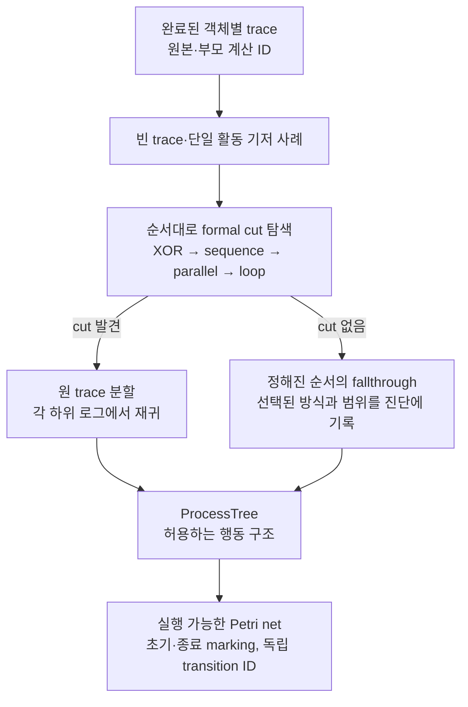

# PIX 로그 기반 Inductive Miner 구현 명세

기준일: 2026-09-10. 구현 식별자 `pix.im.v1`, noise threshold `0`, 최대 재귀 깊이 기본값 `128`.

이 문서는 [discovery.py](../../src/pix/compute/discovery.py)의 실제 구현 범위를 설명한다. 반환값은 기존 `ProcessTree`이며, 기존 Petri net 변환과 계산 결과 계약을 그대로 사용한다. `pix.im.v1`은 **아래에 고정한 로그 기반 IM 프로필**이다. 특정 PM4Py/ProM 배포판, 2013년 B′, 2017년 논문의 모든 개선사항과 같은 tree를 생성한다는 뜻은 아니다.

기존 `pix.inductive_cut.v1`은 기본 선택으로 유지한다. 그 이름의 tree 발견 규칙·기존 매개변수·요청 식별자 생성 규칙을 바꾸지 않았으며, 새 IM을 쓰려면 알고리즘을 명시적으로 선택한다. 두 프로필 모두 정상 완료된 상위 trace의 정책 경고를 보존하도록 경고 전달은 보완했다.

## 무엇이 구현되었는가

입력은 계산이 완료된 **객체별 TraceSet**이다. 객체형·qualifier·동시각 처리 정책은 상위 trace 계산의 조건이며 부모 계산 ID로 연결된다. DFG를 trace 입력으로 자동 변환하지 않는다. 별도로 추출한 execution을 자동으로 case로 간주하지도 않는다.

두 프로필의 차이는 다음과 같다.

| 항목 | 기존 `pix.inductive_cut.v1` | 새 `pix.im.v1` |
|---|---|---|
| XOR | 직접선행 그래프의 약연결 성분 | 동일한 formal cut |
| Sequence | Plain sequence | 동일한 formal cut |
| Parallel | 초기 모든 성분이 시작·종료 조건을 만족할 때만 선택 | 필요한 성분을 결합하여 유효한 최대 분할을 구성 |
| Loop | 시작·종료를 body로 놓고 segment 경계만 확인 | 여섯 formal 조건에 따라 body 확장·redo 경계의 완전연결 확인 |
| Activity fallthrough | 없음 | 모든 trace에 한 번 등장하는 활동, 활동 제거로 cut을 드러내는 경우 |
| Tau-loop | 엄격한 경계 분할 | 엄격한 경계 분할 후 일반 시작 활동 기준 분할 |
| 최후 flower | 해당 alphabet의 비어 있지 않은 모든 문자열 | epsilon을 포함하는 모든 문자열 |

## Cut의 실제 의미

아래 formal cut은 **19쪽 분량인 2013 저자본의 Definitions 5–8**에 따른다. Trace를 DFG로 대체해서 모델을 만드는 방식이 아니라, DFG로 분할 조건을 찾고 **원 trace를 분할**한다. [Leemans·Fahland·van der Aalst, 2013](https://leemans.ch/publications/papers/pn2013leemans.pdf)

| Cut | 그룹 사이에서 확인하는 조건 | 원 trace의 분할 |
|---|---|---|
| XOR | 서로 다른 그룹 사이 직접선행이 없음 | trace 전체를 소속 그룹에 배정 |
| Sequence | 앞 그룹에서 뒤 그룹으로 도달 가능하고 역방향 도달은 불가능 | 각 그룹의 활동만 순서대로 남김. 빈 projection도 보존 |
| Parallel | 서로 다른 그룹의 모든 활동 쌍에 양방향 직접선행이 존재. 각 그룹에 로그의 시작 활동과 종료 활동이 존재 | 그룹별 projection을 보존하고 병렬 결합 |
| Loop | 시작·종료 활동은 body에 포함. body→redo는 종료 활동에서만, redo→body는 시작 활동으로만 연결. 서로 다른 redo끼리는 연결되지 않음. redo의 경계 활동은 body의 모든 시작/종료 활동과 필요한 방향으로 연결 | body·각 redo의 연속 segment를 따로 모음 |

Sequence는 서로 양방향으로 도달하거나 어느 방향으로도 도달하지 못하는 활동을 합친 뒤, 남은 그룹을 순서화한다. 모든 비교는 trace에 실제 나타난 활동에 대해서만 수행한다.

Parallel의 초기 그룹은 양방향 직접선행 조건 때문에 더 나눌 수 없는 단위다. 시작·종료를 모두 가진 단위를 유지하고, 시작만 가진 단위와 종료만 가진 단위를 짝짓는다. 남은 단위는 결정적인 순서로 결합한다. 이는 시작·종료 조건을 충족하면서 얻을 수 있는 최대 그룹 수를 보존한다. 후보가 여럿이면 활동명 정렬로 선택하며, 정렬이 인과관계를 입증한다고 해석하지 않는다.

Loop는 시작·종료 집합을 초기 body로 정한다. 나머지의 약연결 성분 중 경계 조건을 위반한 성분 전체를 body로 흡수한다. 남은 성분들을 독립 redo로 유지한다. `ProcessTree`의 loop가 이항이므로 여러 redo는 XOR로 묶어 `body · (redo · body)*`로 표현한다.

예를 들어 `{ABD, ABDCABD}`에서 시작 A와 종료 D만 body에 놓으면 내부 활동 B를 잘못된 redo로 취급하게 된다. 새 detector는 B를 body로 합쳐 **body=ABD, redo=C**를 찾는다.

`{ACB, CBAB, CAB, ABC}`에서는 초기 parallel 후보 `{A}`, `{B}`, `{C}` 중 A에는 종료가, B에는 시작이 부족하다. `{A,B}`를 결합하고 `{C}`를 남겨 두 그룹을 얻는다. 이 표는 **그 단계의 분할**이며 각 하위 로그의 후속 발견이 허용 행동을 추가로 일반화할 수 있다.

## Cut이 없을 때의 선택

정해진 순서는 다음과 같다. 여러 후보 활동이 있으면 사전식 순서로 선택한다. 이 정책들은 [Leemans의 2017 박사논문 §6.1.2](https://leemans.ch/publications/theses/phd.pdf), 인쇄 pp195–198의 practical fallthrough 및 별도 `flowerModelWithEpsilon` 선택을 근거로 한다.

1. **Activity once:** 모든 trace에 정확히 한 번 나타난 활동을 병렬 branch로 분리한다.
2. **Activity concurrent:** 한 활동을 제거했을 때 보완 로그에 비자명한 structural cut이 드러나면 그 활동을 병렬 branch로 분리한다. 보완 로그에 epsilon이 있으면 이 witness 조건을 충족하지 않는다. 단일 활동 기저 사례나 나중의 flower 성공만으로 통과시키지 않는다.
3. **Strict tau-loop:** 관측 종료 활동 바로 다음에 관측 시작 활동이 나타나는 위치에서 분할한다.
4. **General tau-loop:** 관측 시작 활동이 다시 나타나는 위치에서 분할한다.
5. **Flower with epsilon:** 앞의 방식이 모두 실패하면 해당 alphabet의 모든 문자열과 빈 문자열을 허용한다.

Tau-loop는 실제 분할이 생겨야 선택한다. 활동 제거·cut은 alphabet을 줄이고, tau-loop는 segment 길이를 줄인다. 이는 재귀 종료의 근거다. 별도로 설정한 깊이 제한에 도달하면 모델을 일부 반환하지 않고 `UNAVAILABLE`을 반환한다.

각 fallthrough에는 `im_activity_once_fallthrough`, `im_activity_concurrent_fallthrough`, `im_tau_loop_fallthrough`, `flower_fallthrough` 중 해당 진단이 붙는다. 진단의 위치는 **재귀 계산 경로**이며, 정규화·평탄화가 끝난 tree의 노드 번호가 아니다. Flower 진단에는 alphabet과 epsilon 허용 여부가 명시된다.

예를 들어 `{AD, AE, BE, BF, CF, CD}`에서 앞의 cut·fallthrough를 찾지 못하면 flower를 반환한다. 계산이 완료되었다는 사실은 이 모델이 정밀하다거나 실제 업무 제약을 복원했다는 뜻이 아니다.

## 빈 trace, multiplicity, 실패의 의미

- 객체가 하나도 없는 모집단은 `UNAVAILABLE`이다. 관측이 없다는 사실을 silent process 발견으로 바꾸지 않는다.
- 객체는 있으나 선택된 event가 없는 trace들만 있으면 tau다.
- 빈 trace와 비어 있지 않은 trace가 함께 있으면 XOR(tau, 나머지 모델)이다. 이는 2013 B′의 mixed-epsilon flower 정책과 다르다.
- 모델 발견은 distinct trace support를 사용한다. 이번 프로필의 noise-free cut·기저·fallthrough 조건은 양의 빈도 배수에 영향을 받지 않는다. 원본 객체 수와 빈도 근거는 상위 trace 결과에 유지되며, 빈도 통계를 새로 계산했다고 주장하지 않는다.
- 상위 `INVALID_INPUT`은 그 상태·원인을 보존한다. `UNAVAILABLE`·`PARTIAL`은 완전한 trace 모집단을 확보하지 못했으므로 값 없는 `UNAVAILABLE`로 반환하고 원래 원인과 부모 계산 ID를 유지한다.
- 정상 완료된 trace에 동시각의 명시적 순서 결정 같은 정책 경고가 있으면 발견 결과에서도 유지한다. 깊이 제한으로 발견이 중단되어도 해당 상위 근거는 남긴다.
- `noise_threshold != 0`은 지원하지 않는다. 요청한 값을 무시하거나 다른 알고리즘으로 바꾸지 않는다.

## 명시적인 지원 경계

구현된 범위는 이 문서의 네 formal cut 전체, 그에 따른 trace split, 기저 사례, 정해진 practical fallthrough, ProcessTree와 Petri net 변환이다.

이번 프로필에는 **IMf·IMd·IMin, strict-sequence의 optional-block refinement, minimum-self-distance를 사용하는 추가 병렬 제한**이 포함되지 않는다. 따라서 2017 논문의 기본 구현 전체나 현재 PM4Py 기본 IM과의 동일성은 주장하지 않는다. 무관한 알고리즘 이름 `IM`, `IMf`, `IMd` 등을 이 프로필의 alias로 등록하지 않았다.

모델의 fitness 수치는 discovery가 계산하지 않는다. 모든 입력 trace를 허용하도록 분할·결합하였다는 계약과, 별도의 replay/alignment 평가를 구별한다. 실제 생성 과정의 rediscoverability·정밀도·대용량 처리 한계는 이번 유한 테스트만으로 알 수 없다.

## 검증과 판본

[기존 프로필 회귀 시험](../../tests/compute/test_discovery.py), [새 IM 독립 시험](../../tests/compute/test_inductive_miner.py), [formal cut 정의 oracle](../../tests/compute/test_im_cut_definitions.py)은 다음을 검사한다.

- 손으로 정한 sequence·choice·parallel·loop·optional behavior의 수용과 거부.
- 내부 활동을 body로 합쳐야 하는 loop 및 시작·종료 후보를 합쳐야 하는 parallel.
- 선택한 fallthrough와 실제 generalization, 빈 trace, 반복 활동, DFG 입력 거부, 상위 실패 원인, 깊이 제한.
- ProcessTree 의미에서 별도로 생성한 유한 언어와, Petri net의 토큰 방정식으로 계산한 수용 언어.
- 소형 모델의 모든 도달 marking에서 종료 가능성, 정상 종료 시 잔여 token 없음, dead transition 없음.
- 동일한 원본·매개변수에서 결과의 결정성, 부모 계산 계보, 기존 프로필의 동작 유지.

2026-09-10의 Python 3.11 실행에서 위 세 파일의 **93개 시험이 7.87초에 통과**했다. Ruff 검사와 서식 검사도 통과했다. 새 IM 시험은 epsilon과 길이 4 이하의 3활동 trace들로 구성한 **7,260개 trace 쌍**을 포함한다. Formal oracle은 활동 1–3개의 실현 가능한 모든 그래프·시작·종료 조합 **12,922개**와 고정 seed의 4활동 조합 **200개**에서 모든 partition을 별도로 열거해 유효성·최대 분할 수·cut 우선순위를 비교한다. 이 조합 수는 pytest의 독립 test case 수와 구별한다.

검증에 PM4Py/OCPA runtime을 사용하지 않는다. 각 유한 시험의 성공은 특정 라이브러리와의 동등성이나 모든 크기에서의 성능 증명이 아니다. 이 증분의 Python 3.10 실행은 운영체제 Application Control 제한 때문에 수행하지 못했으며, Python 3.11 검증과 구분해서 기록한다.

원문 판본을 혼동하지 않도록 연구 검토 시 내려받은 SHA-256을 기록한다.

| 자료 | 판본·참조 위치 | SHA-256 |
|---|---|---|
| [PN2013 저자본](https://leemans.ch/publications/papers/pn2013leemans.pdf) | 전체 19쪽 분량, Definitions 5–8 및 §6.3 | `9bdb53177e1c8552004c73cc2445b21dbfab8bc0f93551fe8af39e989214b953` |
| [2017 박사논문](https://leemans.ch/publications/theses/phd.pdf) | §6.1.2, 인쇄 pp195–198 | `7ff4ca957ff868cfbd6c78547a109fed7e5ff9263384325ff5e5afd743fb4b06` |

일부 검색 색인이 다른 기술보고서의 sequence 정의를 섞어 보여주었으므로, 이 구현의 formal cut 근거는 위 19쪽 분량의 저자본으로 고정했다.

이 명세의 유효 범위는 `pix.im.v1`과 위 코드·시험의 현재 정의다. 관측 trace를 수용하지 못하는 반례, 정의상 가능한 cut을 놓치는 반례, 기존 프로필의 식별자가 바뀌는 반례가 발견되면 해당 구현 완료·호환성 판단을 철회하고 수정해야 한다.
