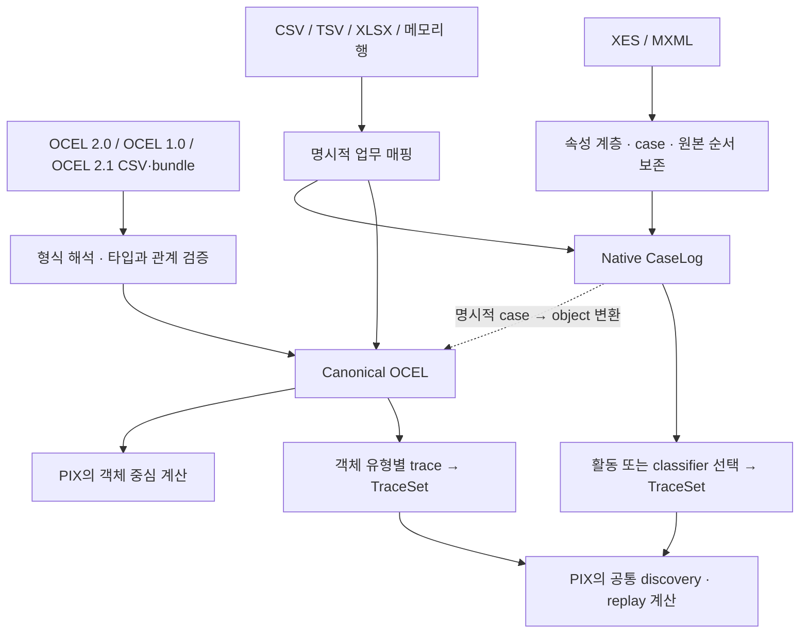

# PIX 0.5 입력 구조와 지원 범위

작성 기준: 2026-09-12, PIX 0.5.0 구현. 이 문서에서 **지원**은 아래에 명시한 입력 프로파일을 읽고 검증한다는 뜻이다. 모든 생산자가 내보내는 변형이나 표준의 모든 선택 기능에 대한 인증을 뜻하지 않는다. 테스트 결과는 마지막 절에 별도로 기록한다.

## 1. 입력 형식과 분석 의미를 나누는 구조

OCEL은 하나의 이벤트가 여러 객체와 관계를 맺는 사실을 담는다. XES·MXML은 trace에 포함된 이벤트의 순서와 case 속성을 담는다. 예를 들어 주문·품목·송장이 연결된 출고 이벤트와, 하나의 case 안에서 `접수 → 처리 → 종료` 순서로 기록된 이벤트는 출발점이 다르다.

PIX는 이 차이를 입력 단계에서 유지한다. OCEL 계열은 기존 immutable canonical `OCEL`로, XES·MXML과 case 매핑 표는 새 immutable `CaseLog`로 받는다. 일반 업무 표는 사용자가 case와 객체 중 어느 해석을 원하는지 매핑으로 지정한다. 파일을 읽기 위해 PM4Py나 OCPA를 실행하지 않는다.



이 구조에서 계산 알고리즘의 구현 주체도 PIX다. 두 입력 모델을 둔다고 해서 discovery나 replay를 라이브러리별로 다시 만드는 것은 아니다. `CaseLog`에서 선택한 활동열과 OCEL에서 선택한 객체 유형의 활동열은 공통 `TraceSet` 계약으로 연결된다. case projection은 discovery, classical replay, alignment, precision 경로에 연결된다. 모든 계산 함수가 `CaseLog`를 직접 받는다는 뜻은 아니다. 기존 constraint 평가와 시간·객체 중심 계산은 각 함수가 요구하는 OCEL 또는 OCEL trace 계약을 유지한다.

시각이 없는 XES도 원본 순서와 활동이 있으면 순서 기반 분석에 사용할 수 있다. 이때 시각은 **알 수 없음**으로 남으며 임의의 epoch나 자정으로 채워지지 않는다. 해당 입력을 저장할 수 있다는 사실과, 시간 간격을 계산할 수 있다는 판단은 별개다.

## 2. 지원하는 입력

| 입력 | 파일·경로 | PIX 내부 결과 | 해석 조건 |
| --- | --- | --- | --- |
| OCEL 2.0 JSON | JSON, JSON-OCEL 계열 및 gzip | `OCEL` | 기존 타입·관계·속성 이력 검증 적용 |
| OCEL 2.0 XML | XML, XML-OCEL 계열 및 gzip | `OCEL` | 기존 OCEL 2.0 XML 프로파일 |
| OCEL 2.0 SQLite | SQLite 파일 | `OCEL` | OCEL 2.0 테이블 구조; SQLite gzip은 지원하지 않음 |
| OCEL 1.0 JSON | JSON-OCEL 계열 및 gzip | `OCEL` | 관측된 primitive 값에서 타입 선언을 재구성; 변환 내역 기록 |
| OCEL 1.0 XML | typed XML 및 gzip | `OCEL` | 지원하는 OCEL 1.0 XML 구조; 임의의 XML을 추정하지 않음 |
| PM4Py classic SQLite | `EVENTS`·`OBJECTS`·`RELATIONS` 구조의 SQLite | `OCEL` | 명시적인 호환 dialect; 공식 OCEL 2.0 SQLite와 구별 |
| OCEL 2.1 compact CSV | `.ocel.csv`, `.ocel.csv.gz` | `OCEL` | `2.1.0pre4` PDF의 compact CSV 프로파일 |
| OCEL 2.1 CSV bundle | `.ocel.zip` 또는 `ocel-meta.json`이 있는 디렉터리 | `OCEL` | metadata가 선언한 CSV 테이블, 타입, 관계 사용 |
| OCEL 2.1 Parquet bundle | 같은 bundle 구조 | `OCEL` | 추가 의존성 `pyarrow` 필요; 물리 타입·논리 타입·nullable 선언 검사 |
| XES | `.xes`, `.xes.gz`; 내용으로 판별 가능한 XML | `CaseLog` | case 기반 XES 보존 프로파일; 상세 제한은 아래 참조 |
| MXML | `.mxml`, `.mxml.gz`; `WorkflowLog` XML | `CaseLog` | `Process`·`ProcessInstance`·`AuditTrailEntry` 구조 |
| 일반 CSV·TSV | `.csv`, `.tsv` 및 gzip | 매핑에 따라 `CaseLog` 또는 `OCEL` | case/activity/time/객체 관계를 명시적으로 지정 |
| Excel | `.xlsx` | 매핑에 따라 `CaseLog` 또는 `OCEL` | 추가 의존성 `openpyxl`; 복수 sheet는 선택 필요 |
| 메모리의 행 목록·iterator | 열 이름을 key로 갖는 mapping 행 | 매핑에 따라 `CaseLog` 또는 `OCEL` | DB 조회 결과도 이 형태로 전달 가능 |

`.csv`와 `.ocel.csv`는 같은 의미가 아니다. 전자는 업무 컬럼의 의미를 지정해야 하는 일반 표이고, 후자는 OCEL의 이벤트·객체·관계·속성 변경 문법을 갖춘 교환 형식이다. 빈 XML처럼 파일명과 내용만으로 판별이 모호하면 `format="ocel10-xml"`, `format="ocel21-csv"`, `format="xes"`처럼 해석기를 지정할 수 있다. `format`은 해석기 선택이며 case↔object 변환 지시가 아니다.

## 3. OCEL 2.1에서 추가한 것은 무엇인가

공식 overview는 OCEL 2.1 변경분으로 compact CSV와 CSV/Parquet bundle을 소개한다. bundle도 OCEL 2.0 로그를 테이블 묶음으로 저장하며, metadata의 버전 필드는 `ocelVersion="2.0"`, `bundleFormatVersion="1.0"`이다. 따라서 이번 구현은 기존 OCEL 모델에 **새 입력 어댑터를 연결**하는 방식이다. [공식 overview](https://www.ocel-standard.org/specification/overview/), [공식 bundle 설명](https://www.ocel-standard.org/specification/formats/bundled/)

compact CSV는 한 표에서 이벤트 행, 객체 간 관계 행, 객체 선언 행, 객체 속성 변경 행을 구분한다. bundle은 이벤트 유형별 테이블, 객체 유형별 테이블, 속성 변경 테이블, E2O·O2O 관계 테이블을 분리한다. bundle은 파일 이름에서 타입을 추정하지 않고 metadata의 연결을 따른다. [공식 CSV 설명](https://www.ocel-standard.org/specification/formats/csv/), [공식 bundle 설명](https://www.ocel-standard.org/specification/formats/bundled/)

이번에 고정한 명세는 [공식 링크의 PDF](https://www.ocel-standard.org/2.1/ocel20_specification.pdf) **2.1.0pre4, 2026-08-24**다. 문서 내용 식별자는 다음과 같다.

```text
SHA-256: b4fa1e9bcbc2c99b8c2f1aea4cb708fccb5e635070fd3474e07997f071e3b42e
compact profile: pix.ocel21-compact-csv.2.1.0pre4.v1
```

확인 시점의 웹 요약은 객체 참조의 구분 문자 escape를 허용하지 않는다고 적고, 첫 timed 속성 대입을 base 값으로 설명한다. 연결된 pre4 PDF는 backslash escape를 정의하고 첫 timed 대입도 실제 시각에 남긴다. PIX는 **PDF 판본**을 기준으로 구현하며, 적용한 판본을 import 변환 기록에 남긴다. 이 구분 없이 “OCEL 2.1 완전 준수”라고 선언하지 않는다. [웹 요약의 해당 설명](https://www.ocel-standard.org/specification/formats/csv/), [기준 PDF](https://www.ocel-standard.org/2.1/ocel20_specification.pdf)

예를 들어 처음 관측된 가격이 9월 1일에 100원이었다면, 그 사실을 1970년부터 100원이었다는 초기값으로 바꾸지 않는다. 시각 없는 객체 선언의 초기값만 OCEL의 epoch 관례를 쓴다. 이 차이는 속성 이력에 의존하는 분석 결과에 영향을 줄 수 있다.

## 4. XES와 MXML에서 보존하는 정보

`CaseLog`는 trace와 event의 원본 순서, 빈 trace, trace/event/log 속성, XES extension 선언, global 기본값, classifier 정의를 담는다. XES의 `string`, `date`, `int`, `float`, `boolean`, `id`, `list` 및 호환용 `container` 구조를 보존한다. 원본의 속성 계층과 내부 식별자는 분리되므로 이름이 같은 두 trace를 임의로 하나의 case로 합치지 않는다.

XES의 날짜가 없거나 timezone이 없는 경우, 원본 정보를 저장하는 단계에서 이를 만들어 넣지 않는다. 분석에 쓸 활동은 기본적으로 `concept:name`에서 선택하고, 필요하면 선언된 event classifier를 선택한다. 복수 속성 classifier의 값은 타입을 포함한 조합으로 표현하므로 `A+B, C`와 `A, B+C`처럼 구분자를 포함한 값이 충돌하지 않는다.

```python
from pix import import_log, read_log
from pix.event_log import CaseTraceSpec, case_traces

# 진단을 먼저 보는 경로
result = import_log("purchase.xes.gz")
print(result.describe())
case_log = result.require_case_log()

# 유효하지 않으면 진단을 가진 예외를 내는 간편 경로
same_kind_of_log = read_log("purchase.xes.gz")

# 원본 순서에 기반한 공통 분석 입력. timestamp를 새로 만들지 않는다.
trace_result = case_traces(case_log, CaseTraceSpec())

# 파일에 선언된 classifier 이름을 선택할 때만 지정한다.
# trace_result = case_traces(case_log, CaseTraceSpec(classifier="Activity"))
```

현재 XES 지원은 공개된 정의와 XSD를 참고한 구체적인 보존 프로파일이다. 전체 IEEE 1849-2023 조항에 대한 인증이나 완전한 XSD validation을 주장하지 않는다. XML 공백·주석의 byte 단위 복원도 범위에 포함되지 않는다. [IEEE Task Force의 XES 정의](https://www.tf-pm.org/resources/xes-standard/for-researchers/ieee-1849-2016-xes/definition), [공개 XSD](https://www.tf-pm.org/upload/1581071084733.xsd)

## 5. case 로그를 OCEL로 바꿀 때의 의미

case 로그에 기존 OCEL 기반 계산을 적용하려면 `to_ocel`을 명시적으로 호출한다. trace 하나가 `case` 타입 객체 하나가 되고, 각 event가 그 객체에 `case` qualifier로 연결된다. 빈 trace도 이벤트 없는 객체로 유지된다. trace 속성은 관측된 변경 시점이 없는 초기 객체 속성이 된다.

```python
from pix.event_log import CaseOCELMapping, to_ocel

conversion = to_ocel(
    case_log,
    CaseOCELMapping(case_object_type="order_case", qualifier="case"),
)
ocel = conversion.require_ocel()
original_case_log = conversion.source_log
```

이 projection은 주문·품목·송장이라는 객체 구조를 자동 복원하지 않는다. 하나의 case를 하나의 객체로 표현한다는 해석만 추가한다. 이벤트의 timezone이 있는 시각이 없거나, 중첩 속성을 canonical OCEL의 primitive 값으로 표현할 수 없거나, 동일한 속성의 타입이 충돌하면 변환을 거절한다.

변환이 성공해도 OCEL 자체에 XES classifier 정의나 원본 trace 순서를 저장할 자리가 생기는 것은 아니다. XES `id`는 OCEL string 속성이 되고, global 기본값은 적용된 속성값으로 투영된다. 원래 타입·계층·global·classifier·순서와 매핑은 `CaseOCELConversion.source_log` 등에 함께 보존된다. **OCEL 파일만 따로 내보내면 이 부가 정보까지 함께 저장된 것으로 간주할 수 없다.** 여기서 sidecar는 변환 결과에 붙은 원본 `CaseLog`를 뜻하며 별도 파일의 자동 생성을 뜻하지 않는다.

## 6. 업무 표에서는 사용자가 분석 의미를 지정한다

일반 표의 `OrderId`가 case인지, 이벤트에 연결된 여러 객체 중 하나인지 PIX가 추측하지 않는다. case 중심이라면 `CaseTableMapping`, 여러 객체를 가진 이벤트라면 `OCELTableMapping`을 사용한다. 같은 표라도 두 선택은 다른 분석 대상을 만든다.

아래 예는 메모리 행을 바로 읽는 완결된 예시다. 같은 매핑을 `read_log("events.csv", mapping=mapping)` 또는 `read_log("events.xlsx", mapping=mapping, sheet="Events")`에 적용할 수 있다.

```python
from pix import read_log
from pix.tabular import AttributeColumn, CaseTableMapping

mapping = CaseTableMapping(
    case_id="OrderId",
    activity="Activity",
    timestamp="OccurredAt",
    event_id="EventId",
    event_attributes=(AttributeColumn("Cost", "float"),),
)
rows = [
    {
        "OrderId": "0007",
        "Activity": "접수",
        "OccurredAt": "2026-09-01T09:00:00+09:00",
        "EventId": "E-1",
        "Cost": "12.5",
    },
]
case_log = read_log(rows, mapping=mapping)
```

기본값은 원본 행 순서이며, 같은 case가 떨어진 행에 나와도 모은 뒤 그 순서를 유지한다. 시간순 정렬은 `order="timestamp"`로 지정하고, 동일 시각의 행은 원본 순서를 유지한다. `timestamp`와 `event_id` 열은 case 매핑에서 생략할 수 있다. 이때 시각은 없고, 이벤트를 구분할 내부 행 식별자를 부여했다는 기록이 남는다.

객체 중심 해석에서는 객체 타입과 관계 qualifier까지 지정한다.

```python
from pix.tabular import ObjectColumn, OCELTableMapping

object_mapping = OCELTableMapping(
    event_id="EventId",
    activity="Activity",
    timestamp="OccurredAt",
    objects=(
        ObjectColumn("OrderId", object_type="order", qualifier="order"),
        ObjectColumn(
            "ItemIds", object_type="item", qualifier="item", encoding="json"
        ),
    ),
)
# ItemIds는 예를 들어 '["I-1", "I-2"]'인 JSON 배열 열이다.
# ocel = read_log("events.csv", mapping=object_mapping)
```

같은 event ID가 여러 행에 있으면 활동·시각·event 속성이 일치할 때만 관계를 모은다. 동일 E2O 관계의 중복은 기본적으로 오류이며, 의도한 중복 제거만 `duplicate_relations="deduplicate"`로 선택한다. 하나의 객체에 상충하는 정적 속성을 주면 임의로 마지막 값을 고르지 않는다.

ID는 기본적으로 문자열이며 `0007`의 앞자리 0을 보존한다. Excel의 숫자 ID를 허용하려면 정수 ID 정책을 명시해야 한다. 빈 문자열, 누락 열, `None`, 업무상 null 표시는 같다고 가정하지 않으며 `AttributeColumn`에서 정책을 정한다. timezone 없는 표의 시각도 기본적으로 오류다. `timestamp_policy="assume_utc"`를 선택하면 그 가정이 변환 기록에 남는다.

## 7. 진단과 재현 근거

`import_log`는 성공 여부만 반환하지 않는다. source 경로, 읽을 수 있었던 원본의 SHA-256과 크기, 형식, 실패 단계와 코드, 변환 내역을 담는다. `read_log`는 유효한 native 로그를 꺼내고, 실패하면 이 진단을 가진 예외를 낸다. 업무 매핑은 데이터와 별도로 fingerprint를 가지므로 같은 파일을 다른 case 정의로 해석한 실행을 구분할 수 있다. `pix.api` facade에서도 공통 import 함수, case trace projection, 명세와 매핑 타입을 제공한다.

OCEL 1.0의 qualifier 부재는 빈 qualifier로, 시각 없는 객체 속성은 초기값으로 표현하며 그 선택을 기록한다. 기존 입력에 없던 O2O 관계나 속성 변경 이력은 생성하지 않는다. 관측된 속성에서 타입을 재구성할 때 충돌하면 임의의 string 변환으로 덮지 않는다.

원본 식별과 의미 식별도 구별한다. gzip 포장이나 ZIP member 순서가 달라지면 원본 hash는 바뀔 수 있다. 내용이 같다면 canonical OCEL digest는 같을 수 있다. 디렉터리 bundle은 정렬된 상대 경로와 파일 내용을 길이 정보와 함께 묶어 digest를 만든다. `CaseLog` digest는 source 경로를 제외한 원본 순서와 속성 사실을 식별한다.

## 8. 현재 경계와 설치 선택

핵심 import 경로는 Python 표준 라이브러리로 동작한다. XLSX에는 `openpyxl`, Parquet bundle에는 `pyarrow`를 선택적으로 설치한다. 두 라이브러리는 파일을 읽는 역할이며 process mining 계산 의존성이 아니다.

```console
python -m pip install -e ".[excel]"
python -m pip install -e ".[parquet]"
# 둘 다 필요한 경우
python -m pip install -e ".[imports]"
```

| 경계 | 현재 동작과 의미 |
| --- | --- |
| XES XML | XML 1.0, 최대 계층 깊이 128. DTD·entity·외부 참조·processing instruction은 거절. XML 1.1과 trace 밖의 독립 event는 지원하지 않음 |
| 날짜 정밀도 | Python `datetime`으로 정확히 표현 가능한 범위와 microsecond 정밀도. 표현 불가능한 추가 정밀도나 날짜를 조용히 잘라서 받지 않음 |
| OCEL의 시각 해석 | 날짜만 있는 값, week date, 시간·분의 소수 표현을 이벤트 시각으로 추정하지 않음. 기존 OCEL 입력의 timezone 없는 시각을 UTC로 보는 정책은 경고와 함께 유지되며, 일반 표의 기본 정책과 다름 |
| 시간 없는 case | 원본 보존 및 순서 기반 projection 가능. 실제 시간 간격과 timezone은 알 수 없음 |
| OCEL 1.0 속성 | 지원하는 primitive 타입만 변환. 중첩 list/map을 임의 문자열로 평탄화하지 않음. XML 어댑터는 전체 XML tree를 사용함 |
| compact CSV | PDF pre4 프로파일. canonical 모델에 없는 JSON null 거절. 같은 객체·속성·시각의 중복 대입 거절. 분·시간의 소수 표현은 거절. text float의 최단 표기 판정은 Python binary64 `repr` 정책 사용 |
| bundle 값 | CSV의 빈 속성 칸은 누락이며 empty string과 구별할 수 없음. Parquet의 nullable 속성은 누락을 표현할 수 있지만 OCEL의 별도 null 값은 만들지 않음 |
| bundle 변경 시각 | 객체 테이블의 초기값은 epoch 관례. 변경 테이블의 epoch 시각 대입과 같은 객체·속성·시각의 중복 대입은 거절 |
| bundle 컨테이너 | 해제 후 크기 최대 512 MiB, 항목 최대 100,000개. ZIP을 디스크에 풀지 않음. 경로 탈출·symlink·중복 member 거절. 안전한 미선언 부가 파일은 로그 테이블로 해석하지 않고 제외 사실을 기록 |
| SQLite 두 dialect | standalone 파일만 지원. WAL 모드와 journal sidecar가 있는 DB는 거절하며 임의 checkpoint를 수행하지 않음 |
| Excel | `.xlsx` 지원. `.xls` 미지원. 복수 sheet의 선택을 요구하며 formula나 의미가 모호한 merged cell을 평가·추정하지 않음 |
| 일반 DB | 연결 정보·인증·네트워크 조회를 수행하는 connector는 없음. 조회한 행을 mapping iterable로 받음 |
| 일반 Parquet | 임의 업무 Parquet의 매핑 입력은 없음. 이번 Parquet 지원은 OCEL bundle 전용 |
| 메모리와 성능 | canonical 결과 전체가 메모리에 존재함. 무제한 streaming 분석이나 특정 처리량을 보장하지 않음. 실제 업무 데이터의 처리량·최대 규모는 알 수 없음 |

## 9. 검증 기록과 판단의 유효 범위

형식별 테스트는 `tests/ocel/test_legacy_import.py`, `tests/ocel/test_legacy_sqlite_import.py`, `tests/ocel/test_compact_import.py`, `tests/ocel/test_bundle_import.py`, `tests/event_log/`, `tests/tabular/`에서 관리한다. 통합 진입점과 기존 계산으로의 연결은 별도의 통합 테스트에서 검증한다. 성공 fixture뿐 아니라 malformed 입력, 타입 충돌, 누락 시각, 잘못된 관계, parser 제한, 선택 의존성 유무를 확인한다.

2026-09-12 Windows / Python 3.11.15에서 전체 **4,184 tests + 284 subtests**가 통과했다. 새 import 단계의 테스트는 **540개**다. 기본 실행의 skip 14개 중 opt-in Chromium 13개는 별도 실행에서 모두 통과했고, 나머지 1개는 OS의 symbolic-link 생성 권한 때문에 실행하지 못했다. Windows junction 거절 검증은 통과했다. JavaScript 테스트 98개도 통과했다.

배포 wheel을 저장소 밖에서 `python -I`로 실행했다. PIX만 설치한 환경에서 import 통합 검증 20개, XLSX·Parquet 의존성을 설치한 환경에서 20개가 각각 통과했다. runtime 파일 106개의 source·wheel·설치본 바이트가 일치했다. 전체 lint, 변경 Python 파일 42개의 format, `git diff --check`도 통과했다. 기존 미변경 파일 6개의 formatter 차이는 별도로 남아 있다.

공개 inventory-management Parquet bundle과 대응 JSON은 **1,210 events / 1,701 objects / 5,767 E2O**로 동일한 canonical 결과를 만들었다. 이 사례는 실제 교환 파일 확인이며, 모든 생산자에 대한 호환성 수치는 아니다. 자세한 명령과 단계별 테스트 파일은 [0.5.0 검증 기록](../version/v0.5.0_IMPORT_IMPLEMENTATION.md), 원시 결과는 `.artifacts/v050/summary.json`과 `pytest.xml`에 있다.

이 문서의 지원 판단은 2026-09-12에 확인한 구현과 위 PDF hash에 한정된다. 명세 개정, 알려지지 않은 생산자 변형, 현재 프로파일에 속하는데도 의미가 달라지는 재현 입력이 발견되면 해당 지원 판단을 철회하거나 범위를 줄이고 regression test를 추가한다. 아직 실행하지 않은 OS·Python 조합과 실제 업무 데이터에 대한 성공률은 알 수 없다.

**판단:** 이번 범위의 import는 OCEL과 case 로그의 의미를 각 native 모델에 보존하고, 필요한 변환과 분석 입력을 명시적으로 연결하는 구조다. OCEL 2.1의 CSV·bundle을 위해 새 입력 해석은 필요하지만, 확인한 pre4 범위에서는 canonical 모델이나 계산 엔진을 별도로 복제할 근거가 없다.
