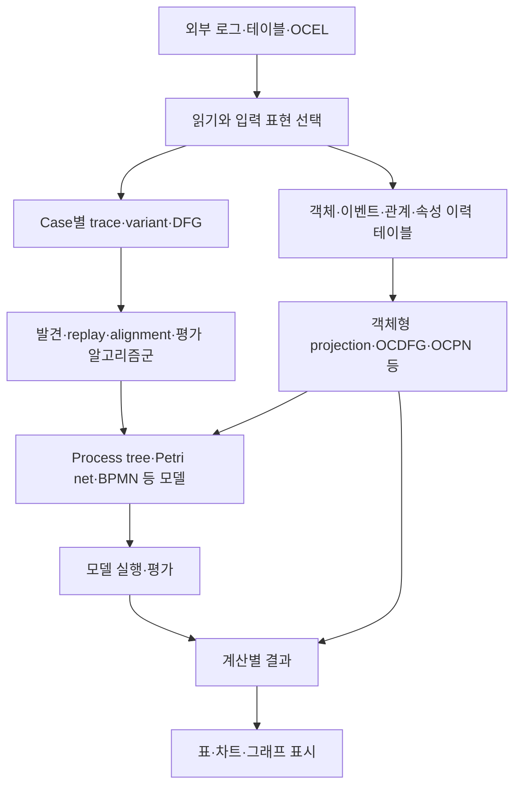
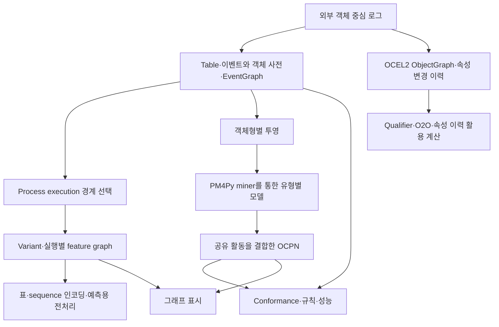

# PM4Py·OCPA 구조 재조사와 PIX 반영 검토

조사일: **2026-09-12**. 독자: Process Mining 도메인 전문가.
이 문서는 기존 조사, 이번에 추가로 확인한 사실, PIX에 대한 설계 제안을 구분한다.
제품의 목적은 PM4Py·OCPA의 계산을 PIX 안에 구현하는 독립 대체 엔진이다.
이번 작업은 문서·소스 조사이며 알고리즘 추가 구현이나 upstream 전체 실행 시험은 아니다.

**기존 문서는 다음 위치에 있다.**

| 문서 | 당시 기준 | 이미 조사한 내용 |
|---|---|---|
| [PM4Py 전체 구조](../pm4py/0_PM4PY_OVERALL_STRUCTURE_ANALYSIS.md) | 2026-07-19, 2.7.23.3 | 공개 API, 알고리즘 선택, 데이터·모델 객체, 계산군, 의존성 |
| [OCPA 전체 구조](../ocpa/0_OCPA_OVERALL_STRUCTURE_ANALYSIS.md) | 2026-07-23, 소스 1.3.3 | 복합 OCEL, execution·variant, OCPN, PM4Py 결합, 결과·캐시 |
| [데이터 모델 비교](0_OCPA_PM4PY_OCEL_DATA_MODEL_COMPARISON.md) | 2026-07-24/26 | OCEL 표준과 두 메모리 표현의 차이, 관계·속성 이력 보존 |
| [파일 I/O·표준 비교](1_OCPA_PM4PY_OCEL_FILE_IMPORT_AND_OCEL20_COMPLIANCE_COMPARISON.md) | 2026-07-25 | 형식별 parser, ID·qualifier·O2O·속성 타입, 제한된 실행 관찰 |
| [입출력·독립 엔진 제안](../../architecture/2_PIX_OCEL_IO_AND_INTEROPERABILITY_PROPOSAL.md) | 2026-09-09 | PM4Py 2.7.23.8, OCPA 배포본 1.3.4, OCEL 2.1 형식과 backend 구분 |
| [계산 의미·구조 검토](../../architecture/3_PIX_NATIVE_PROCESS_MINING_STRUCTURE_REVIEW.md) | 2026-09-09 | 실행 경계, variant 동치, 순서·집계, OCPN binding, 비용·분모·시간 의미 |
| [PIX 0.4.0 구현 기록](../../version/v0.4.0_MODEL_EVALUATION_IMPLEMENTATION.md) | 2026-09-10 | 위 제안 중 실제 구현·시험한 범위 |

9월 9일 문서의 “아직 구현되지 않음”은 당시 제안 상태다. 현재 PIX 구현 여부는 9월 10일
기록과 소스를 기준으로 구분해야 한다. 7월 조사와 9월 추가 조사를 한 시점의 조사로 합치지 않는다.

**조사 대상의 판본을 고정했다.**

| 대상 | 기존 로컬 기준선 | 이번 공식 소스·배포 조회 |
|---|---|---|
| PM4Py | 2.7.23.3 / `3329bbcbadce8764f7df660fd88636c30793fbd0` | 2.7.23.8 / `24a3bf610aea6ecc4938b1864b3ad71fcfb82084`, PyPI 표시일 2026-09-01 |
| OCPA | 소스 1.3.3 / `de056e0203a3fa4a9bbc19a95e001eada323074a` | main SHA 동일, PyPI 배포 버전 1.3.4, 표시일 2025-09-19 |
| PIX | 현재 저장소 | 0.4.0 / `cfb6ae3891835211eda1f73a5dc1be8def069912` 기준 |

이번에 조회한 upstream 버전은 9월 9일 기록과 같다. 아래의 “추가 확인”은 분석 깊이의
추가이며, 지난 조사 이후 새 배포가 나왔다는 뜻이 아니다. OCPA의 소스 버전과 배포 버전은
동일한 표기로 취급하지 않는다. 근거: [PM4Py 배포](https://pypi.org/project/pm4py/2.7.23.8/),
[PM4Py 고정 소스](https://github.com/process-intelligence-solutions/pm4py/tree/24a3bf610aea6ecc4938b1864b3ad71fcfb82084),
[OCPA 배포](https://pypi.org/project/ocpa/1.3.4/),
[OCPA 고정 소스](https://github.com/ocpm/ocpa/tree/de056e0203a3fa4a9bbc19a95e001eada323074a).

**PM4Py는 다양한 입력 표현과 알고리즘군을 연결한다.**

사용자는 읽기·발견·적합성·통계·시각화 같은 업무 기능으로 들어간다. 내부에서는 입력 표현을
확인하고, 해당 계산군과 알고리즘 변형을 선택하며, 필요한 자료구조로 바꾸어 실행한다.
결과는 계산에 따라 process tree, Petri net과 marking, 표, 사전, alignment 목록 등으로 달라진다.
패키지 수준에서는 `objects`, `algo`, `statistics`, `visualization`, `streaming` 등이 이 책임을 나눈다.
근거: [기존 전체 구조 분석](../pm4py/0_PM4PY_OVERALL_STRUCTURE_ANALYSIS.md),
[현재 공개 discovery 경로](https://github.com/process-intelligence-solutions/pm4py/blob/24a3bf610aea6ecc4938b1864b3ad71fcfb82084/pm4py/discovery.py).

OCEL 표현은 `events`, `objects`, `relations`, `o2o`, `object_changes` 같은 관계형 테이블을
중심으로 한다. 테이블에 정보를 담을 수 있는 능력과 특정 importer·algorithm이 그 정보를
보존하거나 활용하는 범위는 다르다. 모든 객체 중심 계산이 flattening을 거치는 것도 아니다.
근거: [OCEL 객체](https://github.com/process-intelligence-solutions/pm4py/blob/24a3bf610aea6ecc4938b1864b3ad71fcfb82084/pm4py/objects/ocel/obj.py).

예를 들어 객체형 하나를 case 관점으로 투영하면 공유 event가 여러 객체 trace에 나타난다.
그 결과를 전통 miner에 줄 수 있지만, 공동 객체 실행을 그대로 보존한 입력은 아니다.
또한 trace 입력을 DFG로 바꾸면 전체 경로 정보가 줄어든다. Inductive Miner의 DFG 경로는
IMd를 선택하므로 단순히 같은 계산을 더 빠르게 실행하는 변경으로 보면 안 된다.
근거: [flattening](https://github.com/process-intelligence-solutions/pm4py/blob/24a3bf610aea6ecc4938b1864b3ad71fcfb82084/pm4py/objects/ocel/util/flattening.py),
[Inductive 선택 경로](https://github.com/process-intelligence-solutions/pm4py/blob/24a3bf610aea6ecc4938b1864b3ad71fcfb82084/pm4py/algo/discovery/inductive/algorithm.py).

PIX에서 참조할 부분은 이 계산군 분해다. 채택 분류는 **CONCEPTUAL REUSE + INDEPENDENT REIMPLEMENTATION**이다.
입력 정보·알고리즘 변형·모델 의미가 바뀌면 별도 계산 정의로 식별해야 한다.

**OCPA는 객체 중심 실행을 구성하고 그 실행에서 여러 분석을 파생한다.**

OCPA의 OCEL은 하나의 테이블만 감싼 객체가 아니다. Table, 이벤트·객체 사전,
event-order graph를 묶고, OCEL 2.0 경로에서는 object graph와 object-change table도 연결한다.
Process execution과 variant는 이 복합 객체의 속성을 처음 조회할 때 계산·보관될 수 있다.
즉 원본 표현, 파생 표현, 계산 결과의 수명과 변경이 밀접하게 연결되어 있다.
근거: [복합 OCEL](https://github.com/ocpm/ocpa/blob/de056e0203a3fa4a9bbc19a95e001eada323074a/ocpa/objects/log/ocel.py),
[기존 전체 구조 분석](../ocpa/0_OCPA_OVERALL_STRUCTURE_ANALYSIS.md).

EventGraph의 선은 원본에 선언된 인과관계가 아니다. 확인한 생성 경로는 테이블 순서에서
같은 객체의 연속 event를 연결한다. Connected-components 추출과 leading-type 추출은
서로 다른 실행 경계를 만든다. Leading 관점에서는 공유 event가 여러 실행에 속할 수 있다.
근거: [EOG 생성](https://github.com/ocpm/ocpa/blob/de056e0203a3fa4a9bbc19a95e001eada323074a/ocpa/objects/log/variants/util/table.py),
[실행 추출](https://github.com/ocpm/ocpa/tree/de056e0203a3fa4a9bbc19a95e001eada323074a/ocpa/algo/util/process_executions).

Variant의 exact 옵션도 선택한 graph 표현에 대한 동형성을 검사한다. 그 표현에서 빠진
qualifier나 객체의 전역 연결 정보를 되살리지는 않는다. OCPN 발견의 내부 classical miner는
PM4Py를 호출하므로 PIX 대체 범위에는 이 내부 계산도 포함된다.
근거: [two-phase variant](https://github.com/ocpm/ocpa/blob/de056e0203a3fa4a9bbc19a95e001eada323074a/ocpa/algo/util/variants/versions/twophase.py),
[OCPN 발견](https://github.com/ocpm/ocpa/blob/de056e0203a3fa4a9bbc19a95e001eada323074a/ocpa/algo/discovery/ocpn/versions/new_inductive.py).

PIX에서 참조할 부분은 execution·variant·객체 context·feature graph의 분석 개념이다.
채택 분류는 **CONCEPTUAL REUSE + INDEPENDENT REIMPLEMENTATION**이다.
원본과 파생 자료를 여러 mutable 표현에 함께 보관하는 방식은 **REFERENCE ONLY**로 둔다.
이 판단은 가변 표현 자체가 항상 오류라는 뜻이 아니다. PIX가 요구하는 원본 보존과 결과 재현을
달성하려면 변경·동기화·캐시 무효화 책임을 별도로 증명해야 한다는 뜻이다.

**이번에는 같은 이름 뒤의 실행 경로를 더 좁혀 확인했다.**

| 추가 확인 | 확인된 사실 | PIX에서 검토할 의미 |
|---|---|---|
| PM4Py 설치 조건 | 현재 `pyproject.toml`과 PyPI metadata는 Python `>=3.11`; README에는 3.9/3.10 설치 설명도 남아 있음 | 비교 환경은 README 문장보다 배포 metadata·실제 설치 결과로 고정 |
| PM4Py 선택적 기능 | OCEL·Polars·시각화 등의 extras가 분리됨. Graphviz는 기본 의존성에 남아 있음 | core·I/O·표시 의존성을 구분하고, 설치된 backend도 계산 출처에 기록 |
| OCPA 이력 활용 | qualifier와 object-change table을 사용하는 별도 계산이 존재함 | “OCPA는 OCEL2 의미를 전혀 사용하지 않는다”는 일반화는 부적절 |
| OCPA 시점 조회 | 확인한 qualifier 규칙 helper는 해당 객체의 마지막 저장 행을 선택하며, 그 helper 안에서 event 시점 제한·시간 정렬을 하지 않음 | 당시 상태와 최신 상태를 서로 다른 질문으로 정의 |
| OCPA 예측 전처리 | execution graph ID를 섞어 train/validation/test를 나누고, scaler는 train에 fit한 뒤 나머지에 적용 | random seed의 재현성과 공유 event/object의 누출 방지는 별도 검증 |

설치 조건의 근거는 [고정 pyproject](https://github.com/process-intelligence-solutions/pm4py/blob/24a3bf610aea6ecc4938b1864b3ad71fcfb82084/pyproject.toml)와
[배포 metadata](https://pypi.org/project/pm4py/2.7.23.8/)다. 이는 PIX의 Python 지원 조건을 바꾸는 제안이 아니다.

OCPA의 시점 조회는 [E2O qualifier 규칙](https://github.com/ocpm/ocpa/blob/de056e0203a3fa4a9bbc19a95e001eada323074a/ocpa/algo/ocel2_use_cases/e2o_qualifier_conformance.py)에서 확인했다.
예를 들어 09:00에는 담당 권한이 없고 10:00에는 권한이 생긴 객체의 09:30 행위를 평가할 때,
최신 행을 쓰는 질문과 09:30 당시 값을 쓰는 질문은 다르다. 이 예시는 차이를 설명하는 가정이며
upstream 전체 실행의 재현 결과가 아니다. PIX는 조회 기준시각, 유효한 변경 기록, 값 부재를 함께 남기는 안이 적절하다.

예측 전처리의 근거는 [FeatureStorage](https://github.com/ocpm/ocpa/blob/de056e0203a3fa4a9bbc19a95e001eada323074a/ocpa/algo/predictive_monitoring/obj.py)다.
Leading execution이 겹치는 데이터에서는 execution ID를 분리해도 같은 event/object 근거가
여러 split에 나타날 가능성이 있다. 이는 구조에서 도출한 **조건부 추론**이며 실제 정확도 상승이나
누출 발생률을 측정한 주장이 아니다. PIX의 향후 feature 계약에는 관측 cutoff, target horizon,
실행 중첩, 분할 단위, scaler 학습 범위를 포함할 것을 제안한다.

**OCEL 보존은 형식·backend별로 판정해야 한다.**

관계형 테이블을 가진다는 사실만으로 파일 왕복이 무손실인 것은 아니다. 반대로 특정 JSON 경로의
필터링·qualifier 손실을 모든 형식에 적용해서도 안 된다. 기존 I/O 조사에 기록한 제한은 그
진입 경로와 backend 범위에서 읽어야 한다. Python 경로와 자동 선택되는 대체 backend도
독립된 비교 대상이다. 근거: [PM4Py 읽기 경로](https://github.com/process-intelligence-solutions/pm4py/blob/24a3bf610aea6ecc4938b1864b3ad71fcfb82084/pm4py/read.py),
[기존 I/O 재조사](../../architecture/2_PIX_OCEL_IO_AND_INTEROPERABILITY_PROPOSAL.md).

공식 사이트는 CSV와 bundled CSV/Parquet를 OCEL 2.1 개정의 직렬화로 안내한다.
Bundle 안의 의미 모델은 OCEL 2.0으로 표시될 수 있다. 따라서 표준 의미 모델 버전,
교환 형식 버전, 구현체 버전의 세 축을 구분해야 한다. 이 사실은 9월 9일 조사에도 있었다.
근거: [공식 개요](https://www.ocel-standard.org/specification/overview/),
[bundle 정의](https://www.ocel-standard.org/specification/formats/bundled/).

이번 소스 추적에서는 다음 네 경계를 추가로 확인했다.

| 경로 | 확인한 동작 | 해석과 검증 과제 |
|---|---|---|
| PM4Py bundle export | 다섯 입력 표를 복사한 후 참조·중복·속성 충돌 등을 검사. 7월 코드의 consistency 호출이 현재 경로에서는 제거됨 | “PM4Py export가 원본을 변경한다”는 포괄 판단을 적용하지 않음 |
| PM4Py bundle import | metadata·표·참조를 검사하고 consistency 적용. JSON 경로의 관계 전파 필터 호출은 없음 | JSON에서 관찰한 고립 event/object 제거를 bundle에도 일반화하지 않음 |
| PM4Py compact CSV | ID와 qualifier의 `\`, `/`, `#`, `{`를 escape하는 구현이 있음 | 공식 CSV 설명의 escape 없음과 구현 확장을 구분. 타 생산자와의 호환성은 미검증 |
| PM4Py Parquet bundle | UTC 마이크로초 Arrow 타입을 사용하고 쓰기 전에 시각을 마이크로초 단위로 내림 | 더 세밀한 원본 시각의 보존은 별도 문제. exporter의 절삭 거부 옵션만 보고 무손실 판정 금지 |

근거: [bundle exporter](https://github.com/process-intelligence-solutions/pm4py/blob/24a3bf610aea6ecc4938b1864b3ad71fcfb82084/pm4py/objects/ocel/exporter/bundled/variants/ocel20.py),
[bundle importer](https://github.com/process-intelligence-solutions/pm4py/blob/24a3bf610aea6ecc4938b1864b3ad71fcfb82084/pm4py/objects/ocel/importer/bundled/variants/ocel20.py),
[CSV exporter](https://github.com/process-intelligence-solutions/pm4py/blob/24a3bf610aea6ecc4938b1864b3ad71fcfb82084/pm4py/objects/ocel/exporter/csv/variants/ocel20.py),
[공식 CSV 문법](https://www.ocel-standard.org/specification/formats/csv/).

위 결과는 명시한 함수 경로의 정적 관찰이다. 실제 모든 타입의 왕복이나 다른 backend와의
동등성을 입증하지 않는다. 특히 CSV의 제한은 **공식 교환 문법**과 **PM4Py가 허용하는 문법**을
구분해 적어야 한다. PIX에 추가한다면 엄격한 표준 경로와 명시적 호환 경로를 나누는 안이다.

7월 기준 이후의 코드에는 영업시간 조건을 결과 객체와 함께 두는 `PerformanceDFG`와,
주어진 실행 의미에 전이 활성화·발화를 질의하는 `DIJKSTRA_SEMANTICS`도 확인된다.
이들은 각각 측정 조건과 결과의 연결, 실행 의미와 탐색 알고리즘의 분리라는 참조 사례다.
동명의 기능을 PIX가 이미 구현했다는 뜻은 아니다.
근거: [DFG 모델](https://github.com/process-intelligence-solutions/pm4py/blob/24a3bf610aea6ecc4938b1864b3ad71fcfb82084/pm4py/objects/dfg/obj.py),
[semantics 기반 alignment](https://github.com/process-intelligence-solutions/pm4py/blob/24a3bf610aea6ecc4938b1864b3ad71fcfb82084/pm4py/algo/conformance/alignments/petri_net/variants/dijkstra_semantics.py).

**그래프도 용도에 따라 다른 자료다.**

| 그래프의 역할 | 보존해야 할 의미 | PIX에서의 경계 |
|---|---|---|
| 원본 E2O·O2O 관계 | 객체·event identity와 qualifier | Canonical 관측 사실 |
| EOG·execution·variant 계산 그래프 | 선택한 순서·연결·동치·경계 | 분석 관점에서 만든 파생 자료 |
| Petri net·OCPN | marking, arc, silent transition, binding, 초기·종료 조건 | 실행 가능한 모델 |
| 화면 그래프 | 좌표·색상·라벨·접힘·필터 | 위 모델과 결과의 표시 |

PM4Py와 OCPA는 여러 시각화 도구를 사용하므로 “그래프 라이브러리 하나로 전체 구조가 결정된다”는
설명은 맞지 않는다. 주요 Petri net/OCPN 표시에서는 Graphviz 경로가 존재하고, OCPA의
execution 계산 그래프에는 NetworkX가 쓰인다. 계산용 graph와 출력 그림을 구분하는 것이 먼저다.
근거: [PM4Py 시각화](https://github.com/process-intelligence-solutions/pm4py/tree/24a3bf610aea6ecc4938b1864b3ad71fcfb82084/pm4py/visualization),
[OCPA 시각화](https://github.com/ocpm/ocpa/tree/de056e0203a3fa4a9bbc19a95e001eada323074a/ocpa/visualization).

구체적인 예로 PM4Py의 Petri net→NetworkX 변환은 초기·종료 marking을 토큰 수량 전체가
아닌 해당 marking에 포함되는지로 기록한다. 이 파생 graph만으로 원래 실행 상태를 복원한다고
가정해서는 안 된다. 근거: [변환 경로](https://github.com/process-intelligence-solutions/pm4py/blob/24a3bf610aea6ecc4938b1864b3ad71fcfb82084/pm4py/convert.py#L596).

PIX 0.4.0은 모델 의미와 표시를 분리하고 자체 SVG와 ELK 배치를 사용한다. 이는 그래프의
확대·필터·배치를 바꾸는 것이 발화나 alignment를 바꾸지 않게 하는 구조다. Graphviz보다
보기 좋거나 빠르다는 비교 결과는 이번 조사에 없다.

**현재 PIX와 후속 후보를 연결하면 다음과 같다.**

| 분석 책임 | PIX 0.4.0에서 확인되는 범위 | 추가 설계·검증 후보 |
|---|---|---|
| 관측 보존·교환 | OCEL JSON/XML/SQLite, Canonical identity, 출처·진단 | CSV/bundle 추가 시 표준 판본·dialect·타입·시간 정밀도 계약 |
| 관점·실행 단위 | 객체 trace, connected/leading extraction, bounded exact incidence variant | 업무 경계 규칙, 시점별 속성 해석, 후속 계산 재사용 가능성 |
| 발견 | 명시적 IM 프로필, process tree/Petri net, 관측 OCPN 발견 | IMf/IMd/IMin 등 추가 계열과 refinement, 다른 모델군 |
| 모델 실행·평가 | PN/OCPN firing, classical·joint alignment, replay, prefix/context 평가 | 추가 비용·정규화 지표, 객체 생성·삭제, 모델 기반 시간 분석 |
| 규칙·해석 | 명시적 다섯 업무·시간 규칙 | qualifier·시점별 속성 조건, 자동 진단·추천 |
| Feature·예측 | 전체 예측 파이프라인은 구현 범위 밖 | cutoff·label·horizon·중첩 검증 후 feature/encoding/model 계층 |
| 표시 | 오프라인 SVG·ELK·inspector | 큰 모델의 계층 탐색과 사용성 검증 |

현재 상태의 근거는 [PIX 구현 기록](../../version/v0.4.0_MODEL_EVALUATION_IMPLEMENTATION.md)과
[모델 평가 안내](../../user-guide/NATIVE_MODEL_EVALUATION_GUIDE.md)다. 표의 오른쪽은 새 기능의
구현 완료 표시가 아니다. 이번 소스 조사가 PIX의 기존 테스트를 새로 통과시킨 것도 아니다.

**후속 판단의 기준은 다음과 같이 제안한다.**

1. 알고리즘 목록을 이름만으로 관리하지 않고 입력 정보·출력 모델·변형·비용·분모·종료 조건·반례를 한 항목으로 관리한다.
2. 원본 사실과 분석 관점을 분리한다. 캐시는 원본 digest뿐 아니라 관점·알고리즘·모델·매개변수를 식별해야 한다.
3. 속성 이력은 event 당시 상태와 최신 상태를 명시적으로 구분한다. 예측에서는 관측 cutoff 밖의 값을 사용하지 않는지 별도로 검증한다.
4. 실행 그래프와 화면 그래프를 분리한다. 화면에 없는 marking·binding·출처도 모델과 결과에는 보존한다.
5. 아직 의미를 결정하지 못한 후보는 **DEFER**한다. 현재 구현을 유지하며 도메인 반례를 먼저 검토하는 무행동 대안이 유효하다.

이는 확인된 구조를 바탕으로 한 설계 제안이다. 유효범위는 위 SHA·배포 metadata·조회일과
명시한 파일 경로다. 경로가 달라지거나 반례가 관찰 내용과 충돌하면 해당 판단을 철회한다.
판본·backend·업무 의미 변경 시 관련 항목을 다시 조사해야 한다. 전체 알고리즘 정확성,
PM4Py/OCPA 대비 오류 감소율·속도·메모리 우위, 대체 완성률은 **알 수 없음**이다.

OCPA 1.3.4 wheel의 선택된 알고리즘 파일을 main 소스와 대조하는 추가 확인은 완료하지 못했다.
9월 9일의 일부 I/O 파일 동일성 기록을 전체 알고리즘에 확대하지 않는다. 이번에 사용하려던
메모리 내 .NET wheel 다운로드·Git blob 비교 명령은 자동 승인 검토에서 `blocked by policy`로
거부되어 재시도하지 않았다. 따라서 알고리즘 배포본/소스의 해당 일치 여부는 **알 수 없음**이다.

최종 판단은 **PM4Py의 계산군 분해와 OCPA의 객체 중심 실행·feature 개념을 참조하면서,
원본 보존·관점·시점·모델 실행·평가 모집단은 PIX가 명시적으로 소유하는 구조를 유지하는 것**이다.
