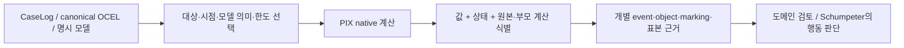

# 계산 모델 확장과 W4 고급 계산 구현 보고서

작업 시작일: 2026-09-17. 문서 검토일: 2026-09-18. 대상: 이번 변경의 모델 교환·변환·분석 및 W4 계산 profile.
이 문서는 Git에 포함되는 소스·테스트·예제를 연결한다. 로컬 `.artifacts` 폴더가 없어도 검토할 수 있다.

기준 계획은 [영역별 개발 계획](../requirements/2026-09-13_PIX_DETAILED_DEVELOPMENT_PLAN.md)의
MODEL-01~06, FEAT-01~04, SIM-01~04, STREAM-01~03, ACT-01~03이다.
이 문서는 해당 영역의 이번 증분 구현을 다루며, 각 계획 항목의 모든 세부 기능이 완료됐다는 표시는 아니다.
[사용 가이드](../user-guide/MODELS_AND_W4_GUIDE.md)는 실제 계산을 연결하는 순서를 설명한다.
참조 inventory는 [9월 15일 기록](../requirements/union-2026-09-15/implementation_registry.json)에 고정된
PM4Py 2.7.23.8·OCPA 1.3.4 소스 기준이다. 이것이 문서 검토일의 최신판이라는 주장은 하지 않는다.

## 1. 이번에 추가한 것과 기존에 있던 것

기존 PIX에는 CaseLog·OCEL import, case/object 중심 발견과 적합성 계산, 다양한 모델 표현,
기초 feature·simulation·streaming·action 계산이 있었다. 이번 작업은 그 이름을 새로 붙인 것이
아니라, 모델의 교환·변환 방향과 고급 계산의 관측·검증·정정 계약을 추가한 작업이다.

| 영역 | 작업 전 기반 | 이번 변경 |
|---|---|---|
| 모델 | PN/OCPN, process tree, BPMN, POWL 등 native 표현과 일부 변환·분석 | PNML/PTML/BPMN 교환, reset/inhibitor·stochastic 모델, coverability, 추가 변환·분해·OC subprocess, capability 표 |
| Case feature | 빈도·속성 feature와 기본 prefix 인코딩 | 실제 관측시점·추적 종료·검열, 그룹/시간 분할, train 전용 encoder, mask를 가진 sequence tensor |
| OC feature | Event/object/execution feature와 인코딩 | 동시각 묶음 기준 k-step 표본, 역변환, native 선형회귀와 분리 평가 |
| Decision/drift | 분기 표본 추출·결정트리, Bose 계열 관계 분포 비교 | Train/test 분리 평가, categorical vocabulary 경계, 다중검정 보정과 미완료 검정군 처리 |
| Simulation | 유한 playout·기본 시간/자원 계산 | 여러 자원·달력·capacity·공통 난수 시나리오, 병렬 실행 시간을 가진 PN playout |
| Streaming | Batch 연산과 기본 streaming adapter | Case 정정/삭제/철회 및 OC execution 병합·분할, 재전송·revision·checkpoint |
| Action/impact | Temporal pattern, 첫 매치 후보, greedy 일정·구조/성능 차이 | 모든 매치 witness, 유한 exact 계획, no-op의 제약 검사, replay 근거를 가진 운영 모집단 차이 |

앞서 승인된 무채색 Chevron 기본 표현과 가로/세로/자동 방향 옵션도 함께 저장되는 변경이다.
이는 계산 결과의 표현 방식이다. [Chevron 기본값 기록](../version/2026-09-17_NEUTRAL_CHEVRON_DEFAULT.md)과
[표현 검증 기록](../version/2026-09-17_CHEVRON_PRESENTATION_VALIDATION.md)을 별도로 유지한다.

## 2. 결과를 판단하는 공통 구조



`computed`는 해당 계산이 선언한 범위에서 결과를 만들었다는 뜻이다. 모델이 sound하거나,
예측이 유용하거나, 계획을 실제 실행해도 실패하지 않는다는 뜻은 아니다. `partial`은 무엇을
계산했고 무엇을 남겼는지와 함께 읽는다. `unavailable`을 0점으로, `invalid_input`을 부적합 실행으로
바꾸지 않는다. 원본 로그와 분석 profile, 부모 계산, 제외/미확정 표본을 결과와 함께 보존한다.

아래의 ‘구현’은 해당 PIX profile의 코드가 있다는 의미다. PM4Py·OCPA 모든 variant의 대체 승인과
선생님의 개별 계산 의미 승인은 별도이다. 시각화 디자인 승인으로 계산 의미까지 승인됐다고 기록하지 않는다.

## 3. 모델 교환과 실행 의미

### 3.1 외부 모델을 그대로 계산의 입력으로 받기

업무 질문은 ‘외부에서 받은 모델의 ID·순서·marking·silent 전이를 보존한 채 PIX에서 계산할 수 있는가?’다.
모델을 읽으면서 로그에서 대체 모델을 다시 발견하지 않는다.

| 입력 | 구현한 교환 범위 | 보존/거부 기준 |
|---|---|---|
| PNML | 단일 weighted ordinary P/T net, 초기/명시적 최종 marking, ProM silent 표현 | Arc weight·동명 전이의 개별 ID를 유지. Sink에서 최종 marking을 추정하지 않음. Reset/inhibitor/data 의미가 들어오면 ordinary net으로 축소하지 않고 거부 |
| PTML | Activity/tau, sequence/XOR/parallel, binary loop 및 표현 가능한 tau-exit loop | Sequence/loop의 자식 순서, 활동 occurrence 대응 보존. 비-silent exit나 미지원 operator는 거부 |
| BPMN 2.0 | 단일 plain start/end, 원자 task, XOR/AND gateway, sequence flow | AND의 동기화를 유지. 조건·message·boundary event·subprocess·DI·알 수 없는 extension 등 profile 밖 요소는 거부. 일반적인 편집기 출력 전체를 읽는 reader는 아님 |

Reader는 모델과 교환 근거를 반환하고, writer는 기본적으로 기존 파일을 덮어쓰지 않는다.
표준 전체를 지원한다는 뜻은 아니다. 의미와 관계없는 표시 정보의 보존/제외도 wrapper와 진단에서 확인한다.

근거: [교환 API](../../src/pix/model_io/__init__.py), [PNML 테스트](../../tests/model_io/test_pnml.py),
[PTML 테스트](../../tests/model_io/test_ptml.py), [BPMN 테스트](../../tests/model_io/test_bpmn.py),
[파일 저장 테스트](../../tests/model_io/test_publication.py).

### 3.2 Reset/inhibitor와 stochastic 모델을 ordinary PN과 구분

Reset arc는 발화 시 해당 place의 token을 모두 지운다. Inhibitor arc는 발화 전 token 수가
threshold보다 작은지를 검사하고 token을 소비하지 않는다. Ordinary input 조건을 원래 marking에서
검사한 뒤 소비·reset·생성을 적용한다. 같은 place→transition에 input 종류를 중복 배치하는 모델은
현재 profile에서 거부한다.

수검산 예: reset place에 0개든 7개든 token이 있고 발화 후 3개를 생성하면 결과는 3개다.
Inhibitor threshold가 2이면 발화 전 0·1에서 허용되고 2 이상에서는 허용되지 않는다.
확장 모델을 기존 alignment에 넣어 특수 arc를 잃는 경로는 지원하지 않는다.

Stochastic 모델은 전이별 상대 선택 weight와 duration 분포를 별도로 저장한다.
각각 ‘가정’과 ‘학습된 값이라는 출처 선언’을 구분한다. 빈도는 학습했지만 duration은 가정한 모델도
표현할 수 있다. 출처 문자열이 있다는 이유만으로 실제 fitting이 검증됐다고 해석하지 않는다.
구조적으로 가능한 전이들의 weight 합이 0이면 균등 선택으로 바꾸지 않는다.

근거: [확장 net 구현](../../src/pix/case_centric/extended_nets.py),
[발화·파라미터·저장 검증](../../tests/case_centric/test_extended_nets.py).

### 3.3 ‘저장 가능’과 ‘계산 가능’을 분리

[Capability 목록](../../src/pix/model_capabilities.py)은 모델별 저장, 활동명 접근, 발화, 변환,
alignment, 도달 분석을 `direct`, `via_conversion`, `unsupported`로 구분한다.
변환을 거치는 계산은 그 변환이 실제 성공해야 한다. 자동 축소나 조용한 fallback은 없다.

활동명 변경은 occurrence ID를 유지한다. 이름이 같다는 이유로 다른 전이를 합치지 않는다.
활동명 변경은 가시적 행동 자체를 바꿀 수 있으므로 의미 보존 축약과 구별한다.
근거: [Capability 테스트](../../tests/test_model_capabilities.py),
[활동명 처리](../../src/pix/case_centric/model_labels.py), [테스트](../../tests/case_centric/test_model_labels.py).

## 4. 모델 변환·분해·성질 분석

| 질문 | 이번 구현과 눈으로 확인할 의미 | 지원 경계와 근거 |
|---|---|---|
| POWL의 병렬을 tree로 옮길 수 있는가? | A/B 무순서이면 AB와 BA를 모두 허용. A→B이면 AB만 허용. 원본 occurrence 경로와 결과 tree 경로 연결 | Series/parallel 부분순서만 구조 변환. N형 부분순서를 임의 순서로 바꾸지 않음. [구현](../../src/pix/case_centric/powl_conversion.py), [검증](../../tests/case_centric/test_powl_conversion.py) |
| Trie의 완료 prefix만 수락하는 PN을 만들 수 있는가? | 관측 AB와 ABC가 있으면 두 종료 모두 유지. A가 terminal이 아니면 A 종료를 새로 허용하지 않음. Empty trace는 root의 명시 종료 관측에 따름 | 유한 prefix trie 대상. 일반 merged transition-system synthesis가 아님. [구현](../../src/pix/case_centric/trie_conversion.py), [검증](../../tests/case_centric/test_trie_conversion.py) |
| Process tree를 transition 경계 subnet으로 만들 수 있는가? | 각 occurrence에 entry/exit transition 대응. AND entry가 분기하고 exit가 모든 branch 종료를 기다림 | 지원 tree operator의 가시적 언어 보존. 전이 수·빈도·시간까지 같다는 의미 아님. [구현](../../src/pix/case_centric/tree_bordered.py), [검증](../../tests/case_centric/test_tree_bordered.py) |
| 큰 net을 의미 있는 구성요소로 나눌 수 있는가? | Place/arc 소유권은 하나. Silent 및 동명 활동의 전이들은 같은 component. 공유된 유일 visible 전이는 원본 ID로 함께 발화 | Ordinary unit-arc P/T profile. 분해별 alignment 비용을 더하면 전역 optimum이라는 뜻 아님. [구현](../../src/pix/case_centric/maximal_decomposition.py), [검증](../../tests/case_centric/test_maximal_decomposition.py) |
| Token이 끝없이 늘어나는가? | Karp–Miller tree, omega 가속과 ancestor/발화 근거, boundedness 및 coverability 판단 | Weighted ordinary P/T net. Omega는 실제 marking도 결측도 아님. 한도 중단을 bounded/unbounded 확정으로 바꾸지 않음. [구현](../../src/pix/case_centric/coverability.py), [검증](../../tests/case_centric/test_coverability.py) |
| OCPN 일부 업무구간만 살펴볼 수 있는가? | 한 객체형의 source→target directed walk 위 노드 선택, 잘린 arc와 공유 전이의 다른 객체형 문맥을 함께 보고. Projection/hiding/reduction 연결 | Structural subnet이며 독립 실행가능성·soundness·언어 동치 인증이 아님. [구현](../../src/pix/object_centric/subprocess.py), [검증](../../tests/object_centric/test_subprocess.py) |

엄격한 Inductive profile도 분리했다. `{ABC, A}`에서 B와 C는 함께 생략되는 블록이다.
B와 C를 각각 optional로 만들어 AB·AC까지 허용하는 기존 plain sequence 의미와 구별한다.
이 선택은 기존 저장 요청의 의미를 바꾸지 않는 새 profile이다.
근거: [Inductive 구현](../../src/pix/case_centric/inductive.py),
[Optional block 반례 테스트](../../tests/case_centric/test_inductive_optional_blocks.py).

변환 결과에는 원본/결과 노드 대응과 한도·거부 이유가 남는다. 완주한 경로 하나가 존재한다는 사실,
관측 trace를 모두 수락한다는 사실, soundness, 변환 전후 언어 동치는 각각 다른 판단이다.

## 5. W4: 관측 시점과 학습 경계를 지키는 feature

### Case-centric

입력은 원본 CaseLog, 관측시점, 그 뒤 어디까지 추적했는지, 완료가 실제로 관측됐는지다.
마지막 event가 있다는 이유만으로 case가 완료됐다고 판단하지 않는다.
입력 feature와 나중에 알게 되는 target을 분리하고, 다음 event 미관측·완료 미관측·horizon까지 생존을 구분한다.

`A@0 → B@5 → C@9`를 시점 5에서 관측하면 입력에는 A/B 두 event와 경과시간 5가 들어간다.
완료가 시점 9로 명시됐다면 remaining time 4는 target이다. C의 이름·시각을 바꿔도 시점 5의 입력은
변하지 않아야 한다. 완료 근거가 없다면 remaining time을 0으로 채우지 않는다.

같은 case와 명시한 공유 그룹은 train/test 사이에 나누지 않는다. 시간 분할은 case 시작 시각만 보는
것이 아니라 관측/label 가용 구간이 겹치는 그룹을 묶는다. Label 가용 종료는 호출자가
`CaseAvailability`로 제공해야 하며, 생략하면 기록된 event 구간만 사용한다. 그 결과 분리 가능한 블록이
부족하면 그대로 보고한다. 비율은 case 수가 아니라 분리 불가능한 블록 수 기준이므로 실제 case 비율은 달라질 수 있다.
Vocabulary는 train에서만 정하고, unknown·missing·padding·실제 0을 구분한 matrix/tensor를 만든다.
입력 가용시점을 명시할 수 없는 case 속성을 prefix feature로 자동 사용하지 않는다.

근거: [관측 dataset·분할·encoder·sequence 구현](../../src/pix/case_centric/feature_dataset.py),
[미래 불변성·검열·분할·저장 검증](../../tests/case_centric/test_feature_dataset.py).

### Object-centric

K-step은 event ID 정렬의 K개가 아니라 **서로 다른 timestamp 묶음 K개**이다.
동시각 event는 하나의 묶음으로 처리하고, target은 마지막 입력시각보다 엄격히 뒤에 있어야 한다.
묶음 내 수치 평균은 선택한 셀이 모두 관측된 경우에만 계산한다. 하나가 미관측이면 관측된 일부만
평균내어 완전한 값처럼 쓰지 않는다. 표본에는 execution/event/object identity가 남는다.

현재 시간창은 timestamp와 execution identity가 있는 행을 대상으로 한다. 모든 event/object/execution
feature granularity가 자동으로 시간창을 만들 수 있는 것은 아니다. 그 정보가 없는 행은 제외 근거에 남는다.

추가한 회귀는 native QR 계산을 사용하는 선형 최소제곱 baseline이다. 완전한 수치 표본으로 학습하며,
rank 부족과 표본 부족을 결과로 알린다. 같은 execution/event/object가 평가 경계를 넘는 경우를 검사하고,
target별 원래 단위의 MAE와 실제 점수 계산에 사용한 쌍의 수를 반환한다. 결측 target을 0으로 채점하지 않는다.
Inverse transform은 학습 당시 encoder의 통계와 vocabulary를 사용하며, 알 수 없는 범주는 복원했다고 하지 않는다.
수치 변환은 부동소수점 연산이므로 큰 정수 등 원래 값의 bit 단위 무손실 복원까지 뜻하지 않는다.

이 경계 검사는 외부에서 이미 미래를 섞어 만든 feature나 회고적으로 만든 execution의 누출까지
자동으로 없애준다는 뜻은 아니다. Feature 정의 자체의 시점 근거도 검토해야 한다.
근거: [OC learning 구현](../../src/pix/object_centric/learning.py), [수검산·누출·복원 검증](../../tests/object_centric/test_learning.py).

## 6. W4: Decision과 drift를 ‘성공률’로 오해하지 않기

Decision evaluation은 분기 전 feature와 분기 label을 받아 train/test case를 분리하고 결정트리를 평가한다.
반복 분기 occurrence와 공유 그룹을 분할 경계에서 확인한다. Train에 없던 범주, 결측 feature, 미확정 label은
mask와 제외 근거로 남기며 정확도와 coverage를 함께 보고한다. Test 표본에 맞춰 vocabulary나 모델을 다시 fit하지 않는다.
외부 feature를 직접 넣을 때 그 값이 분기 전에 존재했는지는 호출자의 근거가 필요하다.
Conformance 표에서 연결하는 adapter는 기존 수치 feature를 사용한다. 범주형 feature의 자동 분기 전 추출까지
추가한 것은 아니다. 상위 표본 추출이 잘렸다면 전체 coverage는 알 수 없음으로 남긴다.

Drift 보정은 기존 Bose 계열 eventually-follows 관계 분포 비교 위에 Holm 또는 BH 보정을 적용한다.
그림에 표시한 후보만 골라 검정군으로 삼지 않는다. 계획한 창 전체가 검정군이다.
검정군의 일부가 미완료이면 계산 가능한 상한과 미확정을 구분하고, 누락된 검정을 ‘유의하지 않음’으로 바꾸지 않는다.

보정의 exact는 유리수 산술이 정확하다는 뜻이다. 원래 permutation 계산이 Monte Carlo였다면 그 성질은
그대로 남는다. Holm의 오류율 해석은 유효한 p-value와 검정군 정의에, BH는 추가 의존성 조건에 달려 있다.
겹치는 창이 그 조건을 자동 충족하지 않는다. Drift 후보는 원인 판정이나 변화의 존재/부재 증명이 아니다.

근거: [Decision 평가](../../src/pix/case_centric/decision_evaluation.py), [검증](../../tests/case_centric/test_decision_evaluation.py),
[Drift 보정](../../src/pix/case_centric/drift_evaluation.py), [검증](../../tests/case_centric/test_drift_evaluation.py).

## 7. W4: 시간·자원·시나리오 계산

시간 PN playout과 자원 queue simulation은 서로 다른 가정을 받는다.
시간 PN은 시작할 때 input token을 확보·소비하고 완료할 때 output을 생성한다.
독립 전이는 겹쳐 실행될 수 있으며 같은 시각의 완료는 묶어서 반영한다. 시작 순서와 완료 순서는 다를 수 있다.
이는 weighted dispatch와 duration sampling을 가진 PIX profile이며 exponential race/GSPN 전체 구현이 아니다.

Resource simulation은 case 도착, 순차 operation route, operation별 resource 요구량,
pool capacity, 유한 절대시각 calendar, duration 분포를 받는다. 필요한 여러 자원을 동시에 확보하며,
일부를 잡은 채 다른 자원을 기다리지 않는다. 작업이 모든 calendar의 공통 열린 구간에 통째로 들어가야 한다.
교대 종료 시 중단·다음 교대 재개하는 preemption은 현재 profile에 없다.

| 검산 입력 | 기대 결과 | 구별할 사실 |
|---|---|---|
| 순차 A(2)→B(3) | 완료 5 | Duration을 합산하는 실행 |
| AND 분기 A(2), B(3), 추가 경계 duration 0 | 완료 3 | 두 branch를 동시에 시작할 자원이 있을 때 `max(2,3)` |
| 시각 0 도착 작업 두 개, duration 2, capacity 1 | 완료 2·4, 대기 0·2 | 순차 서버의 queue |
| 동일 입력, capacity 2 | 모두 완료 2, 대기 0 | Capacity 변경 시나리오 |
| Duration 2, calendar `[0,1)`, `[3,7)` | 작업 3–5, 다음 작업 5–7 | 닫힌 구간을 가로질러 실행하지 않음 |
| Horizon 1, duration 2 | 실행 중 표본과 예정 완료 2를 보존, 관측 완료는 미확정 | 미완료 실행을 버리지 않음 |

시나리오 비교는 같은 case/route 모집단과 horizon을 사용한다. 공통 난수 옵션은 대응하는 case·operation의
duration draw를 연결한다. 완료시간 차이는 양쪽에서 완료된 case의 쌍을 별도로 보고하고 완료 수 차이도 남긴다.
이는 가정 아래의 비교이며 실제 개입 효과나 항상 개선된다는 보장이 아니다.
Lifecycle service 관측으로 duration 평균을 계산할 수 있으나, 분포 family 선택과 도착/route 가정은 별도다.
예를 들어 start(0)–suspend(10)–resume(90)–complete(100)의 100초는 순수 service time이 아니다.
현재 fitter는 이처럼 중단·재개 근거가 해결되지 않은 구간을 학습에서 제외하고, 임의로 휴지시간을 빼서 채우지도 않는다.

근거: [시간 PN](../../src/pix/case_centric/timed_playout.py), [시간 PN 테스트](../../tests/case_centric/test_timed_playout.py),
[자원 simulation](../../src/pix/case_centric/resource_simulation.py), [자원 테스트](../../tests/case_centric/test_resource_simulation.py).

## 8. W4: 늦은 이벤트와 정정을 반영하는 revision

Case stream은 event identity, operation identity, source offset, 명시 순서·완료/reopen을 관리한다.
동일 재전송은 원래 영수증으로 처리하고, 정정·삭제는 이미 만든 DFG에 대한 철회/추가를 반환한다.
현재 정확 구현은 보존한 사실로 batch를 재계산한다. 일정 메모리·상수시간 온라인 알고리즘이라는 주장은 없다.

시각 순서 profile에서 A@1, C@3 뒤에 B@2가 도착하면 `A→C: −1`, `A→B: +1`, `B→C: +1`이다.
B를 삭제하면 반대 변경이 된다. 이 예는 XES 기록 순서를 항상 timestamp로 정렬하라는 규칙이 아니다.

OC stream은 canonical event/object와 qualified E2O를 수정하고 execution을 다시 계산하여 병합·분할을 보고한다.
기존 항목의 정정/삭제에는 현재 revision을 요구해 오래된 상태의 덮어쓰기를 막는다.
선언된 schema와 O2O는 현재 stream의 고정 범위다. Checkpoint는 보존 사실과 operation replay의 내부 일관성을
검사해 복원하며, hash는 작성자 인증이나 distributed exactly-once 보장이 아니다.

넓은 batch 계산과 stream 상태를 연결하는 것과, 각 계산의 전용 증분 알고리즘을 만드는 것은 구분한다.
현재 지원 범위 밖의 watermark 완결성·history eviction·외부 message broker 운영까지 완료로 표시하지 않는다.
근거: [Case revision](../../src/pix/case_centric/revisable_stream.py), [검증](../../tests/case_centric/test_revisable_stream.py),
[OC revision](../../src/pix/object_centric/revisable_stream.py), [검증](../../tests/object_centric/test_revisable_stream.py).

## 9. W4: Action 후보·계획·운영 영향

Temporal pattern에 맞는 구간이 여럿이면 첫 매치만 고르지 않고 각각의 slot→interval 대응을 남긴다.
같은 구간 집합이라도 slot 배치가 다르면 별도 witness다. 공통 객체 ID·pattern ID·원래 action ID와
alternative ID를 보존한다. 탐색 한도로 아직 살펴보지 못한 pattern은 ‘매치 없음’이 아니라 미확정이다.

Planner는 후보를 required/optional로 명시적으로 나누고 release·deadline·duration·precedence·conflict·cost·horizon을 검사한다.
No-op도 대안에 포함되지만 required action이 있으면 feasible이 아니다. 의무를 지킬 수 없는 상태를
‘아무것도 하지 않으면 성공’으로 우회하지 않는다.

| 결과 | 의미 |
|---|---|
| `optimal` | 주어진 후보·목적함수·지원 제약에서 탐색을 완주했고 최적값을 확인 |
| `feasible` | 실행 가능한 일정 witness가 있으나 목적함수가 없거나 최적성 탐색은 미완료 |
| `infeasible` | 탐색을 완주했지만 허용되는 일정이 없음 |
| `unknown` | 한도에 도달했고 아직 가능한 witness를 찾지 못함 |

예를 들어 A(2)≺B(1)의 earliest completion은 3이다. 별개의 예로, 선후관계 없이 서로 충돌하는
A(duration 4, deadline 7)와 B(duration 1, release 2, deadline 3)는 B를 기다려 2–3에 실행한 뒤
A를 3–7에 실행하면 가능하다. 즉시 A부터 실행하는 선택은 B의 deadline을 놓친다.
Makespan 최소와 총 대기 최소는 다른 목적이다. 목적함수가 없다면 임의 점수를 붙여 ‘최적’이라 하지 않는다.
현재 exact 범위는 양의 duration, 비선점 action, pairwise conflict와 열거한 optional subset이다.
Capacity>1 누적 자원 제약·중간 calendar hole·시작시각 의존 효용 등은 이 planner의 지원 밖이다.

Operational impact는 **하나의 모델과 검증된 replay에서 두 event-prefix 상태**를 고르고,
지정한 영향 전이의 선행·후행 영역에 있는 객체 모집단을 비교한다. API의 baseline/scenario라는 명칭은
여기서 두 snapshot을 뜻한다. 전이를 실제로 변경하거나, 서로 다른 모델을 실행하거나, 반사실 시나리오를
simulation하는 기능은 아니다.

Cutoff는 replay의 명시적 위상 순서에서 소비한 고유 event 수다. 서로 독립적인 event의 순서는 ID로
결정될 수 있으므로 벽시계 cutoff로 읽지 않는다. 최종 silent closure와 finalization은 snapshot에서 제외한다.
제공된 replay 근거는 모델과 원본에 대해 재실행해 검사하며, 관측 event binding에 의존한 상태와
silent 추론·token 보정·unknown을 구분한다. 관측 binding에 근거한 marking도 주어진 모델·초기 상태에
조건부인 추론이지 실제 세계 상태의 직접 측정은 아니다.

동일 Item 두 개가 `p —A→ q`를 함께 통과한 전후라면 선행 모집단은 2→0, 후행은 0→2이다.
여기서 처리 event는 1개이며, 같은 객체의 token이 중복되어도 객체 모집단을 중복 계산하지 않는다.
모집단 차이와 별도의 관측 성능 차이는 인과효과로 바꾸지 않는다. 실제 도구 실행·권한·Hub 정책 배포는 Schumpeter의 역할이다.

근거: [모든 매치·계획](../../src/pix/object_centric/action_planning.py),
[유한 전수 검산](../../tests/object_centric/test_action_planning.py),
[운영 영향](../../src/pix/object_centric/operational_impact.py), [Replay·모집단 검증](../../tests/object_centric/test_operational_impact.py).

## 10. 도메인 검토표

이 표는 실행 결과를 읽을 때 판단할 지점을 고정한다. 코드를 읽지 않고도 입력·기대·근거·반례를 비교할 수 있다.
[재현 예제](../../examples/models_w4_review.py)가 작은 입력으로 계산 경로를 연결한다.

| 검토 질문 | 독립 기대값 또는 정책 | 구현에서 확인할 출력 | 반증 조건 |
|---|---|---|---|
| 모델 교환이 의미를 바꾸는가? | AND는 A/B를 모두 요구, weighted arc와 marking 보존 | ID·arc·gateway·marking 및 거부 사유 | 한 branch만 끝나도 수락하거나 미지원 의미를 제거 |
| 모델 변환의 병렬이 유지되는가? | 독립 A/B는 AB·BA, A→B는 AB | 언어 검산·occurrence 대응 | 입력 배열 순서 때문에 합법 trace가 사라짐 |
| 미래를 보고 예측하지 않는가? | ABC의 AB prefix, event 수 2, 경과 5, target 4 | Input/target 분리와 cutoff·follow-up | 미래 C 변경이 과거 입력 feature를 변경 |
| 시간 simulation이 동시성을 반영하는가? | 순차 2+3=5, 독립 병렬 max=3 | Start/finish·marking·미완료 실행 | 병렬을 5로 직렬화하거나 token 중복 사용 |
| 수정 후 DFG가 맞는가? | 늦은 B는 A→C 철회, A→B/B→C 추가 | Revision 영수증·batch 결과·checkpoint | 정정/재전송 뒤 빈도 중복 또는 과거 edge 잔존 |
| No-op이 의무를 회피하지 않는가? | Required가 있으면 no-op infeasible | `no_action_feasible`, 위반 이유 | Required deadline 불가능을 no-op 성공으로 보고 |
| 영향과 효과를 구분하는가? | Baseline/scenario 차이는 해당 모델·모집단 조건부 | 참여 ID·분모·repair/unknown·차이 | 모델 추론을 실제 효과나 성공 보장으로 발표 |

검토 결과의 상태는 ‘설명 확인’, ‘의미 승인’, ‘반례 발견’, ‘정의 변경 필요’로 나누어 기록할 수 있다.
현재 테스트 존재를 선생님의 의미 승인으로 대신하지 않는다.

## 11. 통합 검증과 재현

2026-09-18 최종 소스에서 Windows의 signed CPython 3.13.15로 실행했다.
아래 Python 전체 결과는 마지막 한 번의 실행값이며, 작업별 중첩 테스트 수를 합산하지 않았다.

| 검증 | 실제 결과 | 해석 |
|---|---|---|
| 전체 `pytest -q -ra` | **10,413 passed, 53 skipped, 1,169 subtests passed**, 46.96초 | 전체 회귀 실행. 소요 시간은 이 환경의 1회 관측값 |
| 새 통합 예제 | 32개 연산 결과: 31 computed, 1 partial | 열린 Case prefix는 의도적으로 partial. 모두 JSON 및 파일 저장 왕복과 반복 실행 일치 확인 |
| 새 통합 테스트 | 48 passed | 위 전체 테스트에 포함. 별도 덧셈하지 않음 |
| Node viewer 테스트 | **249 passed** | Geometry, Graphviz 및 UI 계약 |
| 실제 Chromium | **26 passed** | 새 Chevron 방향·스타일 및 기존 시각화 회귀. 아래 opt-in skip 26개를 별도 실행 |
| 설치 wheel 검증 | **runtime 파일 235개**의 소스·wheel·설치본 byte 일치 | 소스 경로 없는 `python -I`, PIX 외 설치 배포본 없음 |
| Wheel에서 계산·교환 | 통합 계산 32개 저장/복원, PNML/PTML/BPMN 왕복 및 확장 net 발화 통과 | PM4Py/OCPA·NumPy/SciPy 등 없이 실제 실행 |
| Wheel에서 시각화 | 기본 export API 3개, 방향×스타일 6조합 통과 | neutral/horizontal 기본, classic 선택, 잘못된 옵션의 기존 파일 보호 |
| 정적·추적 검사 | Ruff, `git diff --check`, 새 registry strict hash 및 거부 self-test 통과 | 코드 형식·추적성 검증이며 알고리즘 동등성의 대체가 아님 |

기본 전체 실행의 skip 53개는 브라우저 opt-in 26개, 대형 로컬 XES corpus opt-in 11개,
현재 signed Python과 호환되는 `pyarrow.lib`가 없는 Parquet 검사 14개, Windows symlink 권한 검사 1개,
`greenlet._greenlet` 부재로 수집하지 못한 Python Playwright 모듈 1개다.
브라우저 26개는 설치된 Node Playwright driver를 통해 별도로 통과했다. 나머지를 통과로 환산하지 않는다.
대형 XES에 대한 과거 실행 기록이 있더라도 이번 변경의 corpus 재실행으로 계산하지 않는다.

설치 wheel은 `pix-0.5.0-py3-none-any.whl`, SHA-256은
`9b734936d2aeebd11b428ac931858ddebbc1ee490fe737df1d8094d8b37ecb93`다.
검증용 로컬 빌드이며 배포 저장소에 release를 발행한 것은 아니다. 버전은 기존 0.5.0을 유지했다.
빌드 시작과 종료 사이 production 파일 변경·추가가 없음을 확인했다.

### 눈으로 비교할 실제 통합 예제 값

다음은 [실행 예제](../../examples/models_w4_review.py)의 실제 값이다.
기대값은 [통합 테스트](../../tests/test_models_w4_integration.py)에서 별도로 검사한다.
앞 절의 설명용 예와 입력이 다른 경우 아래에 구체적인 시각·단위를 명시했다.

| 입력/질문 | 실제 출력 |
|---|---|
| Strict IM에 `{ABC, A}` 입력 | `A → XOR(B→C, tau)`. AB·AC를 추가하지 않음 |
| 순차 PN의 분해/재결합 | 3개 component, shared 전이 a/b를 원본 ID로 동기화. 구조·marking 및 재결합 원본 일치 |
| A@0, B@5, C@10, 완료@12를 시점 5에서 관측 | 입력 AB, elapsed 5초. 다음 event까지 5초, 완료까지 7초. 별도 미완료 case의 remaining은 null |
| Duration 2초인 두 작업, 자원 capacity 1 | 완료 2·4초, 대기 0·2초 |
| 같은 작업을 capacity 2로 변경 | 양쪽 완료 case 쌍의 평균 flow 차이 −1초. 완료 수 차이 0 |
| 순차 timed PN의 duration 2·3초 | A: 0→2, B: 2→5, 완료 5초 |
| A@1, C@3 뒤 B@2 수신 | A→C −1, A→B +1, B→C +1 |
| 필수 action 2개, precedence와 duration 2·1μs | 계획 objective 3μs, no-op infeasible. 실제 운영 단위는 호출자가 제공 |
| 같은 OC replay의 event 0개/1개 처리 후 비교 | prior 모집단 −2, posterior 모집단 +2. 모델 조건부 집합 차이 |
| 학습 표본의 y=2x+1, 별도 test x=4 | 예측 8.999999999999998, MAE 약 1.78×10⁻¹⁵. 부동소수점 오차이며 실제 업무 예측 정확도 주장은 아님 |

통합 검토에서 발견한 두 결함도 회귀 테스트로 남겼다. OC 학습 결과의 누락된 envelope validator와
잘못된 역변환 metadata를 보강했고, 요청과 모순되는 maximal decomposition 증명 및 재결합 출력은
공통 JSON writer/reader가 거부하도록 연결했다. TransitionSystem capability도 실제 full-prefix trie
변환 경로를 가리키도록 수정했다. 이 검사는 내부 일관성을 확인하며 원본 출처의 진실성을 인증하지 않는다.

실행 로그와 wheel은 로컬 `.artifacts/2026-09-17-implementation-models-w4/`에 보존하며 Git에서는 제외한다.
위 결과·skip 사유·wheel 식별값과 아래 재현 진입점은 Git 문서만으로 읽을 수 있도록 여기 기록했다.

표준 개발 환경에서 주요 재현 경로는 다음과 같다.

```text
python examples/models_w4_review.py
python -m pytest -q -ra
python -m ruff check src tests examples tools
python tools/check_models_w4_registry.py --strict-hashes --self-test
```

예제 실행은 기본적으로 로컬 artifact 폴더에 Korean `REVIEW.md`, 32개 결과 JSON, 3개 모델 XML과
실제 값 요약을 만든다. 설치본만 확인할 때는 wheel을 설치한 별도 환경에서 `python -I`로 예제를 실행한다.
선택 의존성이 필요한 검사를 모두 실행하려면 해당 플랫폼과 Python에 맞는 의존성을 준비해야 한다.

이번 추가 범위의 [registry](../requirements/models-w4-2026-09-17/implementation_registry.json)와
[검사 도구](../../tools/check_models_w4_registry.py)는 과거 9월 15일 inventory snapshot을 덮어쓰지 않는다.
현재 소스 변경 후 과거 snapshot의 strict hash를 일치시키는 것을 검증 조건으로 삼지 않는다.
Registry 검사는 함수·파일·분류·snapshot 연결을 확인한다. 수학적 동치나 참조 라이브러리의 실행 결과를
검증하는 대신 사용할 수 없다. 모든 공개 결과의 저장/복원·패키지 설치 경로도 계산 자체와 별도로 확인한다.

## 12. W5와 출시 판단에 남는 범위

계획 항목을 읽을 때 이번 추가분과 이미 있던 계산을 함께 보되, 지원 경계를 유지해야 한다.

| 계획 항목 | 이번 묶음에서 연결되는 계산 | 남는 검토 경계 |
|---|---|---|
| MODEL-01~06 | Capability, 확장 net, 표준 교환, 변환·분해·coverability·OC subprocess | 모든 모델·모든 방향의 변환이나 확장 net conformance를 지원하는 것은 아님 |
| FEAT-01~04 | 기존 feature·clustering·언어 거리 위에 cutoff·분할·회귀·decision 평가·drift 보정 추가 | 전체 참조 feature inventory와 variant별 출력 동등성, 실제 예측 성능 |
| SIM-01·04 | 기존 [유한 playout·process tree 생성](../../src/pix/case_centric/simulation.py)을 유지 | 이번 시간·자원 profile 추가가 모든 생성·playout variant의 동등성을 뜻하지 않음 |
| SIM-02·03 | 시간 PN, 여러 자원의 달력·capacity, 시나리오 비교와 service fitting | 범용 GSPN, 주간/DST 달력, preemption, 실제 개입 효과 |
| STREAM-01~03 | 기존 ordered stream·online 계산에 보존 사실의 정정·철회·복구 경로 추가 | 새 정정 엔진의 자동 재계산은 Case DFG와 OC execution 대상. 모든 분석의 전용 증분 구현은 아님 |
| ACT-01~03 | 매치 열거, 유한 exact 계획, 동일 replay의 객체 모집단 비교 | 실제 action 실행, 인과효과, 임의 자원 제약의 최적화 |

W4 구현 묶음과 PM4Py·OCPA 전체 대체는 같은 완료 조건이 아니다. SCOPE-01의 참조 variant·옵션별
동등성, 실제 corpus와 생산 규모 성능, 선택 의존성·지원 환경, 잔여 모델 profile과 그 조합은 W5에서 계속 추적한다.
모든 inventory 행을 ‘완료’로 바꾸거나 `reference_replacement_verified`를 일괄 참으로 바꾸지 않는다.

이번 구현의 주요 경계는 표준 모델 형식의 지원 부분집합, ordinary P/T에 한정한 coverability,
구조적으로 표현 가능한 변환, finite exact action search, 명시적 달력/자원 가정, 보존 이력의 재계산 stream,
native 선형회귀 baseline이다. 이 경계는 ‘필요 없다’는 범위 삭제가 아니라 후속 작업·검증의 대상이다.
임의 신경망 예측기, 모든 확장 net의 conformance, 범용 GSPN, distributed stream 운영, Schumpeter의 실제 행동 실행은
이번 계산 모듈 구현만으로 완성되지 않는다.

생산 환경 처리량·최대 안전 로그 크기·예측 개선률·최초 작업 성공률·외부 라이브러리 대비 우위는 별도 측정 전 **알 수 없음**이다.
판단의 유효 범위는 이 커밋의 코드와 명시한 입력/profile이다. 독립 반례가 합법 언어·발화·cutoff·분할·분모·최적성·철회·저장
의미를 깨거나, 참조 판본/사용자 정의/코드가 바뀌면 관련 지원 판단을 재검토한다.

이 보고서의 완료 판단은 최종 통합 검증 기록과 함께, **명시한 모델·W4 profile의 native 구현 범위**에 한정한다.
