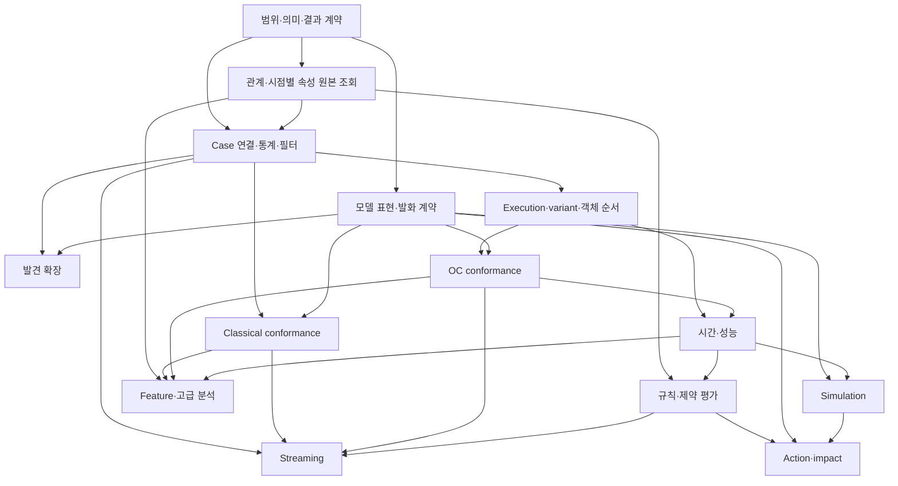

# PIX 영역별 상세 개발 계획

작성일: 2026-09-13. 상태: **검토 가능한 개발 제안, 구현 완료 보고가 아님**.
기준은 [사용자 요구사항](2026-09-13_PIX_SCHUMPETER_USER_REQUIREMENTS.md)과
[현재 구현 격차 평가](2026-09-13_PIX_RELEASE_GAP_ASSESSMENT.md)다.
2026-09-13 추가 결정: **도메인 검토를 병행하며 한 묶음씩 개발하는 절차를 채택**했다.
이번 작업 범위는 계획 기록까지이며, 후속 기능 구현·신규 테스트 작성/실행은 시작하지 않는다.

**2026-09-16 후속 결정:** 위 착수 제한은 9월 13일 계획 작성 당시의 범위다. 이후 사용자 지시로 계산·시각화 구현을 진행했다. 시각화는 이제 **모든 graph에 Graphviz를 기본 적용하고 OCPA 스타일의 OC variant chevron을 추가**한다. 아래 VIEW 영역의 최신 요구는 [변경 요구사항](2026-09-16_GRAPHVIZ_AND_OC_VARIANT_VISUALIZATION.md)이 우선한다. 계산 기능의 동치 정의와 과거 검증 수치는 이 결정으로 바꾸지 않는다.

## 0. 읽는 방법과 범위

**2026-09-18 잔여 범위 협의 후속:** [잔여 기능 세부 설계](2026-09-18_PIX_RESIDUAL_DETAILED_DESIGN.md)와 [177개 설계 추적표](2026-09-18_PIX_RESIDUAL_DESIGN_TRACEABILITY.md)에 사용자 체크·조건·수집/계산 책임 구분을 반영했다. 잔여 177개 작업의 최신 범위·보류 조건은 이 후속 문서를 우선한다. 이 연결은 구현 완료나 기존 평가 등급 변경을 뜻하지 않는다.

**2026-09-18 구현 후속 기록:** 남은 모델 지원과 W4의 명시된 계산 profile은
[모델·W4 구현 보고서](../reports/2026-09-17_MODELS_AND_W4_IMPLEMENTATION_REPORT.md)와
[추가 구현 registry](models-w4-2026-09-17/implementation_registry.json)에서 추적한다.
아래의 9월 13일 현재 상태는 계획 당시 기록이다. 이후 구현, 검증 결과, 미지원 범위는
후속 보고서를 기준으로 확인한다. 도메인 의미 승인과 W5 참조 variant 대체 검증은 별도 상태다.

각 영역을 업무 질문 → 현재 자산 → 개발 작업 → 계산 의미 → 검증 → 완료 조건 순서로 설명한다.
작업 ID는 후속 구현·테스트·개발 기록에서 같은 일을 추적하기 위한 식별자다.
아래 테스트 경로는 **제안된 신설 또는 확장 대상**이며, 이번 문서 작성으로 테스트가 만들어지거나 통과한 것은 아니다.
기존 테스트를 확장할 수 있으면 중복 파일을 새로 만들지 않는다.

PM4Py·OCPA의 계산 기능 전체 대체 지향을 유지한다. 분야를 뒤에 배치했다는 이유로 첫 출시 범위에서
자동 제외하지 않는다. 정확한 알고리즘·variant별 목록은 SCOPE-01에서 현재 배포본까지 대조한다.
일부 기능으로 먼저 공개할지 여부는 사용자가 범위를 변경할 때 별도로 기록할 사안이다.

현재 소스 대조는 PM4Py 2.7.23.3 및 OCPA main의 소스 1.3.3을 기반으로 했다.
공식 배포 2.7.23.8 / 1.3.4와의 남은 차이는 격차 평가에 기록되어 있다.
따라서 이 계획의 목록을 최신 배포본 전체의 감사 완료 목록으로 표현하지 않는다.

## 1. 모든 영역에 적용할 계산 계약

원본을 보존하는 **CaseLog / canonical OCEL**, 분석 대상을 정하는 **선택·투영**, 실제 **계산**, 계산 결과를
보여주는 **저장·시각화**의 책임을 유지한다. CaseLog를 모든 계산 전에 강제로 OCEL로 바꾸지 않는다.
이미 의미가 맞는 TraceSet·ComputationResult·모델 계약을 재사용하되 서로 다른 의미를 이름만 맞춰 합치지 않는다.

| ID | 개발 작업 | 산출물과 완료 확인 |
| --- | --- | --- |
| SCOPE-01 | 고정한 PM4Py·OCPA 소스/배포본에서 공개 계산과 variant 목록 추출. PM4Py의 OCEL 계산도 OCPA와 함께 대조 | 각 항목에 참조 판본, 업무 질문, 입력·출력, PIX 작업 ID, 구현 상태, 검증 링크. 중복 wrapper·별도 알고리즘·외부 실행 backend 구별. 미분류 항목을 남긴 채 전체 대체 완료라고 하지 않음 |
| SCOPE-02 | 계산 의미 명세 작성 | 각 지표의 단위·분모·가중치·빈 집합·동률·결측·종료 상태·동치 정의. 기존 정의 지원, 명시적 PIX 대안, 미지원 중 상태를 표시. 다른 정의가 기존 정의의 지원을 자동 대체하지 않음 |
| SCOPE-03 | 결과·상태·출처 계약 확장 | 기존 computed/partial/unavailable/invalid_input 유지. source/model/selection/profile 식별, 사용/제외/불명 표본, 탐색 한도, 증거와 parent computation 연결. exact·근사·하한/상한은 알고리즘별 명시 |
| SCOPE-04 | 공개 호출과 의존성 경계 정리 | Case와 OC 요청을 명시적으로 받는 공개 API·필요한 batch 요청 확장. 같은 순서를 소비하는 집계만 내부 공유. PM4Py/OCPA runtime 호출 없음. 일반 수치 solver 등이 필요하면 역할·선택 의존성·실패 상태를 명시 |

**기본 제안:** 원본은 불변으로 두고 분석마다 선택 조건과 profile을 기록한다. 시각 누락을 임의 시각으로
채우거나, 탐색 제한을 부적합으로 바꾸거나, 결측 집단을 몰래 제외하여 점수를 좋게 만들지 않는다.
Evidence를 줄이는 설정이 필요하면 계산 대상과 증거 보관 범위를 각각 표시한다.

**제안 테스트:** `tests/test_capability_inventory.py`는 inventory ID·작업·검증 참조 연결을 확인하고,
`tests/test_results.py` 및 `tests/test_extended_results.py`는 새 결과의 저장/복원·구버전·오류 상태를 검증한다.
`tests/test_import_boundaries.py`는 독립 계산 경계를 유지한다. 이 메타 검사는 알고리즘 정확성 검사의 대체가 아니다.

**완료 조건:** 계산값이 같더라도 대상·정의·완료 여부가 다른 두 결과를 구별할 수 있고, 모든 대체 대상이
구현·대안 검토·미지원 중 어디에 있는지 추적할 수 있다.

## 2. 입력·보존·출력과 Case 분석 연결

**업무 질문:** 실제 로그를 읽고, 원본의 활동·순서·관계·속성을 잃지 않은 상태로 분석하고 다시 전달할 수 있는가?

**현재 자산:** OCEL 1/2 및 지정한 2.1 pre4 profile, XES/MXML·업무 표 import,
CaseLog·canonical OCEL, 명시적 case_traces/to_ocel, 일부 OCEL export와 결과/model JSON.
실제 XES 9개 고유 로그에 대한 전체 import·원본 대조도 재사용한다.

| ID | 개발 순서와 내용 | 입력 → 출력 / 주의점 |
| --- | --- | --- |
| IO-01 | 지원 형식과 실제 생산자별 fixture 목록 보완 | 선언된 profile·원본 hash·기대 개수/관계·경고 목록. OCEL 2.1은 pre4와 이후 판본을 구분하며 최신 표준 전체 준수로 확대하지 않음 |
| IO-02 | CaseLog/TraceSet의 DFG·variant·통계·시간 분석 진입 경로 연결 | Case 기록 순서와 classifier를 명시한 분석 결과. 기존 OCEL 객체별 시각 순서 의미는 유지. 시작/종료 빈도와 빈 case도 처리 |
| IO-03 | Lifecycle을 이용하는 interval 해석을 별도 연산으로 구현 | Raw start/complete 이벤트 → 짝 지어진 실행 구간과 미대응/모호한 이벤트. activity instance ID가 있으면 사용하고, 없으면 사용자가 선택한 pairing 규칙을 기록 |
| IO-04 | XES/MXML writer 및 지정한 OCEL 교환 profile의 writer 확장 | 메타데이터·중첩 속성·원본 순서·타입/시각 정밀도 보존. 표현 불가 정보는 손실 보고 또는 실패. OCEL 2.1 출력과 나머지 형식은 SCOPE-01 출력 목록과 연결 |
| IO-05 | 입력→분석→저장→다시 읽기 사용 흐름 검증 | Native case 경로와 명시적 OCEL 투영을 모두 지원. generic DB/추가 업무 형식은 참조 기능 inventory에서 요구되는 connector를 별도 작업으로 펼침 |

**해석 제안:** XES 순서는 기본적으로 기록 순서로 유지한다. 시각 정렬을 선택하면 분석 변환으로 남긴다.
시각이 없는 로그의 빈도·발견은 가능하게 하고 기간 계산은 결측 상태를 반환한다.
같은 활동의 start가 겹칠 때 FIFO 등 특정 pairing을 자동으로 정답 취급하지 않는다.

**검산 사례:** 기록 순서가 A(10:05)→B(10:00)인 case의 DFG는 기본 profile에서 A→B다.
시간 차이는 음수/순서 불일치로 진단하며 조용히 B→A로 바꾸지 않는다.
start(A), start(A), complete(A)만 있으면 구간을 하나로 확정하기에 근거가 부족함을 표시한다.

**제안 테스트:** `tests/event_log/test_case_analysis.py`(순서·classifier·빈 case·시각 누락),
`tests/compute/test_lifecycle.py`(동명 중첩·미완료·instance ID),
`tests/event_log/test_export.py`(XES/MXML round-trip),
`tests/ocel/test_exchange_roundtrip.py`(profile별 관계·이력·표현 불가),
기존 `tests/event_log/test_downloaded_xes.py`(실제 corpus) 확장.

**선행:** SCOPE-02/03. IO-02는 통계 개발과 함께 진행하고, writer는 독립적으로 병렬 개발할 수 있다.
**완료 조건:** 지원하는 입력이 해당 분석으로 끝까지 연결되고, 변환한 의미와 유지한 의미가 구별되며,
지원 출력 profile의 round-trip 및 실패 진단이 독립 기대값과 일치한다.

## 3. 기초 통계·필터·분석 모집단

**업무 질문:** 어떤 실행 집단을 보고 있으며, 얼마나 자주 어떤 일이 일어나는가?
필터를 적용한 뒤 빈도·관계·기간을 같은 기준으로 해석할 수 있는가?

**현재 자산:** 객체형·E2O qualifier 선택, DFG/OCDFG의 일부 빈도, 불변 로그와 source digest.
범용 sublog 및 case 통계는 새로 채운다.

| ID | 개발 작업 | 핵심 의미 |
| --- | --- | --- |
| STAT-01 | case/event/object/activity 빈도, 시작·종료, variant 빈도와 coverage | 고유 이벤트 수·객체별 occurrence 수·고유 객체 수를 별도 지표로 제공. 빈 case와 고립 객체의 분모 포함 여부 명시 |
| STAT-02 | 속성 분포·누락률·재작업·경로·eventually-follows 집계 | attribute scope와 rework 정의(반복 이벤트 수/재작업 case 비율 등)를 명시. 경로의 인접·비인접·순서 정책 구별 |
| STAT-03 | 기간·도착·겹침·cycle time 등 case 통계 연결 | 시간 원천과 case 범위, 미완료 관측, 동일 시각 처리. 실제 시간 수식은 PERF 영역이 소유 |
| FILTER-01 | event/case/object/execution 선택과 논리 조합 | 활동·속성·variant·시간·빈도·경로·재작업 필터. case 전체 선택과 case 내부 event 삭제를 별도 연산으로 둠 |
| FILTER-02 | OCEL sublog의 관계·객체 이력 보존 | 선택 이벤트의 관련 객체 포함, 고립 객체 처리, O2O closure의 방식·깊이 명시. 시간창 시작 직전의 속성 값을 분석에 필요한 경계 상태로 유지 |
| FILTER-03 | 선택 결과와 원본의 lineage·분모 저장 | 선택/제외 ID 또는 재현 가능한 선택 식, 변경된 경계·빈 trace·공유 이벤트 중복. 화면 숨김과 계산 필터를 구분 |

**해석 제안:** 필터가 이벤트를 지워 A→B→C를 A→C로 만든 경우, A→C는
선택 후 투영의 directly-follows임을 표시한다. 원본의 직접 후속 관계를 찾는 모드는 별도로 둔다.
시간창은 경계 포함 규칙과 start/end/contained/spanning/개별 event 선택을 구분한다.
O2O를 무제한 따라가면 선택 집단이 커질 수 있으므로 closure를 암묵적으로 수행하지 않는다.

**검산 사례:** 하나의 이벤트 e가 주문 O1과 O2 모두에 연결되면 고유 이벤트는 1,
주문별 occurrence는 2다. 세 case가 A→B, A→B, A→C라면 variant 빈도는 2와 1이고,
전자를 선택한 coverage는 2/3이다. 공유 객체가 있다고 두 집단을 독립 표본으로 가정하지 않는다.

**제안 테스트:** `tests/compute/test_case_statistics.py`, `tests/compute/test_object_statistics.py`,
`tests/compute/test_filtering.py`, `tests/compute/test_sublog_semantics.py`.
작은 집합의 수동 기대 ID·분모·비율, 필터 재적용의 멱등성, 논리 조합,
시간창 직전 속성의 유지, 원본 불변성, 잘린 trace 경계와 가짜 directly-follows 구분을 확인한다.

**선행:** IO-02, SCOPE-02/03. FILTER-02는 REL의 시점 조회 계약을 공유한다.
**완료 조건:** 사용자는 숫자마다 어느 집단을 셌는지 확인할 수 있고, 필터 뒤 달라진 관계·순서·경계가
새로운 원본 사실처럼 보고되지 않는다.

## 4. 객체 중심 Execution·variant

**업무 질문:** 객체들이 함께 수행한 하나의 실행은 어디까지이며, 두 실행은 어떤 의미에서 같은 변형인가?

**현재 자산:** connected components/leading-object extraction, qualified E2O incidence의 exact variant.
현재 extraction은 O2O를 사용하지 않으며 variant는 객체 속성과 O2O를 비교하지 않는다.

| ID | 개발 작업 | 판단 가능한 결과 |
| --- | --- | --- |
| OCEXEC-01 | 실행 추출 profile 대조와 coverage 확장 | 객체형·qualifier·eventless object·무관계 event·overlap·unassigned를 표시. OCPA leading-type과 경계 차이를 설명 |
| OCEXEC-02 | 객체별 순서 계약을 발견·평가·성능 계산에서 공유 | timestamp tie는 기본 유보, event ID 정렬은 명시적 convention. 독립 객체 이벤트의 임의 전체 순서를 인과로 해석하지 않음. 부분순서 profile 추가 시 별도 의미·지원 연산 명시 |
| OCEXEC-03 | variant 동치 profile 대조·확장 | 기존 incidence 정의 유지, OCPA EOG 동치의 대응 profile과 반례. O2O/속성 비교는 명시 선택. Hash는 후보 축소에만 쓰고 exact 검사를 대신하지 않음 |
| OCEXEC-04 | 실제 공유 객체·대칭 graph의 정확성/규모 검증 | 큰 connected component, leading overlap, 동일 라벨·대칭 graph에 대한 완료·제한·시간/메모리 기록 |

**검산 사례:** Order O1/O2가 Invoice I를 공유하면 connected-component 방식에서는 연결된다.
Leading 방식에서는 두 실행이 이벤트를 공유할 수 있으므로 실행별 이벤트 수의 합이 원본 수를 넘을 수 있다.
또한 Order와 Item 각각의 A→B 순서는 같아도, B에서 짝이 교차하면 공동 참여 구조는 달라진다.
동일 Batch로 연결한 두 로그를 구성해 객체 ID만 치환한 경우와 실제 짝을 바꾼 경우를 구별한다.

**제안 테스트:** `tests/compute/test_execution_profiles.py`, `test_execution_order_contract.py`,
`test_variant_profile_oracle.py`. 작은 graph는 가능한 ID 대응을 독립 전수 열거하고,
ID 치환 불변성·연결 변경·overlap·탐색 한도 유보를 검증한다.
실데이터/규모 검사는 QA-02/04의 공통 harness로 실행한다.

**선행:** FILTER-01/03, SCOPE-02. **완료 조건:** 채택한 execution/variant마다 동치·순서·중복과 제외
범위를 재현할 수 있다. Exact 탐색 미완료를 새 variant의 확정 증거로 사용하지 않는다.

## 5. 프로세스 발견

**업무 질문:** 관측 행동을 어떤 모델로 설명하며, 잡음·반복·병렬성을 어떻게 다루는가?

**현재 자산:** `pix.im.v1`, `pix.inductive_cut.v1`, DFG/OCDFG, tree→net,
객체형별 발견과 동기화 및 관측 수용 witness를 가진 OCPN 발견. 현재 IM noise threshold는 0만 지원한다.

| ID | 개발 작업·순서 | 계산 의미와 산출물 |
| --- | --- | --- |
| DISC-01 | 발견군 정의표와 기존 IM/OCPN 의미 대조 | 입력 정보·빈도·순서·출력 모델·보장 성질·제한·선택 근거. OCPN의 관측 cardinality와 업무 규범 구별 |
| DISC-02 | IMf와 IMd 추가 | IMf는 빈도에 따른 cut/filter와 버린 관측 근거를 반환. IMd는 DFG·경계·빈 trace 정보를 입력받음. IM의 단순 속도 옵션으로 취급하지 않음 |
| DISC-03 | Alpha/Alpha+, Heuristics classic/++ | 인과/병렬/독립·길이 1/2 loop, dependency·AND·activity threshold를 분리. Heuristics net 표현과 연결 |
| DISC-04 | ILP·genetic 계열 | Region/제약 구성, 후보·목적함수·변이/선택을 자체 계산. 수치 solver는 역할을 분리한 선택 의존성 후보. Seed·탐색 예산·종료 이유 명시 |
| DISC-05 | POWL·Split 계열과 BPMN 발견 경로 | 부분순서·choice/loop, 빈도·동시성 결정. IM→BPMN은 발견+변환 조합으로 재사용 |
| DISC-06 | 관계/규칙/기타 발견군 | Footprints, eventually-follows, transition system, prefix tree, temporal profile, log skeleton, Declare, batches/correlation. 집계는 STAT, 발견 규칙의 평가는 RULE과 연결 |

**OCPN 확장 방법:** 객체형별 miner를 교체 가능한 명시 profile로 연결하고, 선택한 type·qualifier·순서·
activity synchronization·cardinality 산출 과정을 보존한다. 기존 전체 관측 수용 profile은 실제 joint accepting
witness 보장을 유지한다. 잡음을 허용하는 추가 profile은 원본/학습 모집단과 제외 근거, 각 모집단에 대한
fit/nonfit/unknown을 분리한다. 일부 관측을 제외한 모델을 원본 전체 수용 모델로 표시하지 않는다.
동명 transition이나 선택 타입의 빈 로그를 조용히 합치거나 누락하지 않는다.
Finite 객체 범위의 관측 수용을 일반 OCPN soundness나 새 업무의 규범으로 확대하지 않는다.

**검산 사례:** A→B→C와 A→C→B가 있을 때 B/C 병렬은 후보 설명이다. 관측 두 순서를 수용하는지와
B 생략·반복까지 허용하는지를 별도로 검사한다. 여기에 희귀한 A→D를 넣고 빈도를 바꾸면서
무잡음 IM과 IMf의 cut 결정이 언제 달라지는지 기록한다. 유일한 정답 모델이 주어졌다고 가정하지 않는다.

**제안 테스트:** `tests/discovery/test_discovery_contracts.py`, `test_imf.py`, `test_imd.py`,
`test_im_noise_oracle.py`, `test_alpha.py`, `test_heuristics.py`, `test_ilp_discovery.py`,
`test_genetic_discovery.py`, `test_powl_discovery.py`, `test_split_discovery.py`,
`test_relational_discovery.py`, `test_behavioral_profiles.py`, `test_constraint_discovery.py`,
`test_batch_correlation.py`; 기존 `tests/compute/test_ocpn_discovery.py` 확장.
작은 cut·관계표·정수 feasible set·유한 후보 집합·실행 언어를 독립 검산한다.
잡음 임계값·동률·빈 trace·희귀 활동·루프·미지원 옵션·탐색 종료를 포함한다.

**선행:** IO-02/STAT-01, MODEL-01/02. DISC-04는 CONF의 목적함수와 모델 계약,
DISC-05는 MODEL-02/04, DISC-06의 시간/규칙 발견은 PERF/RULE 계약에 의존한다.
**완료 조건:** 각 miner의 공개 경로·정의·독립 검산·실데이터 실행이 연결되고,
모델 생성·학습 로그 수락·품질·soundness를 서로 다른 판단으로 보고한다.

## 6. Classical conformance·모델 품질

**업무 질문:** 실행은 모델에서 어디가 어긋났으며, 모델은 관측을 얼마나 설명하고 얼마나 과도하게 허용하는가?

**현재 자산:** weighted P/T net 의미, token replay, bounded Dijkstra alignment, 자체 prefix precision,
move/token/비용/한도 증거와 독립 alignment oracle.

| ID | 개발 작업 | 의미와 완료 확인 |
| --- | --- | --- |
| CONF-01 | 평가 계약과 참조 수식 대조 | Trace 평균/전체 합계, 빈 모집단, 비용, 최종 marking, 완료 범위·분모를 고정 |
| CONF-02 | 정규화 replay/alignment fitness | 초기·최종 token, unknown activity, model-only 기준 경로와 비용을 명시. 분모 탐색 실패도 결과 상태에 반영 |
| CONF-03 | ET 계열 replay/alignment precision | Prefix weighting, escaping edge, silent closure·종료·미적합 prefix 처리를 명시. 기존 PIX precision 유지 |
| CONF-04 | Generalization·simplicity | 전이 방문 기반 지표, inventory의 arc-degree/Cardoso/cyclomatic 등 구조 지표. Silent·미방문 전이·축약 기준을 명시 |
| CONF-05 | 비용·모델·탐색 문제 확장 | Per-event/transition 비용, A*/분해 탐색, tree/DFG/edit-distance, anti/multi-alignment 등 참조 inventory의 문제를 구분하여 구현 |
| CONF-06 | 진단 집계·실데이터 계산 | 어긋난 event/transition/case·variant별 원인, 재현 가능한 witness와 집계. 캐시·탐색 개선 전후 결과 동일성 |

**검산 사례:** 모델 A→B, trace A→C→B, log/model move 비용 1, synchronous/silent 비용 0이면
최소 보정 비용은 C를 log move로 처리하는 1이다. Log-only 비용 3과 모델 최소 완주 비용 2의 합을
분모로 쓰는 profile에서는 alignment fitness가 `1−1/5=0.8`이다.
분모의 경로를 찾지 못했다면 이 값을 확정하지 않는다. 임의 양의 동기 비용 profile까지 같은 정규화를 확대하지 않는다.

**Replay 주의점:** `½(1−missing/consumed)+½(1−remaining/produced)` 계열은 token의 초기·최종 집계,
분모 0, 미지 활동을 별도로 정의해야 한다. Token 수가 변하지 않은 unknown activity를 무시해서
적합 판정을 내리지 않도록 token 지표와 unknown/log deviation 증거를 함께 반환한다.
Generalization 지표는 새 작업 성공 확률이 아니다.

**추가 최적화 문제:** Anti-alignment는 비교 로그·거리·모델 실행 길이/정규화 조건을 명시하고,
multi-alignment는 묶을 trace와 합/최대 등 목적함수를 참조 profile에 맞게 고정한다.
순환 모델의 거리를 길이 제약이나 정규화 없이 최대화하면 유한한 최적해가 없을 수 있다.
일반 alignment의 최소 비용 예제를 이 두 문제의 검증으로 재사용하지 않고 작은 후보 전수해를 별도로 비교한다.
ILP/solver를 사용하는 계산도 feasible incumbent·optimality proof·infeasible·unbounded·limit를 구분한다.

**제안 테스트:** `tests/conformance/test_evaluation_contracts.py`, `test_replay_fitness.py`,
`test_alignment_fitness.py`, `test_et_precision.py`, `test_alignment_precision.py`,
`test_precision_language_oracle.py`, `test_generalization.py`, `test_simplicity.py`,
`test_alignment_cost_profiles.py`, `test_alignment_search_oracle.py`, `test_alignment_model_types.py`,
`test_anti_multi_alignment.py`, `test_conformance_diagnostics.py`.
관측되지 않은 분기 추가·동명 전이·silent loop·unknown activity·빈 trace·분모 한도와
작은 상태공간의 최적해를 검증한다. A* heuristic은 허용 가능성, 분해 탐색은 재결합의 전역 비용을 검사한다.

**선행:** SCOPE-02/03, MODEL 실행 의미, IO-02. CONF-05의 추가 모델은 MODEL-02/04.
**완료 조건:** 점수마다 정의·분자/분모·모집단·제외·한도를 확인할 수 있고,
최소 비용·replay 적합·모델 품질을 각각 독립 근거로 설명한다.

## 7. 객체 중심 conformance

**업무 질문:** 객체별 순서뿐 아니라 실제 참여 객체들의 결합까지 모델에 맞는가?

**현재 자산:** concrete object binding을 함께 탐색하는 실제 joint alignment,
binding-prefix context fitness/precision, finite 객체와 초기/최종 marking 의미.

| ID | 개발 작업 | 의미와 산출물 |
| --- | --- | --- |
| OCONF-01 | Joint alignment의 순서·비용·scope 계약 및 witness 검증 보강 | 로그 event의 한 번 소비, 공동 transition의 객체별 참여, 최종 marking, binding/상태 한도·하한을 검증 |
| OCONF-02 | Object-centric token replay | Silent 선택, missing token 삽입, token flooding·종료 수집 정책. Place/object별 생성·소비 증거. Flattened replay는 별도 의미 |
| OCONF-03 | OCPA context 수식 대응 profile | OCPA context·enabled activity 집합·event 평균·제외 정책을 명시한 계산 추가. 현재 PIX concrete binding-prefix 지표와 이름/ID 구별 |
| OCONF-04 | 객체 오류 진단·평가·규모 통합 | 누락/추가/순서/객체 교체/최종 미도달 사례, execution overlap 처리, profile별 score와 전체 coverage |

**검산 사례:** Order와 Item이 함께 필요한 transition은 각각의 단독 token만 맞는다는 이유로
허용하면 안 된다. 주문–품목 연결을 바꿔 개별 sequence는 같은데 joint 결과가 다른 반례를 사용한다.
객체 100개가 참여한 batch event 하나를 수정할 때 event당 비용과 참여 객체당 비용은 서로 다를 수 있다.
사용자가 0 비용을 허용한 경우 비용 0만으로 deviation 없음이나 최종 수용을 판정하지 않는다.

**지표 정책:** OCPA의 event별 집계와 PIX의 binding behavior 집계는 지원 profile을 나누어 제공하는 안이다.
정규화 token fitness는 CONF-02의 분모·unknown 처리 계약을 공유하되 실제 object token 계수를 사용한다.
겹치는 execution의 점수를 합산한 값을 전체 로그의 joint 평가라고 부르지 않는다.

**제안 테스트:** `tests/conformance/test_joint_alignment_witness.py`, `test_object_replay.py`,
`test_object_replay_oracle.py`, `test_ocpa_context_definition.py`,
`test_conformance_profile_counterexamples.py`; 기존 object alignment/context oracle 확장.
작은 객체 우주의 전수 binding, token 보존식, 동일 label의 다른 객체, empty enabled set,
0 비용·무참여 이벤트·탐색 한도·부분 집계·재실행 witness를 검사한다.

**선행:** OCEXEC-02, MODEL-01, CONF-01/02. **완료 조건:** 참조 replay/context와 PIX joint 평가의
지원 관계가 분명하고, 객체를 바꾸거나 공유 제약을 깨는 오류를 독립 oracle와 실제 OCEL에서 검출한다.

## 8. 시간·병목·성능 분석

**업무 질문:** 관측된 지연 중 어떤 부분이 처리·입력 준비·동기화·대기에 해당하는가?

**현재 자산:** event gap, 명시적 start attribute의 service time, 정수 시간 단위와 표본 coverage.

| ID | 개발 작업 | 산출물 |
| --- | --- | --- |
| PERF-01 | 측정 사전과 집계 계약 | 기준 event/token·시작/완료·predecessor 집합, 단위·가중치·결측·미완료 관측·분위수 규칙 |
| PERF-02 | EOG performance | Flow/sojourn/synchronization 및 type별 pooling/lagging/readiness. 시작 event·해당 type predecessor 없음의 처리 |
| PERF-03 | Token performance | Replay token arrival과 실제 start/complete 연결. 가상 보정 token의 arrival을 실제 관측으로 취급하지 않음 |
| PERF-04 | Case/execution/object 시간 통계 | Duration·arrival·overlap·cycle time·관측 span, 분포/분위수/표본 수. 객체 관측 span과 실제 생성·소멸 수명 구별 |
| PERF-05 | Business calendar와 결과 annotation | Timezone·근무시간·휴일·DST 및 window/censoring 계약. 동일 측정 결과를 모델 표시·규칙 threshold·통계에 공급 |

**정의 검토용 시간표:** 두 predecessor/token arrival이 09:00·09:10,
현재 활동 start=09:15, complete=09:25라고 가정한다.

| 계산 정의 | 기대값 |
| --- | ---: |
| 완료 − 가장 이른 predecessor 완료 | 25분 |
| 완료 − 가장 늦은 predecessor 완료 | 15분 |
| 가장 늦은 준비 − 가장 이른 준비 | 10분 |
| 완료 − 시작: service | 10분 |
| 시작 − 모든 입력 준비: `start−max(arrival)` | 5분 |
| OCPA OPERA waiting 구현의 `start−min(arrival)` | 15분 |

마지막 두 식을 같은 waiting의 수정 전/후 값으로 덮어쓰지 않는다. 기준 판본의 baseline과
명확하게 이름 붙인 PIX 지표를 함께 정의한다. EOG와 token replay의 sojourn도 시작점이 다르므로 구별한다.
위 식은 이 시간표의 정의별 검산이며, 모든 객체 중심 지표를 이 표만으로 정의한 것은 아니다.

**제안 테스트:** `tests/performance/test_metric_definitions.py`, `test_eog_oracle.py`,
`test_token_oracle.py`, `test_population_weighting.py`, `test_missing_censored.py`,
`test_business_calendar.py`, `test_case_time_statistics.py`.
위 표, 공유 event 중복 가중치, predecessor 없는 시작, start 결측, token 보정,
음수/동률·근무시간 경계·DST·미완료 case·분위수 보간을 독립 검산한다.

**선행:** IO-03(필요한 lifecycle profile), OCEXEC-02, STAT 모집단, OCONF-02(token 방식).
**완료 조건:** 지표마다 원본 event/token으로 근거를 추적할 수 있고, 측정 불가 구간을 0으로 보고하지 않는다.

## 9. 관계·시점별 객체 상태·규칙

**업무 질문:** 그 이벤트 당시 객체 상태와 참여 역할은 조건에 맞았고, 어떤 규칙을 위반했는가?

**현재 자산:** qualified E2O/O2O·timed attributes 보존/조회와 5종 규칙의 open/closed 판정·witness.

| ID | 개발 작업 | 의미와 산출물 |
| --- | --- | --- |
| REL-01 | 방향·qualifier·객체형별 관계 view/index | 원본 O2O와 E2O 공동 참여로 유도한 관계를 분리. 선택 데이터와 출처 보존 |
| REL-02 | Attribute as-of 조회 | 선택 시각 이전의 마지막 assignment, 결측·삭제 표현·초기값·동시각 충돌을 구분. FILTER의 시간창 경계 상태와 공유 |
| REL-03 | Qualifier와 상태 조건 conformance | E2O role, O2O qualifier, 시점별 속성의 결합 조건 및 event/object/assignment 근거 |
| RULE-01 | 규칙 모집단과 template 확장 | OCPA control-flow/object cardinality/constraint graph, Declare 등 inventory의 각 template를 논리식과 분모로 대응 |
| RULE-02 | 시간·비율·성능·조합 | AND/OR의 unknown/pending 전파, inclusive deadline·activation·vacuity, PERF threshold와 연결 |
| RULE-03 | 발견된 규칙 평가와 진단 통합 | DISC-06의 Declare/log skeleton/temporal profile/footprints를 평가하고 위반 witness·support/confidence와 반례를 반환 |

**시점 정책 제안:** 기본 as-of 후보는 `assignment.time ≤ event.time`이다. 같은 시각의 대입이
이벤트 직전/직후였는지는 timestamp만으로 알 수 없으므로 convention으로 표시한다.
동시각 충돌은 임의 행을 고르지 않는다. 기록/수신 시각이 없다면 당시 시스템이 알던 상태까지 복원한 것은 아니다.
Static O2O에 유효기간이 없다면 과거 특정 시각에도 존재했다고 확정하지 않는다.
시간 변화 관계는 원본의 별도 증거나 명시적인 확장 profile로 다룬다.

**검산 사례:** Invoice 상태가 09:00 draft, 10:00 approved이면 09:30 Pay를
마지막 상태 approved로 소급 통과시키지 않는다. Ship 이벤트 3개의 Item 참여 수가 0/1/2이면
Item present 비율은 2/3이다. 전체 Item 5개 중 2개가 Ship에 참여했다면 객체 기준 비율은 2/5다.
유효한 응답이 아직 없고 위반도 확정되지 않은 activation은 기한 전 pending으로 남긴다.
이미 관측된 응답은 first/any 및 시간창 정책에 따라 fulfilled 또는 violated로 판정한다.
관측 종료의 완결성이 없으면 아직 응답을 관측하지 못했다는 이유만으로 최종 부재를 확정하지 않는다.

**제안 테스트:** `tests/compute/test_relation_views.py`, `test_object_attribute_asof.py`,
`test_qualifier_conformance.py`, `test_constraint_population_oracle.py`,
`test_constraint_composition.py`, `test_discovered_constraint_evaluation.py`.
짧은 활동열 전수 truth table, event/object/activation 분모, 방향/qualifier, 시간창 경계,
unknown·pending·vacuous와 위반 witness, 미래 이력 유입 여부를 검증한다.

**선행:** REL-01/02의 원본 조회는 SCOPE와 기존 canonical OCEL에서 독립적으로 구현한다.
FILTER-02가 이를 재사용하고, 선택 모집단을 평가하는 REL-03/RULE이 FILTER·필요한 OCEXEC 순서를 사용한다.
RULE-02의 성능 조건은 PERF, RULE-03의 입력은 DISC-06에 의존하되 규칙 모델 계약은 양쪽 구현 전에 공유한다.
**완료 조건:** 조건마다 대상·시점·논리식·완결성·근거가 분명하고,
OCPA/PM4Py에서 채택한 규칙을 5종 기존 규칙에 무리하게 축소하지 않는다.

## 10. 모델 표현·교환·변환·성질 분석

**업무 질문:** 외부 모델을 읽고 실행·변환·축약할 수 있으며, 어떤 성질을 보존하거나 판정하는가?

**현재 자산:** process tree, weighted P/T net, concrete-object OCPN, tree→net,
native model JSON, 발화/binding/최종 marking 및 PN/OCPN viewer.

| ID | 개발 작업 | 의미와 산출물 |
| --- | --- | --- |
| MODEL-01 | 모델별 capability·실행 의미 계약 | 노드·arc/gateway·marking·발화·종료와 지원 분석. 색/좌표와 분리. 지원하지 않는 조합을 명시 |
| MODEL-02 | 표현 확장 | BPMN·POWL·Heuristics net·transition system/prefix tree. Inventory에서 확인한 inhibitor/reset/data/stochastic net 계산은 별도 타입/profile로 연결 |
| MODEL-03 | PNML·BPMN 등 표준 교환 | ID·marking·weight·silent·확장 속성 보존. 미지원 요소·손실은 보고하며 ordinary P/T net으로 몰래 축소하지 않음 |
| MODEL-04 | 방향별 변환 | Tree/net, BPMN/net, POWL 등 가능한 방향별 사전조건·보존 관계·손실. 모든 모델에 역변환이 가능하다고 가정하지 않음 |
| MODEL-05 | 모델 성질 분석 | WF-net, reachability/coverability, invariants, boundedness/liveness/soundness, marking equation. 지원 모델 클래스와 증명/반례/한도 상태 구분 |
| MODEL-06 | Reduction·projection·enhancement | 의미 보존 축약, 원본 노드 대응, OCPN type/subprocess projection·hide·reduction/enhancement. 표시용 숨김은 별도 |

**검산 사례:** AND 분기 후 A/B 모두 완료해야 종료되는 모델은 A→B와 B→A를 허용하지만
A만으로 종료되면 안 된다. BPMN→net 변환이 이를 XOR처럼 만들면 반례다.
다른 예로 완주 경로 하나와 deadlock 분기를 함께 둬, 완주 witness 존재와 soundness를 구별한다.
유한 trace 열거는 반례 탐지·제한된 동치 확인이며 일반적인 무한 언어 동치의 증명은 아니다.

**제안 테스트:** `tests/models/test_model_capabilities.py`, `test_bpmn_model.py`, `test_powl_model.py`,
`test_heuristics_model.py`, `test_extended_net_semantics.py`, `test_pnml_io.py`, `test_bpmn_io.py`,
`test_model_conversion.py`, `test_conversion_behavior_oracle.py`, `test_workflow_properties.py`,
`test_reachability.py`, `test_invariants.py`, `test_soundness_oracle.py`,
`test_model_reduction.py`, `test_ocpn_projection.py`, `test_model_pipeline.py`.
알려진 sound/unsound, dead transition·잔여 token·token 증가 loop,
작은 유한 모델의 상태 전수 검사, incidence 방정식, 변환/축약 규칙별 사전조건·원본 대응을 확인한다.

**선행:** SCOPE, 기존 발화 의미. MODEL-01/02는 발견 확장보다 먼저 필요한 모델별로 만들고,
MODEL-04/06은 각 변환·축약에 필요한 분석과 함께 진행한다.
**완료 조건:** 지원 모델은 교환→해당 계산→결과 전달까지 연결되고,
구조 유효·관측 수용·soundness·변환 동치가 각자의 증거와 지원 범위를 갖는다.

## 11. Feature·encoding·decision·clustering·drift

**업무 질문:** 현재까지 관측한 실행을 비교·학습 가능한 정보로 만들고, 분기와 연관된 조건이나
행동 분포의 변화를 찾을 수 있는가?

**현재 자산:** Trace/execution·시간·관계 계산의 재료. 해당 고급 계산의 공개 구현은 아직 없다.
OCPA predictive monitoring의 feature·encoding 지원을 범용 예측모델 전체의 구현 요구로 확대하지 않는다.

| ID | 개발 작업 | 의미와 산출물 |
| --- | --- | --- |
| FEAT-01 | 표본·관측 시점·target·분할 계약 | Case/event/execution 표본, prefix cutoff, label horizon. 같은 case 및 선택한 공유 객체 그룹이 train/test로 분리되지 않도록 누출 점검 |
| FEAT-02 | Feature·encoder·저장 | 활동 빈도·최근 행동·경과시간·객체형 수·과거 속성·자원 workload 등의 inventory 항목, tabular/sequential/time-series 등 인코딩. 이름·단위·mask·vocabulary·열 순서·관측 근거 |
| FEAT-03 | Decision mining·clustering | 분기 직전 정보와 conformance로 대응시킨 분기 label, 결정 규칙·held-out 평가. Feature/trace 거리·군집·대표 사례·설정 |
| FEAT-04 | Log/model 언어 비교·drift | 유한 확률 언어 거리·feature/관계 분포 변화·효과 크기·drift 후보. 거리 비용·창·검정·다중검정·잘린 확률 질량 명시 |

**해석 제안:** 전체 완료 실행 feature와 online prefix feature를 다른 profile로 제공한다.
Vocabulary·정규화는 train에서만 fit한다. 공유 객체 때문에 로그 전체가 하나의 분할 그룹이 되면
독립 train/test 분할이 불가능함을 반환하고, 누출을 허용하여 숫자를 만드는 fallback은 하지 않는다.
불완전 alignment의 분기 label은 확정 표본으로 몰래 넣지 않는다. 규칙·군집·변화는 연관성/차이이며 원인 판정이 아니다.

**검산 사례:** A@0→B@5→C@9에서 B 직후 feature는 event 수 2·경과 5이다.
Remaining time 4는 target이며 feature가 아니다. 미래 C의 시각·이름을 바꿔도 해당 prefix feature는 같아야 한다.
이산 불일치 비용 1을 쓰는 유한 언어 거리에서는 질량 1의 AB와 AC 사이 거리가 1,
같은 언어끼리는 0이다. 이 수치는 선택한 ground cost에 한정한다.

**제안 테스트:** `tests/features/test_prefix_observation.py`, `test_group_split.py`, `test_encoders.py`,
`tests/advanced/test_decision_mining.py`, `test_clustering.py`, `test_language_distance.py`, `test_drift.py`.
미래 수정 불변성·공유 객체 누출·unknown/padding/실제 0·schema round-trip,
군집 label 순열을 제외한 partition 비교·작은 거리 최적화의 전수해·검정의 독립 순열 계산을 검사한다.
확률적/통계적 알고리즘에 단일 표본의 이론값 일치를 강요하지 않는다.

**선행:** STAT/FILTER, REL-02, PERF, OCEXEC. 분기 대응은 CONF/OCONF, 모델 언어 비교는 MODEL.
**완료 조건:** 모든 feature의 관측 범위와 target 경계가 추적되고,
각 고급 결과에 정의·불확실성·평가 분할·재현 설정이 있다.

## 12. 조직·자원 분석

**업무 질문:** 누가 업무를 넘기고 협업하며, 어떤 활동 역할과 작업 부하를 갖는가?

**현재 자산:** 로그의 resource 속성을 보존할 수 있으나 조직 분석 연산은 새 구현 영역이다.

| ID | 개발 작업 | 의미와 산출물 |
| --- | --- | --- |
| ORG-01 | 인계·협업·subcontracting network | Resource 속성·순서·case/OC execution 모집단을 입력받아 원시 횟수와 정의별 정규화 network 반환. Self-loop·결측·공유 이벤트 중복 명시 |
| ORG-02 | 자원 유사도·역할 | 자원×활동 행렬, 빈도/비율 거리, 역할 병합 threshold. 0 벡터·동률 처리 |
| ORG-03 | Workload·busy time·utilization | 명시적 interval·resource 배정의 활성 작업 수·중첩·합집합. Calendar·capacity가 있을 때 해당 기준 이용률 |

**검산 사례:** c1=A(r1)→B(r2)→C(r1), c2=A(r1)→B(r1)이면 직접 인계는
r1→r2, r2→r1, r1→r1 각각 1회다. 서로 다른 자원 간 case 단위 협업은 c1의 1건이다.
한 자원의 [0,4), [2,6) 작업은 busy 구간 합집합 6, 중첩 길이 2다.
완료 시각만으로 busy duration이나 생산성을 만들어내지 않는다.

**제안 테스트:** `tests/organization/test_networks.py`, `test_roles.py`, `test_workload.py`.
위 수계산, 자원 결측, 동시 이벤트 방향 유보, 빈도/비율 구분,
행 재배열 불변성·겹치는 OC execution·calendar와 capacity 분모를 검증한다.

**선행:** IO-02/03, STAT, OCEXEC, PERF-05. **완료 조건:** 자원 지표의 업무 집단·분모·시간 근거가
명시되고, 협업 빈도나 관측 성과가 인과적 생산성 순위로 바뀌지 않는다.

## 13. Simulation·모델 생성

**업무 질문:** 이 모델과 선택·시간·자원 가정 아래에서 어떤 실행과 결과 분포가 나오는가?

**현재 자산:** 모델 발화/binding primitive. 완결된 simulation은 새 구현 영역이다.

| ID | 개발 작업 | 의미와 산출물 |
| --- | --- | --- |
| SIM-01 | 유한 playout | PN/tree부터 DFG·Declare와 해당 OCPN profile로 확장. 초기/종료 조건·선택 정책·seed·한도 → 생성 로그와 completed/deadlock/limited 내부 종료 사유 |
| SIM-02 | 확률·시간 playout | 주어진 분기 확률/stochastic map·duration 분포 → 시각과 선택 근거. RNG 판본·seed, 학습된 분포와 가정한 분포 구분 |
| SIM-03 | Resource·what-if | Calendar·capacity·queue·도착 가정 → throughput/waiting 등의 시나리오 분포·차이. 비교 시 공통 난수 사용 여부 명시 |
| SIM-04 | Process tree 등 모델 생성 | Operator 비율·깊이·label 정책·seed → 인공 모델과 생성 설정. 실제 프로세스 대표성은 별도 |

**검산 사례:** 선형 A→B에 duration 2·3을 주면 총 5다. 단일 서버에 시각 0에 도착한
duration 2 작업 두 개는 FCFS에서 완료 2·4, 대기 0·2다. 무한 반복 가능 모델은
step 한도에 도달한 생성 실행도 한도 종료로 기록하며 완결 trace만 골라 결과를 좋게 만들지 않는다.

**제안 테스트:** `tests/simulation/test_playout.py`, `test_timed_playout.py`,
`test_resource_simulation.py`, `test_tree_generation.py`.
고정 난수 입력의 선택·작은 유한 선택 확률·seed 재현·invalid probability·deadlock·한도 종료,
생성 모델 유효성과 로그 provenance를 검사한다.

**선행:** MODEL, PERF, ORG-03(자원 simulation), RULE(Declare).
**완료 조건:** 가정·분포·seed·미완료 표본이 남으며, simulation의 비교를 실제 개입 효과로 표현하지 않는다.

## 14. Streaming·증분 계산

**업무 질문:** 늦게 도착하거나 정정되는 이벤트까지 반영했을 때, 현재 계산을 정확히 갱신하고 복구할 수 있는가?

**현재 자산:** Batch 계산과 open 규칙 평가. 수신·상태·증분 엔진은 새 구현 영역이다.

| ID | 개발 작업 | 의미와 산출물 |
| --- | --- | --- |
| STREAM-01 | 수신·상태 계약 | Event ID·source offset·event/arrival time·완료 신호 → 변경과 revision. 동일 재전송은 멱등, 동일 ID의 다른 내용은 정정 또는 충돌 |
| STREAM-02 | 증분 분석 | DFG·빈도부터 replay·temporal·Declare·footprints·alignment까지 batch 정의와 연결. Approximate window alignment도 inventory에서 별도 추적 |
| STREAM-03 | Late event·정정/삭제·checkpoint | 영향 결과 철회/새 revision, execution 병합·분할, offset/model/profile/state 저장과 복구. 초기 정확 구현은 영향 집단 batch 재계산을 허용 |

**정책 제안:** PIX는 iterator/변경 요청과 계산 상태를 제공한다. Kafka·Agent 수집 서버를 선행 구현으로
두지 않는다. Watermark는 특정 source의 완결성 가정이며 새로 온 이벤트가 없다는 사실과 다르다.
Retention 밖 정정으로 정확 복구할 수 없으면 재수집/재계산 필요 상태를 반환한다.
근사법은 버린 이력·지원한 오차 근거를 명시하고, 근거가 없는 오차 상한은 알 수 없음으로 둔다.

**검산 사례:** Event-time 순서 profile에서 A@1, C@3 다음 B@2가 늦게 오면
기존 A→C를 1 감소시키고 A→B·B→C를 각각 1 증가시킨다. B 삭제는 역변경이다.
이는 시각 기반 profile의 예이며 XES 기록 순서 profile에 시각 정렬을 강제하는 규칙은 아니다.

**제안 테스트:** `tests/streaming/test_batch_equivalence.py`, `test_late_events.py`,
`test_retractions.py`, `test_checkpoint.py`, `test_execution_revisions.py`.
동일 관측 집합/순서에서 매 단계 batch와 비교하고, 중단·복원·재전송·정정 뒤 결과와 revision을 검증한다.

**선행:** 해당 batch 계산의 완료 계약, SCOPE의 identity/상태, IO/OCEXEC 순서.
**완료 조건:** 지원 profile에서 갱신·복구 결과가 batch 정의와 같고,
근사·부분·철회 상태가 소비자에게 전달된다.

## 15. Action 후보·계획·impact 계산

**업무 질문:** 현재 관측과 제약에서 가능한 개입 후보는 무엇이고, 무엇에 영향을 줄 수 있는가?

**현재 자산:** 규칙·모델·marking 계산의 재료. Recommendations/recovery는 placeholder이며
OCPA AOPM 대응 계산은 새로 구현한다.

| ID | 개발 작업 | 의미와 산출물 |
| --- | --- | --- |
| ACT-01 | Temporal pattern → 후보 | 제약 평가의 구간·pattern·명시 action catalogue → 매칭 증거와 후보. No-op을 비교 대안으로 포함하고, 정보 부족을 후보 실행으로 바꾸지 않음 |
| ACT-02 | 후보 feasibility·계획 | Precedence·conflict·duration/cost·horizon → 가능한 일정·제외 사유. 목적함수가 주어진 경우에만 bounded 최적화 |
| ACT-03 | 구조·운영·성능 impact | OCPN 구조/marking·action interface의 영향 노드/객체, 관측 전후 성능 차이, 별도 simulation 결과. 부호·cohort·분모·결측과 근거 |

**책임 제안:** PIX는 조건·근거가 있는 후보와 계획 계산을 반환한다.
최종 행동 선택·도구 호출·권한·실행·Hub 배포는 Schumpeter/Agent와의 경계에서 담당한다.
No-op 역시 hard constraint 위반 여부를 평가하며, 행동하지 않으면 기한을 어기는 경우 이를 적합 후보로
위장하지 않는다. 다른 feasible 후보도 없으면 불가능/불명/탐색 제한 중 실제 사유를 반환한다.

**검산 사례:** A duration=2, B=1, A≺B이면 가장 이른 완료는 3이다.
B≺A까지 추가하면 precedence cycle이다. 관측 waiting 평균 10→8의 차이는 −2이며,
그 변화가 action 때문에 발생했다는 인과 주장은 생성하지 않는다.

**제안 테스트:** `tests/actions/test_temporal_candidates.py`, `test_action_planning.py`,
`test_action_impact.py`. Pattern의 포함/중첩/경계, no-op과 제약,
작은 후보 일정 전수해·cycle·conflict·탐색 한도·목적함수 없는 feasibility,
영향 범위와 관측 cohort의 수동 기대값을 검증한다.

**선행:** RULE/REL, MODEL, PERF. ACT-03의 가상 시나리오 비교만 SIM-03에 의존한다.
**완료 조건:** 후보의 전제·가능성·제약·영향 근거·한도가 설명되고,
최적성 증거 없는 계획이나 관측 변화가 무실패·실제 개선 보장으로 전달되지 않는다.

## 16. 결과 전달·그래프

**업무 질문:** 계산한 구조·지표·진단을 사람이 확인하고, 원본 근거까지 따라갈 수 있는가?

**현재 자산:** 버전 있는 결과/model JSON, DFG/OCDFG와 PN/OCPN graph,
독립 ELK/SVG viewer, 타입 필터·edge 근거 pagination·실제 브라우저 검증.
현재 DFG/OCDFG adapter는 computed 결과만 받으며 process tree의 직접 viewer는 없다.

| ID | 개발 작업 | 완료 확인 |
| --- | --- | --- |
| VIEW-01 | 지표·진단·상태 보고와 graph 근거 연결 | 분모·제외·한도·event/object/model ID를 보여줌. Partial은 별도 결과 보고에서 범위와 함께 표현하며 computed graph로 둔갑시키지 않음 |
| VIEW-02 | 새 모델·지표의 adapter | Process tree/BPMN/POWL 등 구현된 모델의 의미를 표현. 빈도·시간·PN weight·OCPN cardinality 구별. 동일 label의 다른 transition 보존 |
| VIEW-03 | 큰 그래프 탐색·내보내기 | 검색·주변 보기·execution/variant drilldown·근거 페이지. 전체/표시/숨김을 표시하고 원본 결과 export와 화면 SVG를 구분 |

**2026-09-16 채택한 변경:** 기존 ELK 기본 배치·신규 자체 기본 배치 선택을 철회하고,
Graphviz 16.0.0을 `@viz-js/viz` 3.30.0 WebAssembly로 동봉하여 신규·기존 graph 모두의 기본으로 사용한다.
PIX의 SVG renderer·도메인 근거·필터는 유지한다. 자체 배치는 신규 문서에서만 명시 선택하는 실험 경로,
ELK는 기존 문서에서만 명시 선택하는 경로이며 실패 시 자동 fallback을 하지 않는다.
그래프가 커질 때 모든 데이터를 한 HTML에 담을지 분할 결과로 제공할지는 QA-04 측정 후 선택한다.
원본 분석에서 빠진 것, 아직 로드하지 않은 근거, 화면에서 숨긴 것을 별도 표시한다.

| 추가 ID | 개발 작업 | 완료 확인 |
| --- | --- | --- |
| VIEW-04 | Graphviz 기본 배치와 오프라인 배포 | 세 graph 문서의 기본값 일치, node/edge ID·평행 간선·자기 루프·label 좌표 보존, 실패 표시, vendor 판본·license·hash·wheel 포함. DFG 2개·OCDFG 2개의 동일 입력 변경 전후 화면 비교 |
| VIEW-05 | OC execution / variant chevron | 객체 instance lane, 객체형 색, shared event의 한 ID·같은 inclusive 슬롯. longest-path start·earliest-successor 직전 end·sink 한 슬롯. 빈도·모집단·member와 parent provenance 검증, 불명 순서·표현 불가 근거 보존 |

VIEW-05는 PIX의 exact qualified-incidence variant 계산을 OCPA의 기본 근사 분류로 바꾸지 않는다.
Chevron 폭은 시간이나 비용이 아니며 graph 배치 엔진과 독립된 선행관계 표시다.

**검산 사례:** Type 필터·cutoff·색·layout을 바꿔도 원본 빈도와 digest는 같아야 한다.
화면에서 가지를 숨긴 graph를 실행 가능한 축약 모델이라고 표시하지 않는다.
한도가 걸려 평가하지 못한 구간은 위반 0으로 그리지 않는다.

**제안 테스트:** `tests/viewer/test_result_reports.py`, `test_graph_projection.py`,
`test_process_tree_graph.py`, 기존 `test_adapter.py`·`test_model_graph.py`·`test_layout.cjs` 확장,
`tests/browser/test_viewer_large_graph.py`. 의미 보존·필터 불변성·키보드 탐색·실제 layout/export를 검증한다.

**선행:** 각 모델/결과 계약, SCOPE-03. **완료 조건:** 그래프가 없어도 결과 JSON·진단을 사용할 수 있고,
그래프가 보여주는 범위와 원본 계산 범위를 구별하며 근거로 돌아갈 수 있다.

## 17. 정확성·실데이터·성능·설치·출시

현재 전체 회귀 4,184개와 subtests 284개, Chromium 13개, JS/ELK 98개, 독립 wheel 검증,
실제 XES 검증·독립 계산 oracle를 재사용한다. 이 숫자는 이전 실행 기록이며 이번 계획의 신규 통과 수가 아니다.
세부 환경·skip·표본 범위는 [import 검증](../version/v0.5.0_IMPORT_IMPLEMENTATION.md)과
[XES 검증](../version/v0.5.0_XES_CORPUS_2026-09-13.md)을 따른다.

| ID | 개발 작업 | 합격 근거 |
| --- | --- | --- |
| QA-01 | 계산별 검증표·독립 oracle | 정의·작은 손검산·실패/경계·현재 구현·실행 artifact 연결. Upstream 불일치를 정의/입력 차이·버그·미구현으로 구분 |
| QA-02 | 실제 Case/OCEL 계산 경로 | 원본 hash·전체/표본 범위·선택 설정. 독립 집계, 알려진 해·불변식·작은 부분 문제로 검증하고 미지 최적해는 미지로 기록 |
| QA-03 | 한도·부분 결과 | 상태/binding/깊이 한도 전/경계/초과, witness·하한·처리 prefix·저장/복원. 제한을 unreachable/optimal로 바꾸지 않음 |
| QA-04 | 성능·메모리 측정과 개선 | Import/계산/직렬화/view 생성 분리, 독립 프로세스 peak memory·완료 상태·탐색량·반복 관측. 개선 전후 동일 결과 검증 |
| RELENG-01 | 지원 환경·자동 회귀 | 선언한 Python 최소/지원 환경에서 core·extras·Node·선택 browser 실행. OS 범위 명시, 미실행을 통과로 합산하지 않음 |
| RELENG-02 | 공개 snapshot·배포물 | Commit/tag·wheel/source 배포물 hash 연결, 저장소 밖 설치→계산→저장. Native 계산 경계·선택한 license·vendor 고지와 배포 파일 확인 |
| RELENG-03 | 도메인 문서·재현 명령 | 의미·기본값·한도·partial 설명, 실제 경로와 실행 가능한 예제. 과거 결과와 현재 snapshot 검증 구분 |

**현재 근거를 활용할 구체 사례:** Hospital 451,359 events는 전체 import를 검증했지만
discovery/replay는 32 cases/118 events였다. 이후 계산 범위를 늘릴 때 각 실행의 범위를 따로 남긴다.
HH102 weekends 7 cases/420 events의 silent 한도 256 미완료와 1,024 완료 사례는
한도 정확성·사용성 검증에 포함한다. 1,024를 모든 로그의 보편 기본값으로 정하지 않는다.

**측정 축:** 이벤트 수, 객체 수/유형 수, E2O/O2O 수, 속성 이력 길이, execution overlap,
객체 공유 차수, 모델 크기·동시성, 상태/binding 수를 구분한다.
최대 처리 규모·메모리·시간 목표는 사용자 실제 작업과 측정 후 정한다. 임의 SLA는 넣지 않는다.

**제안 파일:** `tests/integration/test_real_ocel_pipeline.py`, `test_real_case_pipeline.py`,
`test_bounded_result_contracts.py`, `tests/benchmarks/`, `tools/benchmark_pix.py`,
`tests/docs/test_documented_examples.py`, CI workflow.
기존 `tools/check_native_wheel.py`와 `tools/check_import_wheel.py`를 확장한다.
긴 benchmark는 opt-in으로 분리하고 일반 회귀에서 반복하지 않는다.

**문서의 실제 수정 대상:** v0.5.0 재현 명령에 있는 `test_model_layout.cjs`·`test_model_render.cjs`는
현재 파일이 없고 모델 JS 검증은 `tests/viewer/test_layout.cjs`에 통합돼 있다.
RELENG-03에서 실제 명령과 기록을 정리한다. 이는 기존 98개 검증 자체가 없었다는 뜻은 아니다.

**완료 조건:** 출시 대상 모든 행의 구현·정의·실행 근거가 연결되고,
명시한 환경에서 배포 패키지로 재현된다. 안정성 문구는 실제로 실행한 입력·규모·환경 범위를 넘지 않는다.

## 18. 구현 순서와 병렬화

아래는 **필요한 profile 단위의 의존 관계**다. 한 상자의 모든 변형을 끝내야 다음 상자를 시작한다는 뜻은 아니다.
기존 구현을 이용할 수 있는 작업은 먼저 진행한다. QA와 결과 저장·문서 검증은 모든 작업에 붙는다.

일부 화살표는 해당 하위 기능만의 의존성이다. 예를 들어 EOG 성능은 token replay를 기다리지 않고,
token 성능만 OCONF-02가 필요하다. ACT 후보/feasibility는 simulation 없이 시작할 수 있다.
Classical conformance는 Case TraceSet과 P/T net으로 시작하며 OC execution 추출을 기다리지 않는다.
OCEXEC 의존성도 해당 순서/실행을 사용하는 OC profile에 적용한다. 관계 원본 조회는 기존 canonical
OCEL에서 시작하며, 그 조회를 사용하는 sublog 필터와 선택 집단의 관계 평가는 후속으로 연결한다.
규칙의 공통 모델은 발견과 평가 구현 전에 정의해 양쪽 구현이 서로 완료되기를 기다리는 순환을 피한다.

| 묶음 | 먼저 완성할 사용 흐름 | 병렬로 진행 가능한 일 |
| --- | --- | --- |
| W0 | SCOPE 목록·의미·결과, MODEL-01, IO-02/REL-01~02 계약 | Writer·fixture 보강, QA 검증표·문서 경로 정리 |
| W1 | 실제 XES/OCEL → 통계·DFG·filter·execution → 결과 저장 | 모델 표현/PNML, 기존 conformance witness·variant oracle |
| W2 | 품질 지표·object replay·EOG/token 성능, IMf/IMd | Case 시간·calendar·자원 기초, 지표 viewer |
| W3 | 추가 miner·표준 모델 변환/분석·규칙 평가 | 각 준비된 profile의 feature·조직·streaming DFG·playout |
| W4 | 고급 feature·decision/drift, 넓은 streaming·simulation, action/impact | 미완료 발견/모델 변형, 큰 그래프·성능 개선 |
| W5 | Inventory 잔여 항목 해소 + 전체 출시 검증 | 환경·독립 설치·예제·snapshot 및 지원 문구 정리 |

W5에 테스트를 몰아서 수행하지 않는다. W1의 사용 흐름이 완료되어도 W2~W4를 제외한 전체 대체 완료로
표현하지 않는다. 달력 일정과 인시는 현재 알 수 없음이다. 첫 묶음에서 설계·구현·검증·재작업 시간을
측정하고 알고리즘별 복잡도와 새 모델 필요 여부를 반영해 추정한다. 작업 ID 개수를 공수 비율로 사용하지 않는다.

## 19. 각 작업의 완료 기록 형식

선생님이 코드 대신 의미·예제·실제 결과를 검토하는 절차와 작성 예제는
[도메인 검토 방식](2026-09-13_PIX_DOMAIN_REVIEW_WORKFLOW.md)에 정리했다.
절차는 2026-09-13 사용자 지시로 채택했으며, 개별 계산 정의의 채택이나 구현 검증 완료를 뜻하지 않는다.

### 19.1 채택한 개발·도메인 검토 절차

사용자 지시: “그럼 그 부분도 플랜에 기록해두고, 하나씩 개발을 진행해보자. 일단 플랜에 기록까지만 해놔줘.”

개발 재개 후에는 **업무 질문 하나에 답하는 계산 묶음**을 단위로 다음 순서를 적용한다.

| 순서 | 진행 내용 | 남길 기록 |
| --- | --- | --- |
| 1. 의미·사례 준비 | Vera가 업무 질문, 모집단·분모·순서·관계·시간 해석, 작은 입력, 예상 답과 반례를 준비 | 작업 ID와 검토 ID, 정의 후보, 기대값/성질 및 독립 검산 근거 |
| 2. 개발 전 도메인 검토 | 선생님이 새로운 의미 선택·기존 의미 변경을 검토. 이미 채택한 정의는 재사용 | 정의 채택 / 별도 profile 필요 / 정의 수정 / 근거 부족·보류 |
| 3. 기대값 고정·구현 | 선택한 정의와 사례를 판본으로 남긴 뒤 구현·테스트·독립 검산 진행 | 기대값 변경 이력, 코드·fixture·profile, pass/fail/skip/미실행 |
| 4. 실제 결과 검토 | 예상값·실제값·차이·포함/제외·미확정 대상·event/object/model 근거를 제시 | 도메인 적합성 판단과 구현·검증 상태를 별도 기록 |
| 5. 회귀 반영·다음 묶음 | 채택한 사례와 발견한 반례를 회귀 검증으로 남기고 다음 묶음으로 진행 | 완료/미완료 범위, 남은 결정, 영향받는 후속 작업, 재검토 조건 |

각 묶음의 검토표에는 정상 사례·경계·반례·정보 부족을 포함한다. 검토 자료는 Markdown 표와 기존
HTML graph·결과 JSON·실행 기록을 재사용한다. 별도 검토 앱 개발을 선행 작업으로 추가하지 않는다.
모든 commit의 승인을 요구하지 않으며, 채택한 의미 안의 구현·리팩터링·회귀 수정은 자동 검증으로 진행한다.
미정 판단을 무응답으로 채택하지 않고 그 결정에 의존하는 부분만 보류한다. 독립적인 준비·검산은 계속할 수 있다.
이 규칙은 개발 재개 후 적용하며, 이번 계획 기록 지시를 구현 착수로 확대하지 않는다.

**재개 시 첫 준비 묶음:** SCOPE-01/02의 대체 목록·계산 의미와 작은 검산 사례를 검토 가능한 자료로 정리한다.
**2026-09-14 갱신:** [SCOPE-01 대체표](2026-09-14_PIX_SCOPE_01_REPLACEMENT_MATRIX.md)는
고정 wheel PM4Py 2.7.23.8·OCPA 1.3.4 기준 **334개 검토 항목 작성·정적 연결 검증 완료**다.
개별 의미·범위 경계의 사용자 검토는 아직이며, 대체 완료로 승인한 항목은 없다.
Privacy와 graph comparison conformance 등 기존 작업 정의를 보완할 항목은 대체표의
SCOPE-D01~05에 남겼다. 기존 79개 작업 ID의 존재만으로 모든 새 계산을 포괄한다고 간주하지 않는다.
**SCOPE-02 계산 의미·검산 사례는 계획됨·미착수**다. 검토 절차 채택으로 waiting 정의, as-of 경계, solver 선택,
개별 알고리즘의 대체 완료나 아래 예제의 사용자 판단까지 확정된 것으로 처리하지 않는다.

### 19.2 작업별 완료 기록

| 기록 항목 | 남길 내용 |
| --- | --- |
| 기능 | 작업 ID, 참조 기능/variant/판본, 사용자 업무 질문 |
| 의미 | 입력 profile·순서·모집단·수식·종료·한도·동등성 또는 의도한 차이 |
| 구현 | 공개 사용 경로, 기존 자산 재사용과 신규 모듈, 결과 schema/profile 판본 |
| 검증 | 손검산/독립 oracle, 경계·실패·반례, 실데이터 또는 해당 기능에 적합한 생성/외부 모델 fixture |
| 실행 | 코드 snapshot·입력 hash·환경·명령·결과 artifact, pass/fail/skip/미실행 |
| 도메인 검토 | 검토 ID·정의/사례 판본, 실제 사용자 판단과 근거, 미정 사항. 구현 검증 상태와 분리 |
| 제한 | 미지원 입력·수학적 판정 범위·부분 결과·성능/메모리 실측과 미측정 |
| 판정 | 완료/부분/미구현/의미 검토 중. 완료를 철회할 반례 조건 |

테스트는 구현식을 그대로 복사해서 기대값을 만들지 않는다. 단순 집계는 손으로 작성한 ID·개수,
탐색은 작은 유한 공간의 별도 전수해, 변환은 규칙별 보존 논리와 반례,
통계는 정의에 맞는 독립 계산을 사용한다. 기존 라이브러리 비교도 추가하되 그것만을 정답으로 두지 않는다.
관련 검증을 통과하면 새로운 변경·실패·미해결 우려가 없는 범위의 테스트를 불필요하게 반복하지 않는다.

## 20. 도메인 검토가 필요한 결정안

아래는 이번 계획의 구체적인 제안이며 사용자가 이미 확정한 요구로 기록하지 않는다.
답을 받기 전에도 정의표·반례 fixture·기존 구현 검증처럼 독립적인 작업은 진행할 수 있다.

| 검토점 | 제안 | 다른 선택의 영향 |
| --- | --- | --- |
| 기존 지표와 PIX 지표 | 정의/ID가 다른 profile로 병행하고 차이 예제 제공 | 하나로 합치면 과거 비교와 지표 해석이 바뀔 수 있음 |
| XES 순서 | Native 기록 순서 유지, 시각 정렬은 명시 변환 | Timestamp 우선이면 원본 control-flow 해석이 달라짐 |
| Lifecycle pairing | Instance ID 우선, 없으면 명시 정책·모호성 표시 | FIFO 등의 자동 추론은 실제 중첩 실행과 다를 수 있음 |
| As-of 경계 | `≤` convention, 동시각 충돌 유보 | `<`는 같은 시각의 상태 반영 여부가 달라짐. 어느 쪽도 미기록 인과 순서를 복원하지 못함 |
| OCEL 필터 | 이벤트 선택·객체 유지·O2O closure·이력 경계를 별도 설정 | 자동 closure는 모집단을 넓히고, 과도한 절단은 상태·관계를 잃음 |
| 지표 집계 | Trace/event/object/occurrence별 분모를 구분 | 단일 기본값만 있으면 객체 공유도에 따라 비교가 달라짐 |
| 정규화 fitness | 지원 비용 profile과 기준 경로를 명시 | 임의 비용의 일반 정규화는 범위·해석이 달라짐 |
| ILP/수치 계산 | PIX가 문제·제약을 구성하고 일반 solver는 명시된 선택 의존성 후보 | Solver까지 자체 구현하면 범위와 검증 부담이 증가. 어느 선택도 PM4Py/OCPA 위임을 허용하지 않음 |
| Streaming 정정 | 영향 집단 재계산으로 정확 경로부터 확보 | 초기부터 완전 증분만 요구하면 late event·execution 분할 구현 의존성이 커짐 |
| 최적화 목적 | 명시 목표가 없으면 feasibility·후보 비교, no-op 포함 | 자동 점수는 시간·비용·성공의 선호를 임의로 결정하게 됨 |
| 출시 기준 | 대상 inventory·허용 제한·환경·실제 규모를 함께 명시 | 일부로 출시하는 선택은 전체 대체 완료와 별도로 이름 붙여야 함 |

## 21. 근거·유효기간·수정 조건

현재 구현 사실과 과거 실행 증거는 [격차 평가](2026-09-13_PIX_RELEASE_GAP_ASSESSMENT.md)의
소스·artifact 참조를 따른다. 추가로 현재 [결과 계약](../../src/pix/contracts/result.py),
[Case adapter](../../src/pix/event_log/adapters.py), [계산 진입점](../../src/pix/engine.py),
[viewer 계약](../../src/pix/viewer/README.md)을 확인했다.

OCEL의 객체 속성 변화와 qualified E2O/O2O 표현은 [공식 OCEL 설명](https://www.ocel-standard.org/)을
확인했다. 다만 관계의 유효기간·당시 시스템의 지식·행동 성공 같은 추가 의미가 자동으로 생기는 것은 아니다.
이번 열람에서 [PM4Py ReadTheDocs](https://pm4py-source.readthedocs.io/en/latest/pm4py.html)는 2.2.32,
[OCPA ReadTheDocs](https://ocpa.readthedocs.io/en/latest/)는 1.0.0 문서로 표시되어 있었다.
해당 웹 문서를 최신 판본 대체 목록의 근거로 쓰지 않고, 로컬 소스 대조와 SCOPE-01의 배포본 확인을 우선한다.

로컬 참조의 기능별 근거는 PM4Py `discovery.py`, `conformance.py`, `stats.py`, `filtering.py`,
`convert.py`, `analysis.py`, `ml.py`, `org.py`, `sim.py`, `algo` 및 `streaming/algo`,
OCPA의 `discovery`, `conformance`, `enhancement`, `ocel2_use_cases`, `predictive_monitoring`,
`util/{process_executions,variants,filtering,aopm}`다. 상세 판본은 격차 평가에 고정되어 있다.

- **사실과 제안:** 현재 자산은 소스/실행 기록으로 확인한 사실이다. 19.1절의 도메인 검토 병행 절차는 채택했다. 개별 작업·기본값 후보·테스트 파일·영역 간 세부 우선순위는 제안이다.
- **유효기간:** 2026-09-13 작업 트리와 고정 참조 판본에 한정한다. 코드·upstream·사용자 범위·profile 결정이 바뀌면 관련 작업을 갱신한다.
- **반증 조건:** 손검산·독립 oracle·실데이터에서 반례가 나오면 해당 정확성/동등성/보존 판단을 철회한다. 다른 구현이 확인되면 미구현 분류를 수정한다.
- **우선순위 수정:** 측정 결과 병목이나 실제 사용 의존성이 계획과 다르면 순서를 수정한다. 기존 계약 재사용으로 오히려 의미 손실·복잡성이 커지면 그 통합안을 철회한다.
- **알 수 없음:** 현재 전체 대체율·잔여 인시·출시일·실사용 최대 규모·성공률 개선·미관측 작업 최적성은 수치 근거가 없다.

## 21.1. 2026-09-18 추가 설계 — PM-ADV-007 n-gram 확장

**결정:** 사용자가 설명을 확인한 뒤 설계에 포함하도록 요청했다. [공동 검토표](2026-09-18_PIX_REMAINING_177_JOINT_REVIEW_CHECKLIST.md)의 PM-ADV-007은 양측 필요로 합의한다. 이 결정은 설계 범위 채택이며, 아래 세부 정책은 구현 전 검토할 제안이다. 이번에는 계산 코드를 변경하지 않는다.

**목적:** 일반 업무와 Agent 실행 모두에서 활동 하나의 횟수뿐 아니라 연속된 활동 묶음의 반복을 비교한다. 예를 들어 `검색 → 열기 → 검색 → 열기 → 저장`에서 1-gram의 검색은 2회, 2-gram의 `검색 → 열기`는 2회다. 단어의 언어적 의미를 추론하는 기능이 아니며 활동 ID로도 계산할 수 있다. 전체 순서·인과관계·객체 관계를 이 표현만으로 보존한다고 주장하지 않는다.

| 설계 요소 | 제안 범위 |
| --- | --- |
| 분석 단위 | Case-centric에서는 case별 활동열. Object-centric에서는 지정 객체 또는 명시적으로 추출한 실행 단위별 활동열. 다른 단위의 경계를 넘어 묶지 않는다. |
| 이벤트 순서 | 기존 입력의 명시 순서 또는 사용자가 선택한 순서 정책을 사용한다. 시각 동률·병렬 관계를 임의로 인과 순서로 해석하지 않는다. 선형화가 필요하면 정책과 모호성을 결과에 남기고, 정책이 없으면 계산을 보류한다. |
| 토큰 구성 | 기본 활동 ID, 선택적으로 도구·결과 상태 등 지정 속성을 결합한다. 문자열을 단순 연결하지 않고 구조화된 조합으로 구별한다. 결측값 처리와 속성 선택을 명시한다. |
| 묶음 길이 | 선택한 n 또는 n 범위의 연속 부분열을 사용한다. 겹치는 출현도 센다. 비연속 부분열과 부분순서 패턴 발견은 이 확장에 자동 포함하지 않는다. |
| 표현 | Count는 출현 횟수, binary는 존재 여부, TF-IDF는 문서별 빈도와 모집단에서의 희소성을 반영한다. 문서는 위 분석 단위이며 TF·IDF 공식, smoothing·정규화 정책을 고정한다. |
| 학습·적용 | 어휘와 IDF는 학습 모집단에서만 맞춘 뒤 검증·신규 자료에 적용한다. 미등록 토큰 처리와 시간 기준 feature 가용성을 명시해 누출을 방지한다. |
| 공유 이벤트 | 하나의 이벤트가 여러 객체 활동열에 참여할 수 있다. 객체별 횟수와 고유 이벤트 수를 구분하고, 객체별 결과의 합을 전체 고유 발생 횟수로 표시하지 않는다. |
| 결과 근거 | 분석 단위 ID, 토큰 정의, n 범위, 순서·결측 정책, 어휘/학습 모집단 판본, 발생 횟수와 원본 이벤트 묶음으로 추적하는 경로를 제공한다. 대규모 근거의 생략·한도를 표시한다. |
| 규모 제한 | 어휘 수·희소 행렬 크기·근거 저장 한도를 정하고 초과 시 진단한다. 기존 인코딩 경로를 먼저 확인해 확장하며 별도 계산 엔진을 중복 생성하지 않는다. |

**검증 계획:** 구현 단계에서 다음 사례를 테스트 파일로 작성한다. 아직 실행된 검증 결과는 아니다.

- 위 5개 이벤트의 1/2/3-gram을 손검산하고 count·binary 결과를 확인한다. `A → A → A`에서 `A → A`가 2회인지 검증한다.
- 빈 활동열, 길이가 n보다 짧은 활동열, 서로 다른 case/객체 경계에서 가짜 묶음이 생기지 않는지 확인한다.
- 공유 이벤트의 객체별 출현과 고유 이벤트 집계를 구분하고, 동시각·병렬 이벤트의 순서 정책 누락을 진단하는지 확인한다.
- 복합 토큰의 구분자 충돌·결측값, 고정 어휘 적용과 미등록 항목 처리를 검증한다.
- 작은 모집단에서 선택한 TF-IDF 정의를 독립 검산하고, 검증 자료가 학습 어휘·IDF를 바꾸지 않는지 확인한다.
- 원본 이벤트 추적과 한도 초과 진단을 확인한다. 실제 자료의 속도·메모리는 측정 후 기록한다.

**개발 후 사용자 검토용 샘플:** 사용자의 추가 요청에 따라 구현 결과와 함께 샘플을 제공한다. 원본 활동열과 1/2/3-gram별 묶음·횟수를 나란히 보여 주고, 같은 입력의 count·binary·TF-IDF 차이를 실제 계산 결과로 설명한다. 일반 업무 예제와 Agent 예제를 포함하며, 객체별로 분리했을 때와 잘못 합쳤을 때 생기는 차이도 보여 준다. 합성 예제는 합성이라고 표시하고, 실행 명령·입력·결과 파일·검증 결과를 함께 남겨 재현할 수 있게 한다. 표나 시각 자료는 실제 PIX 출력에서 생성한다. 사용자는 샘플로 의미를 검토하며, 샘플 제시 자체를 도메인 승인으로 간주하지 않는다.

**유효 범위·철회 조건:** 2026-09-18의 설계 포함 요청을 근거로 한다. 순서 정책이 업무 의미를 왜곡하거나 객체 간 혼합으로 허위 패턴이 생기면 해당 설계를 수정한다. 기존 구현으로 이미 충족된 부분은 재개발하지 않고 검증 대상으로 전환한다. 적정 n, 실제 분석 효용, 실행 규모와 개발 공수는 아직 알 수 없음이다. 브라우저 전용 수집기나 입력 확장은 이 항목의 승인에 포함하지 않는다.

## 22. 최종 제안

기존 입력·계산 코어를 유지하면서 **분석 의미와 모집단을 먼저 연결하고, 품질·병목·발견·모델 계산을 확장한 뒤,
고급 분석·증분 처리·개입 계산까지 같은 결과·검증 체계로 완성**한다.
각 작업은 작은 검산 사례부터 실데이터·설치 경로까지 증거를 남기며,
출시 판정은 남은 기능을 조용히 제외하지 않은 대체 목록과 그 검증 범위를 기준으로 한다.
