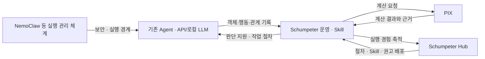

# PIX · Schumpeter 사용자 요구사항

| 항목 | 내용 |
| --- | --- |
| 문서 버전 | 1.0 |
| 기록일 | 2026-09-13 |
| 요구사항 출처 | Chanta Minero 선생님과의 프로젝트 대화 |
| 작성 | Vera |
| 대상 | PIX 계산 엔진, Schumpeter의 PI 기반 Agent 운영·Skill·Hub |
| 문서 성격 | 사용자 의도와 제품 요구사항의 기록. 구현 완료나 출시 승인을 선언하는 문서는 아님 |

## 1. 문서 목적과 읽는 방법

이 문서는 PIX와 Schumpeter를 왜 만들며, 무엇을 우선 완성하고, 장기적으로 무엇을 가능하게
하려는지 정리한다. 새로운 설계나 개발 세션에서도 사용자가 같은 의도를 반복 설명하지 않도록 한다.

문서의 항목은 다음과 같이 구분한다.

- **명시 요구:** 사용자가 직접 밝힌 제품 방향과 작업 요구.
- **목표·가설:** 사용자가 지향하지만 아직 성능이나 실현 가능성이 입증되지 않은 상태.
- **설계 제안:** 대화 중 Vera가 제안한 구체화 방법. 사용자 확정 요구와 구분한다.
- **미정:** 기능 범위, 수치, 배포 방식 등 추가로 구체화할 사항.

요구사항은 구현 사실과 별개다. 현재 코드·테스트·출시 범위는 별도 구현 및 검증 문서로 확인한다.
기존 아키텍처와의 차이는 후속 설계에 반영할 사항으로 기록하며, 이 문서 작성만으로 API나 모듈
책임을 변경하지 않는다.

## 2. 배경과 문제의식

### 2.1 모델 성능과 Agent 운영 성능

사용자는 생성형 AI가 이미 성능의 천장에 도달했다는 명제에 동의하지 않는다. 특히 프롬프트
엔지니어링, 하네스 구성, 반복 실행과 피드백을 설계하는 루프 엔지니어링을 통해 Agent의 작업
성공률을 개선할 여지가 있다고 본다.

제품의 관심사는 모델의 능력과 함께, Agent가 실제로 어떤 행동을 수행하고 그 결과를 다음
행동에 어떻게 반영하는가에 있다. 모델의 성능 상한에 관한 논쟁과 별개로, 실행 체계의 개선
효과를 검증할 수 있어야 한다.

대화에 등장한 외부 인물의 발언이나 유출 관련 이야기는 사용자의 문제의식에 대한 배경이다.
이 문서는 그 진위를 확인하거나 외부 제품의 성능을 판정하는 근거로 사용하지 않는다.

### 2.2 Process Intelligence가 필요한 이유

사용자는 자신이 만들거나 연결한 Agent의 실행을 객체·이벤트·속성·관계 수준에서 기록하고
분석하는 데 OCPM이 핵심적인 역할을 할 수 있다고 본다. 이를 통해 실행 순서, 객체의 변화,
Agent 사이의 작업 인계와 결과를 계산 가능한 대상으로 만들려 한다.

Palantir의 Ontology와 객체·행동 정의를 비교 대상으로 보고 있으며, 여기에 프로세스 계산과
실행 경험의 활용을 결합해 더 나은 Agent 운영 체계를 만들고자 한다. **경쟁 제품보다 우수하다는
평가나 상위 호환성은 현재 입증된 사실이 아니라 비교·검증할 목표다.**

### 2.3 PM4Py·OCPA 대체 동기

사용자는 기존 PM4Py·OCPA를 사용하며 겪은 오류와 업데이트 속도에 불만을 갖고 있다.
PIX는 이 라이브러리들에 계산을 위임하는 wrapper가 아니라, 해당 계산 기능을 자체 구현하여
독립적으로 사용할 수 있는 대체 엔진을 목표로 한다.

### 2.4 개발 자원과 노선 전환

초기에는 PI-Native Agent의 전체 하네스와 실행 체계를 직접 만들려 했다. 사용자는 퇴근 후
개발하는 제한된 자원으로 다른 Agent 개발 조직의 전체 하네스 개발을 따라가는 부담이 크다고
판단해 그 노선을 폐기하고 방향을 전환했다고 설명했다.

현재 방향은 **PIX 계산 엔진에 집중하고, 기존 Agent를 활용하는 Schumpeter 운영 체계를
그 위에 구축하는 것**이다. 개발 속도를 높여 Git 저장소에 공개하는 것이 중요하다.

## 3. 제품 정의와 책임

| 구성 | 사용자 요구에서의 역할 |
| --- | --- |
| **PIX** | PM4Py·OCPA의 계산 기능을 대체하는 독립 Process Intelligence 계산·해석 엔진. Schumpeter의 핵심 계산 기반 |
| **Schumpeter** | PIX를 사용해 OCPM과 AI를 연결하는 PI-Native Agent 운영 체계. Agent 측 Skill, 실행 경험의 활용, 중앙 Hub를 포괄하는 명칭 |
| **기존 Agent·AI 모델** | 실제 작업을 수행하는 실행 주체와 추론 수단. API 기반 모델과 로컬 LLM을 모두 수용하는 방향 |
| **NemoClaw 등 외부 실행 관리 체계** | 사용자 구상에서 보안·격리·실행 관리 역할을 담당하는 결합 대상. 실제 지원 범위와 연동 방식은 별도 확인 대상 |

의존성은 **Schumpeter → PIX** 방향을 유지한다. PIX를 Schumpeter 전용 내부 부품으로 제한하지
않으며, PIX가 Schumpeter의 Agent 실행·권한·운영 서비스에 의존하도록 만들지 않는다.

다음 그림은 요구 수준의 논리 흐름이다. 서버 배치, 프로토콜, 저장소, 실시간 제어 구조를
확정한 구현 설계가 아니다.

## 4. PIX의 명시 요구사항

| ID | 요구사항 | 적용 범위 |
| --- | --- | --- |
| UR-PIX-01 | PM4Py·OCPA가 가진 계산 알고리즘과 기능을 PIX에 자체 구현한다. 분석용 변환이나 계산을 해당 라이브러리에 맡기는 구조를 목표로 하지 않는다. | 핵심 제품 방향 |
| UR-PIX-02 | 사용자의 표현대로, PM4Py·OCPA의 계산 기능들을 “현재 버전에 맞게 안정적으로” 동작하게 만든다. 여기서 “현재 버전”의 구체적인 기준은 11절의 미정 사항으로 남긴다. | 출시 범위 구체화 필요 |
| UR-PIX-03 | OCEL과 XES 등 실제 이벤트 로그를 입력받고 계산에 사용할 수 있어야 한다. 객체 중심 로그와 case 중심 로그의 의미를 고려한 입출력 구조를 제공한다. | 입력 기반 |
| UR-PIX-04 | Schumpeter와 독립적으로 설치·사용할 수 있는 계산 엔진으로 제공한다. | 독립 제품 |
| UR-PIX-05 | Schumpeter가 Agent의 동작을 분석하고 경로·행동을 판단하는 데 필요한 핵심 계산 기반이 된다. | 후속 소비자 지원 |
| UR-PIX-06 | 기존 라이브러리의 기능을 어떤 구조로 옮겼는지 사용자가 도메인 관점에서 확인할 수 있어야 한다. | 설명·검증 가능성 |

사용자는 “OCPA, PM4Py의 계산기능들을 현재 버전에 맞게 안정적으로 돌아가게 만들 수만 있다면
출시해도 괜찮다”는 기준을 제시했다. **이를 일부 계산 기능만 구현해도 충분하다는 승인으로
해석하지 않는다.** 첫 출시가 대체해야 하는 정확한 알고리즘 목록과 동등성 수준은 아직 미정이다.

기존 대화에서는 그래프를 더 깔끔하고 활용하기 쉽게 표현할 수 있는 라이브러리 또는 자체 구현도
요청했다. 이는 계산 구조와 결과를 사람이 확인하는 사용성 요구로 유지하되, 특정 그래프 라이브러리나
시각화 기능 전체를 이번 대화만으로 첫 출시의 필수 범위로 새로 확정하지 않는다.

## 5. Schumpeter의 명시 요구사항

| ID | 요구사항 | 적용 범위 |
| --- | --- | --- |
| UR-SCH-01 | PIX를 사용하는 OCPM 기반 PI-Native Agent 운영 체계를 만든다. | 핵심 제품 방향 |
| UR-SCH-02 | 기존 Agent에 적용할 수 있는 Skill과 운영 기능을 제공한다. 자체 전체 Agent 하네스를 다시 만드는 것을 우선 목표로 삼지 않는다. | 현재 개발 노선 |
| UR-SCH-03 | 개별 Agent의 Sequence Trace와 실행 경험을 중앙에서 받아 분석·활용할 수 있는 Hub를 만든다. | Hub |
| UR-SCH-04 | 축적한 경험과 계산 결과를 작업 절차·Skill·권고 등의 형태로 적용하고 배포·다운로드할 수 있게 한다. 구체적인 배포 단위와 형식은 별도 설계한다. | 경험의 재사용 |
| UR-SCH-05 | Agent의 동작을 관리·분석하고, 더 적절한 실행 경로와 행동을 제안하는 방향으로 발전시킨다. | 실행 개선 |
| UR-SCH-06 | 특정 API 모델이나 로컬 LLM 하나에 종속되지 않는 방향으로 설계한다. | 모델 중립성 |
| UR-SCH-07 | NemoClaw와 같은 보안·실행 관리 체계와 결합할 수 있도록 역할을 나눈다. | 외부 체계 연동 |

장기적으로는 개별 Agent를 연결하는 단계에서 여러 Agent를 집단으로 관리하는 단계까지 확장한다.
모든 Agent의 경험이 다른 Agent에게 자동으로 유효하다는 가정은 두지 않는다. 경험의 적용 조건과
공유 범위는 설계·검증할 사항이다.

## 6. Agent 간 인계: OCEL 동작 수준의 요구

### 6.1 사용자가 명시한 기준

**UR-OCEL-01:** Agent 사이의 작업 인계는 문서만 주고받는 수준에 머물러서는 안 된다.
OCEL 기반의 객체·이벤트·속성·관계 및 동작 수준에서 실행 상태를 전달하고 연결해야 한다.

**UR-OCEL-02:** 객체와 행동을 공유하는 여러 Agent의 작업을 계산 가능한 구조로 표현해야 한다.
Sequence Trace를 활용하되, 여러 객체와 여러 Agent의 관계를 한 개의 단순한 문장이나 순서 목록으로
축소하지 않는 방향을 요구한다.

문서는 작업의 설명과 사람이 읽는 표현으로 사용할 수 있다. 사용자 요구의 중심은 인계와
후속 동작을 판단하는 기반을 객체·실행 기록에 두는 것이다.

### 6.2 요구의 의미를 보여주는 예시 — 설계 설명용

Agent A가 코드를 수정하고, B가 테스트하며, C가 배포하는 작업을 가정한다.
“테스트가 통과했다”는 설명과 함께 코드·테스트 실행·실행 환경·결과·배포 대상의 연결이 있어야,
다음 Agent가 자신이 다루는 대상과 그 검증 근거를 구분할 수 있다.

이 예시는 대화 중 Vera가 제시한 요구 해석이다. 객체 버전 정책, 승인 무효화 규칙, 이벤트 명칭,
원자적 실행 방법까지 사용자가 확정했다는 뜻은 아니다.

## 7. 이미지·영상·실물로의 확장

**UR-EXT-01:** 이미지 안의 대상을 객체화하여 같은 운영·분석 구조에 연결할 수 있는 확장성을 고려한다.

**UR-EXT-02:** 비디오와 그 안의 객체·행동도 같은 방향으로 포함할 수 있도록 한다.

**UR-EXT-03:** 실제 사물과 physical Agent까지 장기적인 관리 대상으로 고려한다.

**UR-EXT-04:** 컴퓨터 내부의 작은 소프트웨어 Agent부터 physical Agent까지 다양한 실행 주체를
집단으로 관리할 수 있는 체계를 장기적으로 지향한다.

| 대상 | 대화에서 제안한 구체화 예시 — 미확정 |
| --- | --- |
| 이미지 | 원본 이미지, 식별된 영역, 관측된 객체, 검토·수정·승인 행동 |
| 비디오 | 영상, 시간 구간·프레임, 추적 대상, 관측된 행동과 변화 |
| 실물 | 장치·부품, 센서 관측, 명령 시도, 관측으로 확인한 변화 |

미디어 원본 저장 방식, 실물 식별, 관측의 불확실성, 장치별 실행 연결부와 실시간 제어 책임은
아직 정하지 않았다. 위 확장 목표가 현재 PIX에 이미지 인식·비디오 이해·로봇 제어가 구현됐다는
뜻은 아니다.

## 8. 우선 출시와 개발 요구

| ID | 요구사항 |
| --- | --- |
| UR-REL-01 | PM4Py·OCPA의 대상 계산 기능을 현재 요구에 맞게 안정적으로 제공할 수 있다면 PIX부터 출시할 수 있다. |
| UR-REL-02 | Schumpeter 전체와 중앙 Hub의 완성을 PIX 첫 출시의 선행 조건으로 두지 않는다. |
| UR-REL-03 | 개발 진도를 높여 Git 저장소에 공개하는 것을 우선한다. 실제 공개 시점과 저장소 설정은 별도 작업이다. |
| UR-DEV-01 | 단계별 테스트 파일을 만들고 실제로 검증한다. |
| UR-DEV-02 | 실제 OCEL·XES 등 사용자 제공 데이터를 활용해 테스트를 구체화한다. |
| UR-DEV-03 | 구조와 기능을 Process Mining 도메인 전문가가 눈으로 판단할 수 있도록 설명한다. 코드만 제시하는 방식으로 한정하지 않는다. |
| UR-DEV-04 | 기존 조사·설계·구현 기록을 확인하고 이어서 작업한다. 이미 정한 제품 방향을 반복해서 원점으로 되돌리지 않는다. |
| UR-DEV-05 | 업무 질문 단위로 하나씩 개발하며, 개발 전 작은 사례·예상 답·반례의 의미와 개발 후 실제 결과를 사용자가 도메인 관점에서 검토한다. 채택 사례와 반례는 회귀 검증으로 축적하고 도메인 판단과 구현 검증 상태를 구분한다. |

UR-DEV-05는 2026-09-13 사용자의 도메인 검토 절차 채택을 반영했다.
구체적인 진행 방식은 [상세 개발 계획 19절](2026-09-13_PIX_DETAILED_DEVELOPMENT_PLAN.md)과
[도메인 검토 방식](2026-09-13_PIX_DOMAIN_REVIEW_WORKFLOW.md)을 따른다.
이번 지시는 **플랜 기록까지**이며 후속 기능 구현·신규 테스트 작성/실행 착수는 포함하지 않는다.
운영 방식 채택으로 개별 지표 정의·예제 기대값·미정 기술 선택까지 확정한 것은 아니다.

출시 우선순위는 PIX의 계산 엔진 완성도에 둔다. 이 요구를 근거로 PIX 안에 Agent runtime,
중앙 Hub, 보안 실행 체계를 함께 구현해야 한다고 해석하지 않는다.

## 9. 장기 목표와 검증이 필요한 주장

| 목표·가설 | 현재 해석 | 아직 입증되지 않은 부분 |
| --- | --- | --- |
| Agent가 더 높은 성공률로 작업 | 실행 경험과 OCPM 계산을 다음 행동에 활용 | 개선 폭, 적용 가능한 작업 범위 |
| 최적 경로·최적 행동 제안 | 제약과 결과를 고려해 더 나은 실행을 선택하도록 지원 | 목적함수, 후보 행동, 최적성의 정의·증명 범위 |
| 처음 하는 작업도 실패 없이 수행 | 검증된 경험을 이전하고 새로운 작업에 활용하려는 목표 | 미관측 조건과 새로운 행동의 성공 보장 |
| 인간보다 더 잘 일하는 Agent | 특정 업무의 성과를 개선하려는 장기 지향 | 비교 업무·조건·성과 기준 |
| Ontology 중심 시스템보다 우수한 운영 체계 | 객체·행동 정의에 프로세스 계산과 경험 활용을 결합 | 경쟁 제품 대비 기능·품질 우위 |
| 모든 유형의 Agent 집단 관리 | 공통 운영 구조와 실행 주체별 연결을 지향 | 각 환경의 표현·제어·연동 가능 범위 |

각 목표의 성공률, 성능 향상률, 지원 Agent 수, 최대 데이터 규모, 출시일은 현재 **알 수 없음**이다.
목표를 삭제하거나 축소한 것이 아니라, 실증 전 목표와 확인된 제품 능력을 구분한 것이다.

## 10. 후속 설계 제안 — 사용자 확정 요구와 구분

다음은 요구를 구현 가능한 사양으로 옮기기 위해 대화 중 제안한 방법이다.

1. **계산 기능 대체표:** 알고리즘·변형·참조 버전·입력 조건·구현 상태·검증 근거를 행별로 정리한다.
2. **독립적인 정답 근거:** PM4Py·OCPA 결과 비교와 함께 정의, 작은 검산 사례, 실제 데이터 검증을 사용한다.
3. **조건부 실행 절차:** Hub가 배포하는 내용에 순서 외에도 적용 조건·성공 판정·실패 복구 방법을 담는 안을 검토한다.
4. **관측과 실행의 연결:** 기록된 사실을 계산하는 부분과 실행 직전 조건을 적용하는 부분의 책임을 분리한다.
5. **대상과 관측의 구분:** 실물, 미디어, Agent의 관측·추정을 구분해 잘못된 객체 동일시를 줄이는 안을 검토한다.
6. **효과 비교:** 같은 모델·도구·예산 조건에서 기존 방식과 Schumpeter 사용을 비교해 완료율·재시도·사람 개입·비용을 평가한다.

이 목록은 특정 저장소, 프로토콜, 모듈 구조, 자동 행동 선택권 또는 수치형 출시 기준을 확정하지 않는다.
현재 Schumpeter 아키텍처의 Agent 행동 선택 책임을 Hub로 옮기는 변경도 이 문서에서 확정하지 않는다.

## 11. 아직 구체화하지 않은 결정

| 항목 | 정해야 할 내용 |
| --- | --- |
| 첫 PIX 출시의 대체 범위 | PM4Py·OCPA 대상 알고리즘 전체 목록, 필수 기능, 허용되는 제한과 동등성 수준 |
| “현재 버전” 기준 | 참조 라이브러리 버전·commit, OCEL 등 입력 표준/profile, 지원 Python 환경 |
| 안정성의 판정 | 알고리즘별 기대 결과, 경계 조건, 탐색 한도, 오류·부분 결과의 처리 기준 |
| 초기 Schumpeter 연결 대상 | 먼저 지원할 Agent와 실행 환경, Skill·MCP·기타 연결 방식 |
| 인계 계약 | 객체 식별·상태·이벤트·관계·담당 주체·완료 증거의 필수 항목 |
| Hub 공유·배포 단위 | 원본 기록, 추상화된 절차, Skill, 권고, 정책 중 무엇을 어떤 조건으로 공유할지 |
| 행동 선택과 집행 | Agent·Schumpeter·외부 실행 관리 체계 사이의 최종 책임 |
| 최적화의 목적 | 성공률·시간·비용·사람 개입 등 목표의 우선순위와 제약 |
| 외부 연동 | NemoClaw 등 실제 지원 기능, 운영 환경, 교체 가능한 연결 경계 |
| 멀티모달·physical 단계 | 첫 대상, 객체화 방법, 실시간 제어와 Hub 역할의 경계 |
| 공개 방식 | 공개 저장소, 라이선스, 패키지 배포, 지원 범위 문구 |

미정 항목은 이번 요구사항 문서 작성을 막는 조건이 아니다. 후속 기능 명세와 설계에서 구체화한다.

## 12. 기존 문서와의 연결

| 근거 | 이 문서와의 관계 |
| --- | --- |
| [PIX 초기 컨텍스트 및 아키텍처](../architecture/0_PIX_PROJECT_CONTEXT_AND_ARCHITECTURE.md) | 독립 계산 엔진과 Schumpeter → PIX 의존성의 계보. 초기 문서의 직접 runtime 소유 표현은 최신 전환 방향과 함께 해석해야 함 |
| [PIX 현재 README](../../README.md) | 현재 공개 API·입출력·계산 기능·제한을 확인하는 출발점 |
| [Schumpeter Agent·MCP·Tool 아키텍처](../../../Schumpeter/docs/architecture/SCHUMPETER_AGENT_MCP_TOOL_ARCHITECTURE.md) | 자체 전체 하네스에서 Agent 중립 PI 서비스로 전환한 기록과 현재 책임 경계 |
| [Schumpeter 개발 Gate Ledger](../../../Schumpeter/docs/development/GATE_LEDGER.md) | 목표 구조와 실제 구현·검증 상태의 구분 |
| [실제 XES corpus 검증 기록](../version/v0.5.0_XES_CORPUS_2026-09-13.md) | 사용자 제공 로그에 대한 실행 증거. 계산 기능 전체 대체나 Hub 완성의 증거로 확대하지 않음 |

이 대화에서 더 명확해진 추가 요구는 **OCEL 동작 수준의 Agent 간 인계**, **경험의 중앙 축적과
배포를 담당하는 Hub**, **멀티모달·실물 확장**, **PIX 독립 출시 우선순위**다.
이전 문서에 기술된 기능을 현재 구현 완료로 간주하거나, 오래된 PIX 기능 목록을 현재의 한계로
그대로 사용하지 않는다.

## 13. 유효 범위와 판단을 수정할 조건

사용자 요구의 기록은 2026-09-13까지의 대화를 기준으로 하며, 이후 사용자가 방향을 변경하면
해당 항목을 갱신한다. 참조 문서와 구현 상태는 각 문서의 날짜·버전·검증 범위에만 유효하다.

제안된 검증 원칙은 다음과 같다. 구체적인 수치 기준은 아직 미정이다.

- 지원한다고 명시한 입력과 알고리즘 조건에서 오계산이나 의미 손실이 재현되면 해당 기능의 안정성 판단을 철회한다.
- 동일 조건의 비교에서 Schumpeter의 완료율·재시도·비용 등 이점이 확인되지 않으면 운영 효과 주장을 수정한다.
- 처음 보는 작업이나 공유 객체 충돌에서 실패가 재현되면 무실패·일반화 주장에 그 한계를 반영한다.
- 특정 Agent나 미디어·물리 환경을 공통 구조로 표현·연동하지 못하면 범용 지원 범위를 수정한다.

## 14. 요구사항 요약

**PIX를 PM4Py·OCPA의 계산 기능을 대체하는 독립 엔진으로 우선 완성·출시하고, 그 위에
OCEL의 객체·행동·관계를 기준으로 Agent의 작업을 인계·분석·개선하며 경험을 공유하는
Schumpeter 운영 체계와 Hub를 구축한다. 이미지·영상·실물과 다양한 Agent 집단으로의 확장은
장기 목표로 유지한다.**
