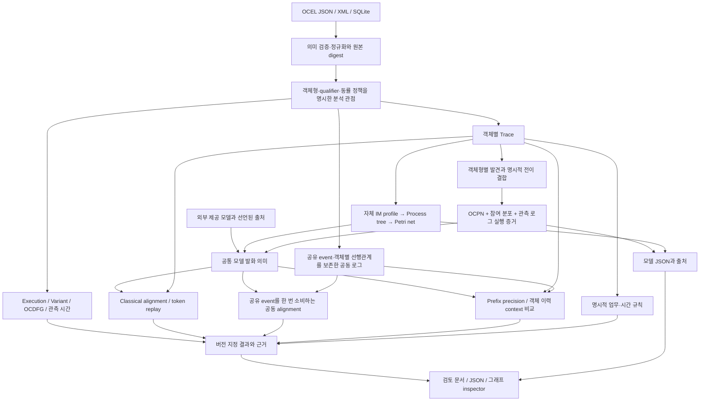

# PIX 모델 발견·공동 실행·평가 구조

기준: 2026-09-10의 PIX 0.4.0 구현. 최종 지원 범위와 시험 집계는
[구현 기록](../version/v0.4.0_MODEL_EVALUATION_IMPLEMENTATION.md)에 있다.
이 문서는 코드 대신 각 계산이 무엇을 입력받아 어떤 판단 근거를 만드는지 설명한다.

실제 계산값과 발화 단계표는 `python examples/model_evaluation.py`가 만드는
`.artifacts/v040/demo/review.md`에서 확인할 수 있다.

## 발견한 모델과 규범 모델

발견은 관측된 행동을 설명할 구조를 만든다. 그것만으로 관측되지 않은 행동을 업무적으로
금지할 수 있다는 뜻은 아니다. 외부에서 제공한 규범 모델은 별도의 출처를 유지하며,
두 경로 모두 동일한 발화 의미를 거쳐 실행한다.

OCPN 발견에서는 객체형별 모델을 먼저 만든 뒤 동일한 activity identity의 전이를
결합한다. 한 객체형 안에 같은 activity를 가진 여러 전이가 있으면, 표시명만으로
임의 결합하지 않고 지원할 수 없는 모호성을 보고한다. 정해진 탐색 한도 안에서 각
객체와 공유 event를 실제 실행할 수 있는 증거를 확인한다.

참여 수는 모든 해당 activity event에 대해 0·1·복수를 세어 분포로 남긴다. 관측 범위를
허용하는 정책을 선택하면 최소·최대 사이에서 실제로 관측하지 않은 수와 객체형별
독립 조합도 허용할 수 있다. 따라서 이 범위는 관측에서 만든 모델 가정이며 규범의
자동 인증이 아니다. 정확한 동시 참여 조합을 강제하는 모델과 구분해야 한다.

## 공동 alignment가 추가로 검사하는 것

동일한 배송 event에 주문 두 개와 포장 하나가 참여했다면, 공동 alignment는 그 세
객체의 binding이 같은 발화에서 가능한지 검사한다. 주문별·포장별 성공 결과를 더하지
않는다. 공유 event는 한 번만 소비하고, 객체별 선행관계만 유지한다. 서로 독립적인
event의 시간순을 임의로 하나 정해 다른 순서를 부적합으로 만들지 않는다.

결과에는 동기 실행, 로그 쪽 이동, 모델 쪽 이동, silent 실행과 각각의 객체·비용·전후
marking이 남는다. Event 단위 비용과 참여 객체 수를 곱하는 비용은 다른 문제 정의다.
최소 비용이 0이어도 비용 정의에 따라 보정 이동이 있을 수 있으므로 이동 종류와 수를
함께 확인한다. 탐색이나 binding 열거가 끝나지 않으면 최적 완료로 표시하지 않는다.

## Precision과 context가 비교하는 모집단

Prefix precision은 관측된 prefix 다음의 행동과, 그 prefix를 실행한 뒤 모델에서 가능한
행동을 비교한다. 동일 prefix를 여러 marking으로 실행할 수 있으면 가능한 marking을
모두 고려한다. Silent transition을 통한 다음 행동도 포함한다. Trace가 끝난 자리의
추가 행동을 평가할지는 종료 정책으로 명시하며, 종료를 실제 activity 문자열과 섞지 않는다.

객체 context는 구체 객체별 활동 이력을 모아 만든다. 같은 이력에서 관측된 다음 행동
집합 L과 모델이 허용하는 집합 M을 비교하되, 행동은 activity뿐 아니라 실제 참여 객체
집합까지 포함한다. 공유 활동명의 빈도나 OCDFG edge 겹침으로 바꾸어 계산하지 않는다.

- Context fitness: 관측 행동 중 모델도 허용한 비중, `|L ∩ M| / |L|`.
- Context precision: 모델의 가능 행동 중 관측된 비중, `|L ∩ M| / |M|`.

최종 micro 집계는 context별 교집합 크기의 합을 각각 관측 집합 크기의 합과 모델 집합
크기의 합으로 나눈다. Context별 비율의 단순 평균이 아니다. 실제 예제의 42/116은
event 수가 아니라 context별 행동 집합의 합이며, 같은 행동도 다른 context에서는 다시 센다.

객체 context의 이력으로 위치를 정할 수 없는 무참여 event는 명시한 범위에서 제외하며
모델 쪽 무참여 binding도 같은 기준으로 제외한다. 제외 ID·수와 평가 범위를 남긴다.
계산된 context의 합과 분모는 공개하고, 한도 초과 때문에 일부 context를 계산하지
못했다면 그 부분 점수를 전체 범위 점수로 발표하지 않는다. 분모가 0인 값은 알 수 없음이다.
이 정의는 PIX의 명시적 profile이며 OCPA와 같은 숫자를 내겠다는 약속이 아니다.

## 업무 규칙과 관측 종료

규칙은 활동 수, response, precedence, 함께 나타나면 안 되는 활동, 시간 제한 response를
명시적으로 받는다. 모든 규칙을 한 점수로 합치지 않고 객체·활성화 event·증거별로
충족·위반·대기 상태를 구분한다. Response의 같은 활동명 두 항목은 같은 event 하나로
충족하지 않으며, 이후의 별도 발생이 필요하다.

관측창이 닫혔다면 응답 없는 요청은 위반으로 판단할 수 있다. 관측창이 열려 있다면
미래 응답 가능성이 있으므로 대기가 될 수 있다. 시간 규칙에는 허용 microsecond 구간과
첫 응답/어느 응답을 사용할지의 정책이 포함된다. 필요한 시점 근거 없이 단순히 마지막
관측 시각을 현재 시각처럼 사용하지 않는다.

## 결과를 읽는 순서

먼저 분석 대상과 제외 범위, 모델 출처를 확인한다. 다음으로 `computed`, `partial`,
`unavailable`, `invalid_input`과 개별 표본의 진단을 확인한 뒤, 계산된 분자·분모와
실제 event/object/marking 증거를 읽는다. 그래프는 이 결과를 탐색하는 화면이며
필터나 배치가 원본 계산을 바꾸지는 않는다.

지원 판단은 최종 기록한 코드·정의·시험 범위에서만 유효하다. 독립 반례가 동치·발화·
최소 비용·평가 모집단·보존 규칙을 깨면 해당 판단을 철회하고 수정한다. 대용량 성능과
외부 라이브러리 대비 우위는 별도 측정 전 **알 수 없음**이다.
