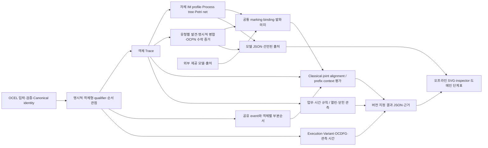

# PIX 0.4.0 — 모델 발견·공동 실행·평가 구현 기록

검증 기준일: **2026-09-10**. 제품 코드와 테스트를 반영했고, 아래 지원 profile의 전체
연결 경로를 실제 실행했다. 전체 PM4Py/OCPA 알고리즘 목록을 구현했다는 뜻은 아니다.

도메인 구조는 [모델 평가 안내](../user-guide/NATIVE_MODEL_EVALUATION_GUIDE.md),
API 사용은 [분석 안내](../user-guide/NATIVE_ANALYSIS_GUIDE.md)에 설명했다.
원본 OCEL·Canonical V1·기존 계산과 오프라인 viewer는 유지하고 계산군을 추가했다.

## 완성한 연결 구조



모델을 발견한 출처와 외부에서 제공한 출처는 합쳐 지우지 않는다. 계산에 쓰는 모델
의미는 하나이며, 화면 좌표·색상·필터가 로그나 모델의 실행 의미를 바꾸지 않는다.
Python 계산의 필수 외부 의존성은 없고, PM4Py/OCPA를 설치하거나 실행하지 않는다.

## 추가 구현과 단계별 시험

아래 시험 수는 **서로 다른 pytest test case 수**다. 내부 oracle의 비교 횟수와 구분한다.
기존 import 경계 시험을 각 단계 숫자에 중복해서 더하지 않았다.

| 단계 | 실제 구현 | 해당 기능 시험 | 도메인 정의·반례 |
|---|---|---:|---|
| Classical discovery | `pix.im.v1`: formal XOR·sequence·parallel·loop cut, split, 명시적 practical fallthrough. 기존 보수적 profile 유지 | **93**: `test_discovery.py`, `test_inductive_miner.py`, `test_im_cut_definitions.py` | [IM 명세](../architecture/5_PIX_LOG_BASED_INDUCTIVE_MINER.md) |
| OCPN discovery | 유형별 자체 발견, unique activity 병합, 0/1/복수 참여 분포, 실제 전체 로그 수락 경로, 저장된 증거의 일관성 검증 | **249**: `test_ocpn_discovery.py` | [OCPN 발견 명세](../specifications/PIX_OCPN_DISCOVERY_V1.md) |
| 공동 실행·alignment | 유한 binding 열거, 공유 event 단일 소비, 객체별 부분순서, 정확한 참여 객체 동기화, 비용·한도·하한 | **256**: `test_object_bindings.py`, `test_object_conformance.py`, `test_object_alignment_oracle.py` | [공동 alignment 명세](../architecture/PIX_JOINT_OCPN_ALIGNMENT_PROFILE.md) |
| Prefix precision | 모든 synchronous·silent 도달 marking, 종료 포함/제외, prefix별 observed/enabled/escaping과 정확한 집계 | **155**: `test_precision.py` | [Precision 명세](../specifications/PIX_PREFIX_PRECISION_V1.md) |
| 객체 context | 구체 객체 이력, activity+정확한 참여 집합, 모든 관측 downset과 모델 도달 상태, micro fitness/precision | **1,697**: `test_object_context.py`, `test_object_context_oracle.py` | [Context 명세](../specifications/PIX_OBJECT_CONTEXT_V1.md) |
| 업무·시간 규칙 | Count·Response·Precedence·NotCoexistence·TimedResponse, open/closed 관측, 충족·위반·대기 증거 | **225**: `test_constraints.py`, `test_constraint_truth_oracle.py` | [규칙 명세](../specifications/PIX_CONSTRAINTS_V1.md) |
| 새 경로의 저장·통합 | 5개 신규 결과 종류, 서로 다른 rule kind 보존, 요청/결과 일치, 실제 예제 보고서 | **21**: `tests/test_extended_results.py`, `test_model_evaluation_example.py` | 아래 저장 검증·실행 예제 |

그 외 기존 I/O·Canonical·Trace·통계·classical alignment/replay·viewer 시험을 포함한
전체 Python 실행은 **3,644 passed, 284 subtests passed, 13 skipped**, **16.38초**였다.
이 시간은 해당 개발 환경의 한 번의 전체 시험 실행 시간이며 엔진 처리량 benchmark가 아니다.

독립 검증은 구현 결과끼리 비교하는 데 한정하지 않았다.

- IM formal cut은 가능한 partition을 별도로 열거하여 **13,122개** 그래프·경계 조건을 비교한다.
  새 IM behavior 시험에는 **7,260개 trace 쌍**이 들어 있다.
- Joint alignment는 별도 Bellman–Ford와 token 방정식으로 경로·최소 비용·탐색 한도를 비교한다.
  객체형별로는 비용 0이지만 공동 실행에는 보정이 필요한 반례를 검사한다.
- Object context oracle는 유한 사례 **400개**와 한도 사례 **1,200개**를 영구 시험에 포함한다.
- 규칙 truth-table 시험은 **44,772개** 규칙/trace 비교를 포함한다. 별도 읽기 전용 검토에서도
  **149,968개** open/closed·동률 규칙 평가를 확인했다. 이 수를 pytest 시험 수에 더하지 않는다.

## 저장 계약에서 확인한 것

분석 결과 형식은 **`pix.analysis-result` 1.1.0**이며 1.0 문서도 읽는다. 모델 형식은
별도 **`pix.model` 1.0.0**이다. 원본 로그의 Canonical V1을 모델·평가 결과 형식으로 사용하지 않는다.

- 결과 종류 14개를 명시적으로 등록한다. 임의 Python class를 import하거나 역직렬화하지 않는다.
- 다섯 규칙 종류는 직렬화되는 `kind`를 갖는다. 같은 필드 모양 때문에 response가 precedence로
  바뀌는 일이 없도록 왕복 시험을 둔다.
- 모델 digest, 종료·가중 정책, 관측 정책, 부모 trace ID, OCPN projection ID, coverage와 envelope
  상태 사이의 모순을 거부한다. 불완전 결과에 전체 점수를 넣은 문서도 거부한다.
- OCPN의 관측 참여 분포와 저장된 유한 발화 증거는 내부 일관성을 검사한다. 초기 marking을
  바꾸고 checksum을 다시 계산해도 비활성 binding의 수락 증명은 통과하지 않는다.
- 결과 정수가 4096 bit를 넘으면 canonical hexadecimal tag로 저장한다. 객체 15,000개에서
  실제 생성한 **`2**15000`** binding 수를 round-trip했고 Python의 전역 정수 변환 제한은
  변경하지 않았다. 임의 크기 요청 매개변수나 모델 digest까지 새로 지원한다는 뜻은 아니다.
- 동시각에 명시한 event-ID 순서를 사용하면 `timestamp_tie_broken`을 남기고 하위 발견·평가에도
  보존한다. 결정적인 순서를 인과관계로 승격하지 않는다.

이 검증은 저장된 자료의 내부 모순을 줄인다. Digest는 계산 실행의 인증이나 외부 데이터의
진실성 증명이 아니며, 모델의 전체 상태공간을 파일 로드 시 다시 탐색하지 않는다.

## 실제 실행 결과를 눈으로 확인하는 방법

```powershell
python examples/model_evaluation.py --output .artifacts/v040/demo
```

생성된 `review.md`는 원본 7-event 표, 참여 수 히스토그램, 공동 발화 단계, 규칙별 증거를
설명한다. OCEL 3형식, 분석 JSON 10개, 모델 JSON 2개와 그래프 HTML 3개도 함께 만든다.
기존 출력 경로를 재사용할 때만 `--overwrite`를 명시한다.

| 예제 관측 | 실제 결과 | 해석 범위 |
|---|---|---|
| 전체 공동 alignment | 최적 비용 **0**, 동기 event **7개**, log/model 보정 **0개** | 이 로그·객체 universe·모델·event 비용 profile |
| Prefix precision | 종료 포함 **14/14**, 종료 제외 **11/11** | 종료 정책에 따라 분모가 다름 |
| Object-context fitness | **42/42** | context별 관측 행동 집합 크기의 합 |
| Object-context precision | **42/116** | 같은 context별 모델 가능 행동 집합 크기의 합 |
| 9분 이내 배송 | **1건 충족, 2건 위반** | 닫힌 관측, 허용 구간 양끝 포함 |
| 배송 후 보관 | **3건 대기, 위반 0건** | 열린 관측, 미래 응답을 아직 배제하지 못함 |

42/116은 event 42개와 116개를 뜻하지 않는다. 동일한 행동이 서로 다른 context에서
가능하면 각각의 context 집합에 포함된다. 이 예제는 관측된 행동이 모두 허용되더라도
모델이 그 밖의 행동을 허용할 수 있음을 보여준다.

## 브라우저·설치 검증

| 검증 | 결과 | 근거 |
|---|---|---|
| Python 3.11.15 전체 suite | **3,644 + 하위 검사 284 통과** | `.artifacts/v040/tests/py311.xml`, `summary.json` |
| 실제 Chromium 회귀 | **13 통과** | `.artifacts/v040/tests/browser.xml` |
| JavaScript / 실제 ELK 배치 | **98 통과** | `.artifacts/v040/tests/layout.txt` |
| 최종 HTML 3종 × desktop/mobile | **6개 화면 확인** | `.artifacts/v040/browser/actual-export-evidence.json`, screenshot 12개 |
| Ruff lint / 변경 파일 format | lint 통과, 변경·추가 Python **92개** format 통과 | `.artifacts/v040/tests/format.json` |
| 제품 변경 공백 검사 | `git diff --check` 통과 | `.artifacts/v040/tests/diff-check.txt` |
| 격리 wheel 설치 | PIX만 `--no-deps` 설치 후 저장소 밖 `python -I` 실행 통과 | `.artifacts/v040/package/installed-smoke/evidence.json` |
| 파일 포함·일치 | runtime 파일 **85개**의 원본·wheel·설치본 바이트 일치 | 같은 package evidence; viewer 개발 README 1개는 명시적 제외 |

기본 Python suite에서 skip한 13개는 opt-in browser 시험이며, 별도 실제 실행에서 모두
통과했다. 최종 모델 화면의 provenance·모델 digest도 JSON과 대조했다. 최종 화면에서
외부 HTTP(S) 요청, browser 오류, 문서 가로 넘침은 관측하지 못했다.

긴 OCPN의 `Fit`은 전체 개요용이다. 실제 예제의 최소 글자 크기는 desktop 2.91px,
mobile 1.02px로 작았다. `Readable`을 선택하면 1배 크기와 최소 11px로 읽을 수 있고
나머지는 pan으로 탐색한다. 전체 모델의 모든 글자를 한 화면에서 읽을 수 있다는 주장이나
Graphviz 대비 시각적 우위는 하지 않는다.

Wheel smoke는 computed 결과 **14종**, invalid input **5종**, partial **2종**을 왕복하고
OCPN 발견·공동 실행·규칙·모델 JSON·오프라인 HTML까지 검사했다. 배포 파일은
`.artifacts/v040/package/dist/pix-0.4.0-py3-none-any.whl`, **656,997 bytes**이며 SHA256은
`8b4eb746eb73496b46b0accc277de4f5f1058c77da90fa201ac2a4abccad6478`이다.

## 확인하지 못한 범위와 재검토 조건

**새 코드의 Python 3.10 실행은 Windows Application Control이 기존 interpreter를 차단하여
검증하지 못했다.** 같은 실행 파일의 `--version` 호출에서도 차단을 확인했고 우회하지 않았다.
3.10 문법과 사용 API의 정적 검토는 수행했지만 실제 실행을 대신하지 않는다. 0.3에서 기록한
이전 3.10 통과 결과를 이번 증분의 통과 근거로 재사용하지 않는다.

전체 저장소 format 검사는 이전 작업에서 확인한 기존 파일 10개의 서식 차이가 남아 있다.
이와 변경 파일 92개의 format 통과를 구분한다. 기존 목록은 `.artifacts/review/baseline-format.json`이다.

IMf/IMd/IMin, strict-sequence optional-block refinement, minimum-self-distance refinement,
정규화 classical fitness, 객체 생성·삭제 의미, 임의 activity 중복 병합, 다른 discovery·예측
알고리즘 포트폴리오는 이 구현의 지원 항목이 아니다. OCPN의 관측 로그 수락은 공동
soundness를 뜻하지 않는다. 실제로 로컬 모델은 sound해도 결합 후 다른 경로에서 교착이
가능한 반례를 시험으로 보존했다.

판단의 유효범위는 2026-09-10의 코드·고정 profile·검증된 wheel과 유한 시험이다.
독립 반례가 formal cut, 발화, 최소 비용, 평가 모집단·비율, 출처·보존 계약과 충돌하면
해당 완료·정확성 판단을 철회하고 수정한다. 소스·의미 정의·Python·ELK 변경 시 관련
검증을 다시 실행해야 한다. 최대 처리량·메모리 상한·전체 외부 producer 호환성·실제 오류
감소율·PM4Py/OCPA 대비 성능 우위와 전체 대체 완성도는 **알 수 없음**이다.
